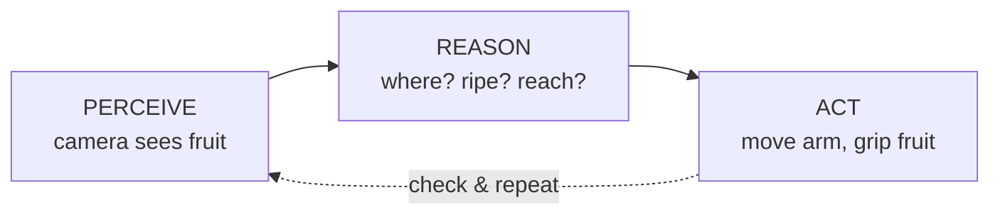

# Lesson 1.1 — Physical AI and the Physical World

> **Module 1 · Unit 1 · Lesson 1.1** · Pilot lesson
> This is the first lesson of the curriculum. It carries no heavy mathematics; its job is to build the mental model — the **Greenhouse Harvesting Robot** — that every later lesson returns to, and to explain *why* the mathematics is coming.

---

## 1. Why This Matters

You already know what artificial intelligence can do on a screen. It can finish your sentence, recommend a film, sort your photos, answer a question. All of that happens inside a computer, working on information that is already digital.

Now picture a different problem. A robot in a greenhouse must find a ripe tomato hidden among leaves, decide whether it is ready to pick, reach out without crushing it, and place it gently in a basket. No amount of clever text prediction does that. The robot has to **see** a real object, **understand** where it is in real space, and **move** real motors to real positions — and if its understanding of *where* is off by a few centimeters, it grabs a leaf or snaps a stem.

This is **Physical AI**: intelligence that senses, decides, and acts in the physical world. It is the discipline behind self-driving cars, warehouse robots, surgical assistants, and agricultural machines. And the reason this curriculum opens with mathematics is simple: **acting correctly in physical space is, underneath, a mathematical problem.** Every "reach for the tomato" hides vectors, coordinate frames, matrices, and trigonometry. This lesson is where you meet the robot. The math that follows is how you teach it to do its job.

## 2. Physical Intuition

Hold your hand out and grab a cup. Notice what your body did without you thinking about it: your eyes located the cup, your brain estimated its distance and orientation, and your arm rotated through a sequence of joint angles to place your fingers exactly there. You ran a complete **perception → reasoning → action** loop in under a second.

A physical AI system runs the same loop, but nothing is automatic. Each stage must be built:

- **Perception (sensing):** a camera or sensor turns the physical world into data — pixels, distances, signals.
- **Reasoning (decision):** the system interprets that data — *where* is the object, *is* it ripe, *can* I reach it — and decides what to do.
- **Actuation (action):** motors and mechanisms carry out the decision, moving real mass through real space.

The whole field of robotics is the engineering of this loop. What makes it hard — and mathematical — is that the three stages live in **different "languages."** The camera speaks in pixels. The world speaks in meters. The motors speak in angles. Getting a tomato from "a blob of red pixels" to "rotate joint 2 by 37 degrees" means **translating between these languages precisely**, and translation between spatial languages is exactly what vectors, frames, and matrices are for.

## 3. Mathematical Foundations

*(Light by design — this lesson motivates the mathematics rather than deriving it. The tools named here are developed in full across Units 2–8.)*

At its simplest, the robot's core question is: **"Where is the thing, and how do I get my gripper there?"** Answering it requires four ideas you will build over this module:

- A **vector** to say *where* something is — a tomato at position $(x, y, z)$ relative to some origin. (Unit 2)
- A **reference frame** to make "relative to" precise — the same tomato has different coordinates in the camera's frame, the robot's base frame, and the world frame. (Unit 3)
- A **transformation** (a matrix) to translate a position from one frame to another — from "where the camera sees it" to "where the arm should reach." (Units 4–5)
- **Trigonometry** to connect *angles* (what motors control) to *positions* (where the gripper ends up). (Unit 6)

That is the entire mathematical spine of Module 1, stated in one paragraph. You are not expected to use any of it yet. You are only expected to believe the claim this lesson is making: *to act in the physical world, a machine must compute its way from sensing to action, and the computation is geometry.*

A single, gentle relationship to carry forward — the **perception-to-action chain** as a sequence of translations:

$$\text{pixels} \;\rightarrow\; \text{camera frame} \;\rightarrow\; \text{robot frame} \;\rightarrow\; \text{joint angles} \;\rightarrow\; \text{motion}$$

Every arrow in that chain is a lesson, or several, later in this curriculum.

## 4. Visual Explanation

The mental image to keep is the **perception–reasoning–action loop**, wrapped around the greenhouse robot.



The loop is closed: after acting, the robot perceives again to check the result and continue. The caption under each box names the "language" of that stage — and the gaps between the languages are where the mathematics lives.

`[Visual: Greenhouse harvesting robot perception → reasoning → action pipeline, closed loop]`

**Rendered assets** (produced, in-repo, renderable):
- SVG: `assets/diagrams/m01-l1-perception-action-loop.svg`
- SVG: `assets/diagrams/m01-l1-software-vs-physical-ai.svg` (§5)
- Mermaid pipeline diagram and an interactive "Trace the loop" demo are embedded on the MkDocs page (`site_src/module01/lesson01.md`); demo source at `modules/module01/demos/lesson01_trace_the_loop.html`.

**Diagram Specification** (production input for the loop SVG)
- **Objective:** the viewer grasps that intelligence in the physical world is a closed loop, and that each stage speaks a different "language" (pixels / meters / angles).
- **Scene:** three labeled stages — PERCEIVE (camera), REASON, ACT (arm/gripper) — with forward arrows and a dashed return arrow ("check & repeat").
- **Labels:** PERCEIVE (pixels), REASON (meters / frames), ACT (joint angles).
- **Form:** SVG (delivered); the pipeline also rendered as Mermaid on the site.

## 5. Engineering Example

**Software AI vs. Physical AI — three domains.**

Consider how the same loop appears across the fields this curriculum serves:

- **Agriculture:** A harvesting robot perceives ripe strawberries with a camera, reasons about which are ready and reachable, and actuates a soft gripper to pick them. A misjudged position bruises the fruit — a physical cost a software recommendation never pays.
- **Robotics:** A warehouse arm perceives a package, reasons about a grasp point, and actuates to move it to a bin. The arm's reach is finite and its motion must avoid collisions — constraints that only exist because it is physical.
- **Mechatronics:** A CNC or pick-and-place machine perceives a part's position, reasons about the toolpath, and actuates motors to micrometer precision. Here the "decision" is mostly geometry and control.

The contrast with software AI is the through-line: a chatbot that is wrong produces a bad sentence; a physical AI that is wrong produces a broken stem, a dropped package, a damaged part. **Physical consequences are why precision — and therefore mathematics — is non-negotiable.**

## 6. Worked Example

*Let's reason through one "reach" qualitatively, to feel where the math will enter.*

The greenhouse robot's camera reports a ripe tomato. We want the gripper to arrive at it. Walk the chain:

1. **Perceive.** The camera says the tomato is at a certain spot *in the image* — say, slightly left of center and fairly large (so, probably close).
2. **Reason — step A (where, really?).** "Left of center, large" is a statement *in the camera's frame*. The arm doesn't live in the camera's frame; it lives at its own base. So we must **re-express the tomato's position in the robot's base frame.** (This is a frame transformation — Unit 3, made rigorous in Module 2.)
3. **Reason — step B (how to reach?).** Now that we know the target in the robot's frame, we need the **joint angles** that put the gripper there. The arm reaches by rotating joints, so position depends on angles through trigonometry. (Units 4 and 6; full kinematics in Modules 4–5.)
4. **Act.** Send those angles to the motors; the arm moves; the gripper closes.

Notice we solved nothing numerically — and yet every decision pointed at a specific future tool. That is the point of this lesson: you can already *narrate* the perception-to-action pipeline correctly. The rest of the curriculum replaces each narrated step with a computation you can actually run.

## 7. Interactive Demonstration

*(Concept described here; the runnable notebook is authored in the notebook phase, in `../notebooks/`. Python is formally introduced in Unit 8.)*

**Demo: "Trace the loop."** An interactive widget shows the greenhouse scene. The learner clicks a tomato in the camera view; the demo highlights, in turn, (1) the tomato's position in the camera frame, (2) the same position re-expressed in the robot's base frame, and (3) the arm swinging to a set of joint angles to reach it. Sliders let the learner move the tomato and watch every downstream stage update.

The goal is not to compute anything by hand but to *see* that moving the target changes the frame coordinates, which changes the angles, which changes the motion — the chain made tangible.

## 8. Coding Exercise

*A gentle first taste only. Full Python begins in Unit 8; here we just represent the idea in code.*

In a Python notebook, represent a tomato's position as three numbers and print a human-readable description. No libraries required.

```python
# A tomato's position, in meters, relative to some origin.
tomato = [0.30, -0.10, 0.85]   # [x, y, z]

x, y, z = tomato
print(f"Tomato is at x={x} m, y={y} m, z={z} m from the origin.")
print(f"It is {'above' if z > 0 else 'below'} the origin by {abs(z)} m.")
```

**Your task:** change the numbers to describe a tomato that is 20 cm to the right, 5 cm forward, and 1.1 m up, and run it. Then add one line that prints whether the tomato is to the *left* or *right* (hint: the sign of `y`).

**What this is teaching (and what it isn't):** you are *not* doing robotics math yet. You are seeing that a position in the physical world becomes a small list of numbers in code — the seed of a "vector," which Unit 2 makes formal.

## 9. Knowledge Check

*Formative — unlimited attempts, immediate feedback. Not graded (D-015). Check your understanding, not your score.*

1. In your own words, what distinguishes **Physical AI** from software-only AI?
2. Name the three stages of the perception–reasoning–action loop and give the "language" (data type) of each in the greenhouse robot.
3. Why can't the robot use the tomato's *camera-frame* position directly to command its arm?
4. The chain "pixels → camera frame → robot frame → joint angles → motion" has several arrows. Pick one arrow and name (roughly) the mathematical tool that will handle it.
5. True or false: in Physical AI, a small error in estimating position has no real-world cost. Explain.

## 10. Challenge Problem

Choose a physical AI system you've encountered or can imagine — *outside* agriculture (e.g. a self-driving delivery cart, a robot vacuum, a 3D printer, a prosthetic hand). Write a short paragraph that:

- identifies its **sensor(s)**, its **decision**, and its **actuator(s)**;
- describes one place where the system must **translate between two spatial "languages"** (e.g. sensor frame to world frame); and
- predicts one **physical consequence** of getting that translation wrong.

There is no single correct answer — the goal is to show you can map the perception-to-action loop onto a new system and locate where the geometry hides.

## 11. Common Mistakes

- **Treating Physical AI as "software AI plus a robot body."** The hard part isn't bolting a model onto a machine; it's the precise spatial translation between sensing and acting. That translation is the curriculum.
- **Assuming the camera's view *is* the robot's view.** They are different frames. Conflating them is the single most common source of "the arm reached the wrong place" — and it's exactly why Unit 3 and Module 2 exist.
- **Thinking the math is optional or "comes later."** It is the mechanism, not a formality. Skipping the *why* now makes vectors and matrices feel arbitrary in three lessons.
- **Expecting precision to be free.** Sensors are noisy and motors have limits. Physical AI is partly the art of acting well despite imperfect information — a theme that returns in measurement error (Unit 1) and least-squares (Unit 5).

## 12. Key Takeaways

- **Physical AI** senses, decides, and acts in the real world; its defining challenge is precise action under physical consequences, not clever computation on already-digital data.
- Every physical AI system runs a **perception → reasoning → action** loop, and the three stages speak different spatial "languages" (pixels, meters/frames, angles).
- The work of robotics is **translating precisely between those languages**, which is fundamentally geometric — vectors, frames, transformations, and trigonometry.
- The **Greenhouse Harvesting Robot** is the system we will build the mathematics around for the rest of the curriculum; "find and pick a tomato" is the concrete task every abstract tool serves.
- You don't need the math yet — you need the **map**: pixels → camera frame → robot frame → joint angles → motion. Units 2–8 fill in each arrow.


## AI Learning Companion

Copy any prompt below into ChatGPT, Claude, or another AI assistant.

**Tutor prompt** — explain it another way

```
Re-explain Lesson 1.1 (Physical AI and the Physical World) using a real system that is NOT a greenhouse robot. Focus on the perception, reasoning, and action loop and why each stage uses a different kind of data.
```

**Practice prompt** — generate more exercises

```
Give me 5 short exercises that test whether I can identify the perceive, reason, and act stages and their data types (pixels, meters, angles) in different real-world robots. Include answers.
```

**Explore prompt** — connect it to the real world

```
Show me 3 real Physical AI systems and, for each, point out where it must translate between spatial frames and what fails physically if that translation is wrong.
```

## Global Learning Support

Need this lesson explained in another language? Copy one of the prompts below into an AI assistant. English remains the authoritative source; these give an AI-generated explanation in your preferred language.

**Supported languages (initial):** English · Español · 中文 (Simplified Chinese) · Türkçe

**Español**

```
I just completed Lesson 1.1 — Physical AI and the Physical World.
Explain this lesson in Spanish. Keep robotics and mathematical terminology in English when appropriate.
Then provide: a summary, three practice questions, and one challenge problem.
```

**中文 (Simplified Chinese)**

```
I just completed Lesson 1.1 — Physical AI and the Physical World.
Explain this lesson in Simplified Chinese. Keep mathematical notation unchanged.
Then provide: a summary, three practice questions, and one challenge problem.
```

**Türkçe**

```
I just completed Lesson 1.1 — Physical AI and the Physical World.
Explain this lesson in Turkish. Keep robotics terminology in English where commonly used.
Then provide: a summary, three practice questions, and one challenge problem.
```


---

*Next lesson: 1.2 — Units and Dimensions (beginning the precise description of physical quantities the robot measures).*
