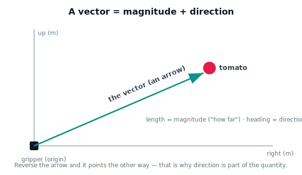

!!! abstract "You are here"
    **Module 1 — Mathematical Foundations**  ·  **Unit 2 — Vectors**  ·  **Lesson 2.1 — What Is a Vector?**

# Lesson 2.1 — What Is a Vector?

> In Unit 1 we found quantities that one number couldn't hold — the ones that need a direction. This lesson gives them their tool: the vector.

---

## 1. Why This Matters

The greenhouse robot's whole job reduces to one question: *where is the fruit, relative to my gripper, and which way do I move to reach it?* "Where, relative to" and "which way" are not scalar ideas — a single number can't express "0.4 meters, up and to the left." The robot needs an object that bundles **how far** and **which direction** into one quantity it can store, combine, and compute with. That object is the **vector**, and almost everything in robotics — positions, velocities, forces, the transformations of later modules — is built on it. Get vectors right here and the rest of the curriculum has a foundation; get them vague and every later topic wobbles.

## 2. Physical Intuition

Stand at the robot's base and point at a tomato. Your arm does two things at once: it points in a **direction**, and the tomato is some **distance** away along that direction. Together those describe a vector — an arrow from you to the tomato.

That's the mental image to keep: **a vector is an arrow.** Its length is the magnitude (how much), and the way it points is the direction (which way). A scalar like temperature has no arrow — there's nothing to point at. A displacement, a velocity, a "from here to there" — those are arrows. The arrow doesn't care about fancy notation yet; it's a physical thing you could draw in the greenhouse with a laser pointer and a tape measure.

## 3. Mathematical Foundations

A **vector** is a quantity defined by a **magnitude** and a **direction**. We write vectors in bold ($\mathbf{v}$) or with an arrow ($\vec{v}$), to distinguish them from scalars.

Two vectors are **equal** if they have the same magnitude and the same direction — *regardless of where they are drawn.* An arrow representing "0.3 m to the right" means the same thing whether it starts at the robot's base or at its elbow. (This "free vector" idea becomes important the moment we have multiple frames in Unit 3.)

A special, central case: a **position vector** points from a chosen origin to a point. If we put the origin at the robot's base, the tomato's position is the vector from the base to the tomato. This is the bridge between "a vector is an arrow" and "a vector tells the robot where something is." Position, displacement, velocity, and force are all vectors; mass, time, and temperature are not (Lesson 1.3).

## 4. Visual Explanation

<figure markdown>
  { width="680" }
</figure>

## 5. Engineering Example

A robot's motion command is rarely "go to coordinate X" at the lowest level — it's often "move *this way* by *this much*," a displacement vector. When the greenhouse arm decides to approach a tomato, it computes a vector from the gripper's current position to the target: that single arrow tells the controller both the direction to move and the distance remaining. As the gripper advances, the vector shrinks; when it reaches zero, the gripper is on target. One vector captures the entire "how far and which way" of the approach — which is why robot software represents positions and motions as vectors rather than loose numbers.

## 6. Worked Example

Describe the arrow from the gripper to a tomato that sits 0.3 m to the right and 0.4 m above the gripper (ignore depth for now, so we work in 2D).

1. The vector has two pieces of information: a horizontal part (0.3 m right) and a vertical part (0.4 m up).
2. As an arrow: it points up-and-to-the-right, and its length is the straight-line distance — by the Pythagorean theorem, $\sqrt{0.3^2 + 0.4^2} = \sqrt{0.25} = 0.5$ m.
3. So this single vector says: "move 0.5 m, heading up-right." (The exact angle and the formal "components" come in Lessons 2.2 and 2.5 — here we just see that one arrow holds it all.)

## 7. Interactive Demonstration

A canvas showing the robot gripper at the origin and a draggable tomato. As the learner drags the tomato, an arrow from gripper to tomato updates live, and a readout shows the arrow's length (magnitude) and heading (direction). Dragging the tomato to the same distance but a different angle keeps the length but changes the direction — making "magnitude vs direction" tangible.

## 8. Coding Exercise

!!! tip "Run the hands-on notebook"
    `modules/module01/notebooks/M01_U02_L2_1_What_Is_A_Vector.ipynb` — open in JupyterLab and run **Kernel → Restart & Run All**.

```python
# A 2D vector from gripper to tomato: (x_right, y_up), in meters.
to_tomato = (0.3, 0.4)

x, y = to_tomato
print(f"Move {x} m right and {y} m up.")
# Straight-line distance (preview of 'magnitude', Lesson 2.5):
print(f"Distance ≈ {(x**2 + y**2) ** 0.5:.2f} m")
```

**Your task:** change the vector so the tomato is 0.6 m left and 0.2 m up (hint: "left" is a negative x). Print the new instruction and distance. Notice you only changed two numbers to describe a completely different arrow.

## 9. Knowledge Check

Formative — unlimited attempts, immediate feedback; does not affect your grade.

<iframe src="../../quizzes/module01/lesson07_quiz.html" title="What Is a Vector? knowledge check" style="width:100%;height:720px;border:1px solid #e2e8f0;border-radius:12px"></iframe>

[Open this quiz in a new tab ↗](../quizzes/module01/lesson07_quiz.html)

1. What two things define a vector?
2. Give two vector quantities and two scalar quantities from the greenhouse robot.
3. Two arrows have the same length and point the same way but are drawn in different places. Are they the same vector?
4. What is a position vector?
5. Why can't a single number describe "move 0.5 m up and to the right"?

## 10. Challenge Problem

A drone (not the greenhouse robot) reports its velocity as "3 m/s, heading north-east, climbing." Explain why this is a vector and how many independent pieces of information it contains. Then argue what would be lost if the drone's software stored only the speed (3 m/s) as a scalar — and relate that loss to a failure the greenhouse robot would suffer if it tracked only distance-to-fruit without direction.

## 11. Common Mistakes

- **Thinking a vector is "just its length."** Drop the direction and you have a scalar — and a robot that moves the right amount the wrong way.
- **Believing a vector lives at a fixed spot.** A (free) vector is defined by magnitude and direction; the same vector can be drawn anywhere.
- **Confusing a point with a position vector.** A point is a location; the position vector is the arrow from the origin to it. The distinction matters once frames appear (Unit 3).
- **Reusing scalar habits.** You can't compare or combine vectors by their numbers alone — that's what the rest of this unit is about.

## 12. Key Takeaways

- A **vector** has both **magnitude** and **direction** — picture it as an arrow.
- Two vectors are equal if length and direction match, wherever they're drawn.
- A **position vector** points from an origin to a point — this is how a robot represents "where."
- Positions, displacements, velocities, and forces are vectors; mass, time, temperature are scalars.
- Vectors are the foundation for everything spatial in this curriculum.

## AI Learning Companion

Copy any prompt below into ChatGPT, Claude, or another AI assistant.

**Tutor prompt** — explain it another way
```
Re-explain Lesson 2.1 (What Is a Vector?) using a real navigation example, not the greenhouse robot. Make the magnitude-and-direction idea concrete and contrast it with a scalar.
```

**Practice prompt** — generate more exercises
```
Give me 6 quick exercises asking whether a quantity is a vector or scalar, and to describe a vector by its magnitude and direction. Include answers.
```

**Explore prompt** — connect it to the real world
```
Show me 3 places in a real robot where position or velocity must be treated as a vector, and what breaks if direction is ignored.
```

## Global Learning Support

Need this lesson explained in another language? Copy one of the prompts below into an AI assistant. English remains the authoritative source.

**Supported languages (initial):** English · Español · 中文 (Simplified Chinese) · Türkçe

**Español**
```
I just completed Lesson 2.1 — What Is a Vector?.
Explain this lesson in Spanish. Keep robotics and mathematical terminology in English when appropriate.
Then provide: a summary, three practice questions, and one challenge problem.
```

**中文 (Simplified Chinese)**
```
I just completed Lesson 2.1 — What Is a Vector?.
Explain this lesson in Simplified Chinese. Keep mathematical notation unchanged.
Then provide: a summary, three practice questions, and one challenge problem.
```

**Türkçe**
```
I just completed Lesson 2.1 — What Is a Vector?.
Explain this lesson in Turkish. Keep robotics terminology in English where commonly used.
Then provide: a summary, three practice questions, and one challenge problem.
```

---

*Next lesson: 2.2 — Vector Representation (turning the arrow into numbers the robot can compute with).*
