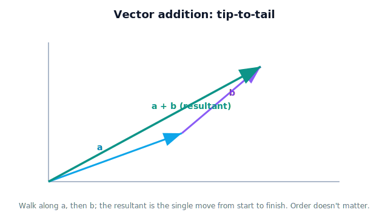

!!! abstract "You are here"
    **Module 1 — Mathematical Foundations**  ·  **Unit 2 — Vectors**  ·  **Lesson 2.3 — Vector Addition**

# Lesson 2.3 — Vector Addition

> A robot arm is a chain of segments, each a displacement. Where the gripper ends up is the sum of those displacements — which is exactly what vector addition computes.

---

## 1. Why This Matters

The greenhouse arm reaches its gripper by chaining links: base to shoulder, shoulder to elbow, elbow to wrist, wrist to gripper. Each link is a displacement vector, and the gripper's position is the **sum** of all of them. Vector addition is therefore not an abstract operation — it is literally how the robot's geometry accumulates from joint to joint. The same operation combines a current position with a commanded move, or a measured displacement with a correction. If you can add vectors fluently, you can reason about where any chain of motions ends up; this is the computational heart of forward kinematics (Module 4), seen here in its simplest form.

## 2. Physical Intuition

Walk 3 steps east, then 4 steps north. Where are you relative to the start? Not 7 steps anywhere — you're at the corner of an L, and the straight-line arrow from start to finish is the **sum** of the two walks.

That's vector addition: lay the second arrow's tail at the first arrow's tip, and the sum is the single arrow from the very first tail to the very last tip. This **tip-to-tail** picture is the intuition to lock in. It captures "do this displacement, then that one, and here's the net result." A robot arm does exactly this, link after link, to place its gripper.

## 3. Mathematical Foundations

**Geometric (tip-to-tail):** to add $\mathbf{a} + \mathbf{b}$, place $\mathbf{b}$'s tail at $\mathbf{a}$'s tip; the sum is the arrow from $\mathbf{a}$'s tail to $\mathbf{b}$'s tip. (Equivalently, the parallelogram rule.)

**By components — just add matching entries:**
$$ \mathbf{a} + \mathbf{b} = \begin{bmatrix} a_x \\ a_y \\ a_z \end{bmatrix} + \begin{bmatrix} b_x \\ b_y \\ b_z \end{bmatrix} = \begin{bmatrix} a_x + b_x \\ a_y + b_y \\ a_z + b_z \end{bmatrix}. $$

This is why components are so powerful (Lesson 2.2): a geometric operation becomes entry-wise arithmetic.

Properties that matter for robotics:
- **Commutative:** $\mathbf{a} + \mathbf{b} = \mathbf{b} + \mathbf{a}$ (order of *adding* doesn't matter — though, note, the order in which a robot *executes* moves can matter once rotations enter, a subtlety for later modules).
- **Associative:** $(\mathbf{a} + \mathbf{b}) + \mathbf{c} = \mathbf{a} + (\mathbf{b} + \mathbf{c})$ — so you can sum a whole chain of links in any grouping.
- Vectors must be in the **same axes/units** to be added (Lessons 1.2, 2.2).

## 4. Visual Explanation

<figure markdown>
  { width="680" }
</figure>

## 5. Engineering Example

Consider a simplified 2-link planar arm. Link 1 extends the displacement $\mathbf{L_1}$ from the base; link 2 extends $\mathbf{L_2}$ from the end of link 1. The gripper's position relative to the base is $\mathbf{L_1} + \mathbf{L_2}$ — a direct vector sum. Add a third link and it's $\mathbf{L_1} + \mathbf{L_2} + \mathbf{L_3}$. This is the seed of **forward kinematics**: given each link's displacement, the gripper position is just the running vector sum. Module 4 will make the link vectors depend on joint angles (via rotation), but the accumulation is this same addition.

## 6. Worked Example

Link 1 of a planar arm gives displacement $\mathbf{L_1} = \begin{bmatrix} 0.4 \\ 0.0 \end{bmatrix}$ m; link 2 gives $\mathbf{L_2} = \begin{bmatrix} 0.1 \\ 0.3 \end{bmatrix}$ m. Find the gripper position relative to the base.

1. Add component-wise: $\mathbf{L_1} + \mathbf{L_2} = \begin{bmatrix} 0.4 + 0.1 \\ 0.0 + 0.3 \end{bmatrix} = \begin{bmatrix} 0.5 \\ 0.3 \end{bmatrix}$ m.
2. Interpret: the gripper is 0.5 m right and 0.3 m up from the base.
3. Tip-to-tail check: start at base, go 0.4 right (end of link 1), then 0.1 right and 0.3 up — landing at (0.5, 0.3). Geometry and arithmetic agree.

## 7. Interactive Demonstration

<iframe src="../../demos/module01/lesson09_vector_addition.html" title="Vector Addition interactive demo" style="width:100%;height:520px;border:1px solid #e2e8f0;border-radius:12px"></iframe>

[Open this demo in a new tab ↗](../demos/module01/lesson09_vector_addition.html)

Two draggable arrows on a grid. The demo always draws them tip-to-tail and shows the resultant arrow plus its components. The learner drags either arrow and watches the sum update. A "swap order" button shows the resultant is unchanged (commutativity), and an "add link 3" button extends the chain into a mini arm whose tip is the running sum.

## 8. Coding Exercise

!!! tip "Run the hands-on notebook"
    `modules/module01/notebooks/M01_U02_L2_3_Vector_Addition.ipynb` — open in JupyterLab and run **Kernel → Restart & Run All**.

```python
def add(a, b):
    return [a[i] + b[i] for i in range(len(a))]

L1 = [0.4, 0.0]
L2 = [0.1, 0.3]
gripper = add(L1, L2)
print(f"Gripper position: {gripper} m")   # [0.5, 0.3]
```

**Your task:** add a third link `L3 = [0.0, 0.2]` and compute the gripper position as `add(add(L1, L2), L3)`. Then compute it grouped the other way and confirm you get the same result (associativity).

## 9. Knowledge Check

Formative — unlimited attempts, immediate feedback; does not affect your grade.

<iframe src="../../quizzes/module01/lesson09_quiz.html" title="Vector Addition knowledge check" style="width:100%;height:720px;border:1px solid #e2e8f0;border-radius:12px"></iframe>

[Open this quiz in a new tab ↗](../quizzes/module01/lesson09_quiz.html)

1. Describe tip-to-tail addition in one sentence.
2. Add $\begin{bmatrix}2\\1\end{bmatrix} + \begin{bmatrix}-1\\3\end{bmatrix}$.
3. What must be true about two vectors before you can add them?
4. How does vector addition relate to a robot arm's links?
5. Is vector addition commutative? What does that mean physically here?

## 10. Challenge Problem

A delivery robot is told to execute three displacements to reach a shelf: $\begin{bmatrix}2\\0\end{bmatrix}$, $\begin{bmatrix}0\\3\end{bmatrix}$, $\begin{bmatrix}-1\\1\end{bmatrix}$ (meters). Find its net displacement, then its straight-line distance from start (preview: magnitude, Lesson 2.5). Finally, argue whether the robot could have reached the same end point with a *single* displacement, and what that implies about the relationship between a path and its net displacement.

## 11. Common Mistakes

- **Adding magnitudes instead of vectors.** "3 east + 4 north" is not 7 of anything; it's the L-shaped resultant (length 5).
- **Adding mismatched representations** — different axes or units. Align first (Lessons 1.2, 2.2).
- **Confusing path length with net displacement.** The sum is the *net* arrow, not the total distance traveled.
- **Mixing component order** during the add. Keep $x$ with $x$, $y$ with $y$.

## 12. Key Takeaways

- **Vector addition chains displacements tip-to-tail**; the sum is the net arrow from first tail to last tip.
- In components, you simply **add matching entries**.
- Addition is **commutative and associative**, so chains of links sum cleanly.
- A robot arm's gripper position is the **sum of its link displacements** — the seed of forward kinematics.
- The sum is *net* displacement, not path length.

## AI Learning Companion

Copy any prompt below into ChatGPT, Claude, or another AI assistant.

**Tutor prompt** — explain it another way
```
Re-explain Lesson 2.3 (Vector Addition) with the tip-to-tail idea, using a delivery-robot path example, and explain what the resultant means physically.
```

**Practice prompt** — generate more exercises
```
Give me 6 vector-addition problems (2D and 3D) with answers, mixing component form and tip-to-tail reasoning.
```

**Explore prompt** — connect it to the real world
```
Show me where a robot adds vectors in practice (combining movements, forces, sensor offsets) and why order does not matter.
```

## Global Learning Support

Need this lesson explained in another language? Copy one of the prompts below into an AI assistant. English remains the authoritative source.

**Supported languages (initial):** English · Español · 中文 (Simplified Chinese) · Türkçe

**Español**
```
I just completed Lesson 2.3 — Vector Addition.
Explain this lesson in Spanish. Keep robotics and mathematical terminology in English when appropriate.
Then provide: a summary, three practice questions, and one challenge problem.
```

**中文 (Simplified Chinese)**
```
I just completed Lesson 2.3 — Vector Addition.
Explain this lesson in Simplified Chinese. Keep mathematical notation unchanged.
Then provide: a summary, three practice questions, and one challenge problem.
```

**Türkçe**
```
I just completed Lesson 2.3 — Vector Addition.
Explain this lesson in Turkish. Keep robotics terminology in English where commonly used.
Then provide: a summary, three practice questions, and one challenge problem.
```

---

*Next lesson: 2.4 — Vector Subtraction (the arrow that points from one place to another — the robot's "where do I aim?").*
