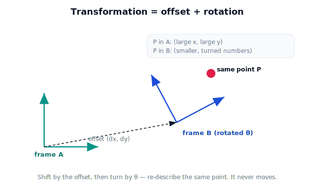

!!! abstract "You are here"
    **Module 1 — Mathematical Foundations**  ·  **Unit 3 — Coordinate Systems & Reference Frames**  ·  **Lesson 3.6 — Conceptual Frame Transformations**

# Lesson 3.6 — Conceptual Frame Transformations

## 1. Why This Matters

This lesson is the bridge. In 3.5 and 3.7 you *saw* one tomato carry different coordinates in different frames. Here you learn the operation that gets you from one frame's numbers to another's — the **frame transformation** — but entirely as intuition: an **offset** (the frames sit at different places) plus a **rotation** (the frames point different ways). No matrices yet; those arrive in Unit 4 as the compact notation for exactly this idea. Get the concept now and the matrix later will feel inevitable rather than mysterious.

Unit 3's question reaches its sharpest form: changing frames is literally changing *who describes* the point.

## 2. Physical Intuition

Two friends stand at different spots, facing different directions, both looking at the same lamp. To translate "the lamp is 2 m ahead and 1 m left of *me*" into your friend's terms, you do two things: account for **where they're standing** versus you (the offset), and **which way they're facing** versus you (the rotation). Apply those two adjustments and you've converted your description into theirs. The lamp never moved.

That is a frame transformation: **shift, then turn** (or turn, then shift) — re-describe the same point from a new viewpoint.

## 3. Mathematical Foundations

Conceptually (no matrices). To express a point known in frame $A$ in the coordinates of frame $B$, you need how $B$ sits relative to $A$: its **offset** $(d_x, d_y)$ and its **rotation** angle $\theta$.

- **Offset only** (axes aligned, $\theta = 0$): subtract the offset, as in 3.5's worked example. $P_B = P_A - d$.
- **Rotation** then re-describes the shifted point along $B$'s turned axes by the angle $\theta$.

We will treat "apply the offset, then account for the rotation" as a two-step recipe and compute it with a small helper, not a matrix. The point: a transformation is **offset + rotation**, nothing more conceptually. Unit 4 will package both into one matrix.

## 4. Visual Explanation

<figure markdown>
  { width="680" }
</figure>

## 5. Engineering Example

The camera reports a tomato in the camera frame. The camera is mounted with an offset and a tilt relative to the robot base. To hand the arm a usable target, the software applies that offset and tilt — a frame transformation — turning camera-frame coordinates into robot-frame coordinates. This single operation is the glue between perception and action; Unit 4 will write it as a matrix, but it *is* the offset-plus-rotation you practice here.

## 6. Worked Example

Frame $B$ is offset from $A$ by $(1.0, 0.5)$ with **no** rotation. A point is at $P_A = (2.0, 1.5)$. Then $P_B = (2.0-1.0,\ 1.5-0.5) = (1.0, 1.0)$.
Now suppose $B$ is also rotated. Conceptually: first shift to $(1.0, 1.0)$ relative to $B$'s origin, then re-read those along $B$'s turned axes (the rotation step). The numbers change again — but the point is still the same physical spot. (The interactive demo lets you turn the rotation up from zero and watch this happen.)

## 7. Interactive Demonstration

<iframe src="../../demos/module01/lesson22_frame_transform.html" title="Conceptual Frame Transformations interactive demo" style="width:100%;height:520px;border:1px solid #e2e8f0;border-radius:12px"></iframe>

[Open this demo in a new tab ↗](../demos/module01/lesson22_frame_transform.html)

Move frame B's offset and rotation with sliders and watch one fixed point's coordinates change in both frames — transformation as something you feel before you write it as math.

## 8. Coding Exercise

!!! tip "Run the hands-on notebook"
    `modules/module01/notebooks/M01_U03_L3_6_Conceptual_Frame_Transformations.ipynb` — open in JupyterLab and run **Kernel → Restart & Run All**.

Implement a conceptual `convert_A_to_B(point, offset, angle)` using offset + rotation (no matrix libraries) and verify the offset-only case matches 3.5.

## 9. Knowledge Check

Formative — unlimited attempts, immediate feedback; does not affect your grade.

<iframe src="../../quizzes/module01/lesson22_quiz.html" title="Conceptual Frame Transformations knowledge check" style="width:100%;height:720px;border:1px solid #e2e8f0;border-radius:12px"></iframe>

[Open this quiz in a new tab ↗](../quizzes/module01/lesson22_quiz.html)

A check that a transformation = offset + rotation, that offset-only is subtraction, and that the point doesn't move.

## 10. Challenge Problem

Explain, in words, why "shift then turn" and "turn then shift" generally give different recipes, using two friends at different positions and orientations. (You don't need matrices — just the intuition.)

## 11. Common Mistakes

- Remembering the offset but forgetting the rotation (or vice versa).
- Thinking new coordinates mean the object moved — it's the frame that changed.
- Assuming the order of shift and turn doesn't matter.

## 12. Key Takeaways

- A frame transformation re-describes a fixed point from a new viewpoint: **offset + rotation**.
- Offset-only conversion is the subtraction you already did in 3.5.
- The point never moves; only its description changes.
- This is the conceptual seed of the matrix transformations in Unit 4.

---

## AI Learning Companion

Copy any prompt below into ChatGPT, Claude, or another AI assistant.

**Tutor prompt** — explain it another way
```
Explain Lesson 3.6 (Conceptual Frame Transformations) using two people at different positions facing different directions describing the same object. Make "offset + rotation" intuitive, with no matrices.
```

**Practice prompt** — generate more exercises
```
Give me 6 exercises converting a point between two frames using offset (and simple rotations like 90 degrees), no matrices, with answers and a sentence each on why the point didn't move.
```

**Explore prompt** — connect it to the real world
```
Show me how a robot converts a camera-frame detection into a robot-frame target using an offset and a tilt, and explain how this becomes a single matrix later.
```

## Global Learning Support

Need this lesson explained in another language? Copy one of the prompts below into an AI assistant. English remains the authoritative source.

**Supported languages (initial):** English · Español · 中文 (Simplified Chinese) · Türkçe

**Español**
```
I just completed Lesson 3.6 — Conceptual Frame Transformations.
Explain this lesson in Spanish. Keep robotics and mathematical terminology in English when appropriate.
Then provide: a summary, three practice questions, and one challenge problem.
```

**中文 (Simplified Chinese)**
```
I just completed Lesson 3.6 — Conceptual Frame Transformations.
Explain this lesson in Simplified Chinese. Keep mathematical notation unchanged.
Then provide: a summary, three practice questions, and one challenge problem.
```

**Türkçe**
```
I just completed Lesson 3.6 — Conceptual Frame Transformations.
Explain this lesson in Turkish. Keep robotics terminology in English where commonly used.
Then provide: a summary, three practice questions, and one challenge problem.
```

---

*Next lesson: 3.8 — Coordinate Frames in Physical AI (Unit 3 recap and the bridge to matrix transformations).*
