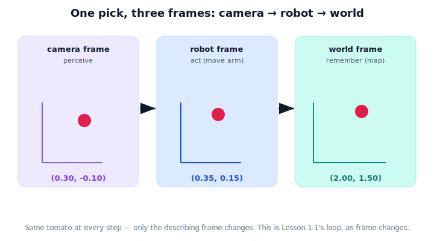

!!! abstract "You are here"
    **Module 1 — Mathematical Foundations**  ·  **Unit 3 — Coordinate Systems & Reference Frames**  ·  **Lesson 3.7 — Robot and Camera Frames**

# Lesson 3.7 — Robot and Camera Frames

## 1. Why This Matters

This is where the unit pays off. A harvesting robot makes a pick by passing one tomato's location *through a chain of frames*: the **camera** sees it, the **robot** base must move the arm to it, and the **world** map remembers it. The fruit never moves — but it is *described* three different ways within a single second of operation. If any handoff between frames is wrong, the arm misses. Seeing all three frames at once, on one pick, is the signature Unit 3 experience.

## 2. Physical Intuition

Watch one pick in slow motion:

1. **Camera frame:** the lens sees a red blob "0.3 m ahead, 0.1 m down." That's the tomato *to the camera*.
2. **Robot frame:** the arm doesn't live at the lens — it's at the base. So the robot re-describes the same tomato relative to its shoulder: "0.35 m forward, 0.15 m up."
3. **World frame:** to log the fruit on the greenhouse map (so it can return later), it re-describes it once more relative to the room corner: "2.0 m east, 1.5 m north."

Three descriptions, one tomato, one moment. **The tomato has not moved — only the observer (frame) changed.** Perception happens in the camera frame; action happens in the robot frame; memory lives in the world frame.

## 3. Mathematical Foundations

Still conceptual (matrices come in Unit 4). Each arrow in the chain is a **frame change**: re-describe the same point from a new origin/orientation.

$$\text{camera frame} \;\to\; \text{robot frame} \;\to\; \text{world frame}$$

Each step uses the offset and orientation between the two frames (the camera's mounting relative to the base; the base's pose relative to the world). You already met one such re-description by hand in Lesson 3.5's worked example. Here the point is the *pipeline*: perception enters in one frame and must be walked, step by step, into the frame where it's needed.

## 4. Visual Explanation

<figure markdown>
  { width="680" }
</figure>

## 5. Engineering Example

The vision system outputs detections in the camera frame — that's all it can know. The motion planner only accepts robot-frame goals — that's where the arm lives. The task scheduler logs picked/unpicked fruit in the world frame — so the plan survives the robot moving. The same tomato flows camera → robot → world, and each subsystem speaks exactly one of these frames. The "glue" that converts between them is the heart of a robot's software.

## 6. Worked Example

Camera sees the tomato at $(0.30, -0.10)$ (camera frame). The camera is mounted 0.05 m ahead and 0.25 m above the robot's base, axes aligned. Robot-frame estimate (offset only): $(0.30+0.05,\; -0.10+0.25) = (0.35, 0.15)$. The robot base is at world $(1.65, 1.35)$, axes aligned with the world: world coordinates $(1.65+0.35,\; 1.35+0.15) = (2.00, 1.50)$. One tomato: camera $(0.30,-0.10)$ → robot $(0.35,0.15)$ → world $(2.00,1.50)$.

## 7. Interactive Demonstration

<iframe src="../../demos/module01/lesson23_robot_camera_frames.html" title="Robot and Camera Frames interactive demo" style="width:100%;height:520px;border:1px solid #e2e8f0;border-radius:12px"></iframe>

[Open this demo in a new tab ↗](../demos/module01/lesson23_robot_camera_frames.html)

Step through a pick and watch the tomato's coordinates in the camera, robot, and world frames all at once. Move the robot or the tomato and see every frame's readout update together — while the world frame stays fixed to the room.

## 8. Coding Exercise

!!! tip "Run the hands-on notebook"
    `modules/module01/notebooks/M01_U03_L3_7_Robot_And_Camera_Frames.ipynb` — open in JupyterLab and run **Kernel → Restart & Run All**.

Implement the camera → robot → world chain for one tomato as two offset steps and print the coordinates at each stage.

## 9. Knowledge Check

Formative — unlimited attempts, immediate feedback; does not affect your grade.

<iframe src="../../quizzes/module01/lesson23_quiz.html" title="Robot and Camera Frames knowledge check" style="width:100%;height:720px;border:1px solid #e2e8f0;border-radius:12px"></iframe>

[Open this quiz in a new tab ↗](../quizzes/module01/lesson23_quiz.html)

A check that perception is camera-frame, action is robot-frame, memory is world-frame, and that a pick is a chain of re-descriptions of one fixed point.

## 10. Challenge Problem

A second camera is added on the arm's wrist. Describe, in words, the new chain of frames a detection from that camera must pass through to become a world-frame map entry, and why the order matters.

## 11. Common Mistakes

- Feeding camera-frame detections directly to the arm (skipping the camera→robot step).
- Forgetting the camera's mounting offset/rotation relative to the base.
- Logging robot-frame coordinates to the map, which become stale the moment the robot moves (log world-frame instead).

## 12. Key Takeaways

- A real pick is a **chain of frames**: camera (perceive) → robot (act) → world (remember).
- Each subsystem speaks one frame; converting between them is the robot's core glue.
- It's the same tomato throughout — only the describing frame changes.
- This is the perception → reasoning → action loop of Lesson 1.1, expressed as frame changes — and the bridge to matrix transformations in Unit 4.

---

## AI Learning Companion

Copy any prompt below into ChatGPT, Claude, or another AI assistant.

**Tutor prompt** — explain it another way
```
Re-explain Lesson 3.7 (Robot and Camera Frames) by walking through one robot pick step by step, showing how the same fruit is described in the camera frame, then the robot frame, then the world frame, and why each subsystem needs its own.
```

**Practice prompt** — generate more exercises
```
Give me 5 exercises tracing one point's coordinates through camera → robot → world using only offsets (no matrices), with answers, in a harvesting-robot context.
```

**Explore prompt** — connect it to the real world
```
Show me how a real pick-and-place or harvesting robot moves a detection from its camera frame to its base frame to a world/map frame, and which software component owns each step.
```

## Global Learning Support

Need this lesson explained in another language? Copy one of the prompts below into an AI assistant. English remains the authoritative source.

**Supported languages (initial):** English · Español · 中文 (Simplified Chinese) · Türkçe

**Español**
```
I just completed Lesson 3.7 — Robot and Camera Frames.
Explain this lesson in Spanish. Keep robotics and mathematical terminology in English when appropriate.
Then provide: a summary, three practice questions, and one challenge problem.
```

**中文 (Simplified Chinese)**
```
I just completed Lesson 3.7 — Robot and Camera Frames.
Explain this lesson in Simplified Chinese. Keep mathematical notation unchanged.
Then provide: a summary, three practice questions, and one challenge problem.
```

**Türkçe**
```
I just completed Lesson 3.7 — Robot and Camera Frames.
Explain this lesson in Turkish. Keep robotics terminology in English where commonly used.
Then provide: a summary, three practice questions, and one challenge problem.
```

---

*Next lesson: 3.2 — Cartesian Coordinates (the formal anatomy of the coordinates we've been reading).*
