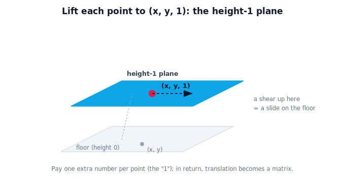

!!! abstract "You are here"
    **Module 2 — Spatial Transformations and SE(3)**  ·  **Unit 2 — Homogeneous Coordinates**  ·  **Lesson 2.1 — The Idea: One Extra Coordinate**

# Lesson 2.1 — The Idea: One Extra Coordinate

## 1. Why This Matters

Unit 1 left us with a precise gap: rotation is a matrix, but translation isn't, because a $2\times2$ matrix always fixes the origin. The fix is almost suspiciously simple — **add one extra coordinate to every point.** With that single addition, translation becomes a matrix multiplication just like rotation, and the robot's constant problem gets one clean tool. This lesson introduces the idea physically before any algebra; the next lessons make it do work.

## 2. Physical Intuition

Imagine your 2D greenhouse floor is actually a slice of a 3D world, sitting at "height 1." Every floor point $(x, y)$ is really the 3D point $(x, y, 1)$. Now here's the trick: a *shear* (a slant) in that higher space — which **is** an origin-fixing linear action up there — looks like a plain **slide** (a translation) when you look only at the height-1 slice. By lifting points up one dimension, the move we couldn't do with a matrix becomes a move we *can* do with a matrix. We pay one extra number per point and get translation-as-a-matrix in return.

You don't have to picture the 3D space to use it. The practical rule is just: **write each point as $(x, y, 1)$** and use slightly bigger matrices. The geometry is the same floor; only the bookkeeping changed.

## 3. Mathematical Foundations

A 2D point $(x, y)$ in **homogeneous coordinates** is written with a third entry equal to 1:

$$(x, y) \;\longrightarrow\; \begin{bmatrix} x \\ y \\ 1 \end{bmatrix}.$$

Transformations become $3\times3$ matrices acting on these 3-vectors. A rotation keeps the bottom row $[0\ 0\ 1]$ and the rotation in the top-left; crucially, a **translation** can now be written as a matrix (Lesson 2.3). The "1" is what lets a matrix add a constant offset — multiply it by the translation entries and it contributes $t_x, t_y$ to the result. Homogeneous coordinates are a **representation** of the same plane, chosen so that translation joins rotation/scaling/reflection as matrix operations.

## 4. Visual Explanation

<figure markdown>
  { width="680" }
</figure>

## 5. Engineering Example

Robotics libraries represent 2D poses with $3\times3$ matrices and 3D poses with $4\times4$ matrices — homogeneous transforms — precisely so a single matrix multiply handles rotation *and* translation together. Every time a robot converts a detection from one frame to another, it's multiplying homogeneous coordinates by a homogeneous transform. The extra coordinate is the small price that makes the whole transform system uniform.

## 6. Worked Example

The point $(2, 3)$ becomes $\begin{bmatrix}2\\3\\1\end{bmatrix}$. Applying the $3\times3$ identity $\begin{bmatrix}1&0&0\\0&1&0\\0&0&1\end{bmatrix}$ returns $\begin{bmatrix}2\\3\\1\end{bmatrix}$ — still $(2,3)$, nothing changed (the identity still does nothing). We've only re-dressed the point; in Lesson 2.3 the same machinery, with a different top-right corner, will *translate* it.

## 7. Interactive Demonstration

**Guided prediction.** Using the lifted-plane figure, predict the homogeneous form of the point (2, 3). Then predict what applying the 3×3 identity returns. Confirm the point is unchanged — you re-dressed its representation without moving it, which is exactly why the geometry is untouched.
## 8. Coding Exercise

!!! tip "Run the hands-on notebook"
    `modules/module02/notebooks/M02_U02_L2_1_The_Idea_One_Extra_Coordinate.ipynb` — open in JupyterLab and run **Kernel → Restart & Run All**.

Write a function that converts a 2D point to homogeneous form (append 1) and back (drop the last entry); confirm round-tripping a few points returns them unchanged.

## 9. Knowledge Check

Formative — unlimited attempts, immediate feedback; does not affect your grade.

<iframe src="../../quizzes/module02/lesson05_quiz.html" title="The Idea: One Extra Coordinate knowledge check" style="width:100%;height:720px;border:1px solid #e2e8f0;border-radius:12px"></iframe>

[Open this quiz in a new tab ↗](../quizzes/module02/lesson05_quiz.html)

A check that a 2D point becomes (x, y, 1), that transforms become 3×3, and that this is a representation of the same plane.

## 10. Challenge Problem

Explain, in your own words, why appending a "1" and using a bigger matrix can express a move that no smaller matrix could — referencing the origin-fixing limit from Lesson 1.3.

## 11. Common Mistakes

- Forgetting the "1" (the point stops behaving like a point under translation).
- Thinking homogeneous coordinates change the geometry — they only change the representation.
- Mixing 2-vectors and 3-vectors in the same computation.

## 12. Key Takeaways

- A 2D point in **homogeneous coordinates** is $(x, y, 1)$.
- Transforms become $3\times3$ matrices acting on these 3-vectors.
- The extra "1" is what lets a **matrix add a translation**.
- It's a representation of the same plane — chosen so translation becomes a matrix.

---

## AI Learning Companion

Copy any prompt below into ChatGPT, Claude, or another AI assistant.

**Tutor prompt** — explain it another way
```
Explain Lesson 2.1 (Module 2) — The Idea: One Extra Coordinate — using the picture of the 2D floor as a height-1 slice of 3D, where a shear above looks like a slide on the floor. Make clear why writing points as (x, y, 1) lets translation become a matrix.
```

**Practice prompt** — generate more exercises
```
Give me 5 exercises converting 2D points to homogeneous form (x, y, 1) and back, and applying the 3x3 identity. Include answers.
```

**Explore prompt** — connect it to the real world
```
Show me how robotics libraries use 3x3 (2D) and 4x4 (3D) homogeneous transforms so one matrix multiply handles rotation and translation together.
```

## Global Learning Support

Need this lesson explained in another language? Copy one of the prompts below into an AI assistant. English remains the authoritative source.

**Supported languages (initial):** English · Español · 中文 (Simplified Chinese) · Türkçe

**Español**
```
I just completed Lesson 2.1 (Module 2) — The Idea: One Extra Coordinate.
Explain this lesson in Spanish. Keep robotics and mathematical terminology in English when appropriate.
Then provide: a summary, three practice questions, and one challenge problem.
```

**中文 (Simplified Chinese)**
```
I just completed Lesson 2.1 (Module 2) — The Idea: One Extra Coordinate.
Explain this lesson in Simplified Chinese. Keep mathematical notation unchanged.
Then provide: a summary, three practice questions, and one challenge problem.
```

**Türkçe**
```
I just completed Lesson 2.1 (Module 2) — The Idea: One Extra Coordinate.
Explain this lesson in Turkish. Keep robotics terminology in English where commonly used.
Then provide: a summary, three practice questions, and one challenge problem.
```

---

*Next lesson: 2.2 — Points vs Directions (what the extra coordinate means: 1 vs 0).*
