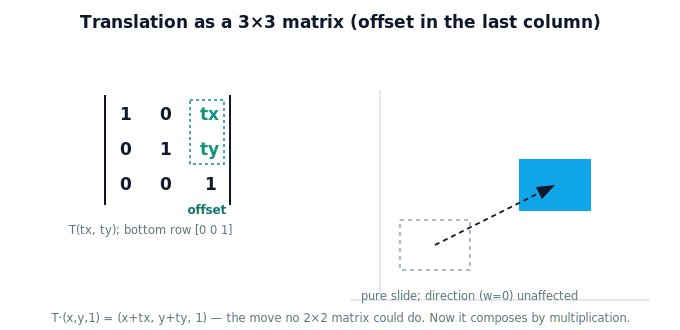

!!! abstract "You are here"
    **Module 2 — Spatial Transformations and SE(3)**  ·  **Unit 2 — Homogeneous Coordinates**  ·  **Lesson 2.3 — Translation as a Matrix**

# Lesson 2.3 — Translation as a Matrix

## 1. Why This Matters

This is the payoff of the unit. The move a robot needs most — sliding a location from one frame's origin to another's — finally becomes a **matrix**. Once translation is a matrix, it lives in the same world as rotation and scaling: you can multiply it, chain it, invert it, and apply it to many points at once. The "constant problem" from Unit 1 now has a uniform tool. This is the moment Module 1's missing piece clicks into place.

## 2. Physical Intuition

Recall the trick: write each point as $(x, y, 1)$. A translation matrix is the identity with the **offset tucked into the last column**. When you multiply, that last column gets multiplied by the point's "1" — so the offset is *added*. The shape slides bodily across the floor; nothing rotates or resizes. It feels like exactly what it is: pick up the whole plane and set it down somewhere else — now expressible as one matrix multiply.

## 3. Mathematical Foundations

The 2D homogeneous **translation matrix** by $(t_x, t_y)$:

$$T(t_x, t_y) = \begin{bmatrix} 1 & 0 & t_x \\ 0 & 1 & t_y \\ 0 & 0 & 1 \end{bmatrix}, \qquad
T\begin{bmatrix}x\\y\\1\end{bmatrix} = \begin{bmatrix} x + t_x \\ y + t_y \\ 1 \end{bmatrix}.$$

The offset sits in the last column; the bottom row stays $[0\ 0\ 1]$. Because it's a matrix, translation now **composes by multiplication** with rotation $R$ (also written $3\times3$, rotation in the top-left, last column zero): $T\,R$ and $R\,T$ are both single matrices — and, as in Module 1, generally different (order matters). For a direction ($w=0$) the offset multiplies by 0, so translation leaves directions unchanged — consistent with Lesson 2.2.

## 4. Visual Explanation

<figure markdown>
  { width="680" }
</figure>

## 5. Engineering Example

The camera-to-arm offset (0.05 m back, 0.25 m down) becomes a translation matrix; the camera's tilt becomes a rotation matrix; their product is the single homogeneous transform that converts any camera-frame detection into the arm frame. That product is precomputed once and applied to every detected point — the uniform "one matrix multiply" the transform system relies on.

## 6. Worked Example

Translate $(2, 3)$ by $(5, -1)$:
$$T(5,-1)\begin{bmatrix}2\\3\\1\end{bmatrix} = \begin{bmatrix}1&0&5\\0&1&-1\\0&0&1\end{bmatrix}\begin{bmatrix}2\\3\\1\end{bmatrix} = \begin{bmatrix}7\\2\\1\end{bmatrix} = (7, 2).$$
The same offset applied to a direction $\begin{bmatrix}2\\3\\0\end{bmatrix}$ returns $\begin{bmatrix}2\\3\\0\end{bmatrix}$ — unchanged, as it must be.

## 7. Interactive Demonstration

<iframe src="../../demos/module02/lesson07_translation_matrix.html" title="Translation as a Matrix interactive demo" style="width:100%;height:520px;border:1px solid #e2e8f0;border-radius:12px"></iframe>

[Open this demo in a new tab ↗](../demos/module02/lesson07_translation_matrix.html)

Switch a point between a plain 2×2 (which can't move the origin) and the homogeneous 3×3 translation (which can); drag the offset and watch the matrix's last column and the point move together — while a direction arrow stays put.

## 8. Coding Exercise

!!! tip "Run the hands-on notebook"
    `modules/module02/notebooks/M02_U02_L2_3_Translation_As_A_Matrix.ipynb` — open in JupyterLab and run **Kernel → Restart & Run All**.

Build $T(t_x, t_y)$ as a 3×3 NumPy matrix, apply it to homogeneous points and directions, and confirm points translate while directions don't.

## 9. Knowledge Check

Formative — unlimited attempts, immediate feedback; does not affect your grade.

<iframe src="../../quizzes/module02/lesson07_quiz.html" title="Translation as a Matrix knowledge check" style="width:100%;height:720px;border:1px solid #e2e8f0;border-radius:12px"></iframe>

[Open this quiz in a new tab ↗](../quizzes/module02/lesson07_quiz.html)

A check that translation is a 3×3 matrix with the offset in the last column, that it slides points, and that it now composes by multiplication.

## 10. Challenge Problem

Show by multiplying matrices that "translate then translate" is itself a translation (add the offsets), and that a translation composed with a rotation is a single matrix that both turns and moves.

## 11. Common Mistakes

- Putting the offset in the wrong place (it goes in the **last column**, not the bottom row).
- Dropping the bottom row $[0\ 0\ 1]$ (the result stops being a valid homogeneous transform).
- Applying translation to a direction ($w=0$) and expecting it to move (it won't — correctly).

## 12. Key Takeaways

- Translation is now a **matrix**: $T(t_x,t_y)$ with the offset in the last column.
- $T(x,y,1) = (x+t_x,\ y+t_y,\ 1)$ — a pure slide.
- Because it's a matrix, translation **composes by multiplication** with rotation/scaling (order matters).
- This closes Module 1's gap — rotation *and* translation now live in one matrix world.

---

## AI Learning Companion

Copy any prompt below into ChatGPT, Claude, or another AI assistant.

**Tutor prompt** — explain it another way
```
Explain Lesson 2.3 (Module 2) — Translation as a Matrix — by showing the 3x3 translation matrix with the offset in the last column and how multiplying it by (x, y, 1) adds the offset. Make clear why this is the move no 2x2 matrix could do.
```

**Practice prompt** — generate more exercises
```
Give me 6 exercises building and applying 3x3 homogeneous translation matrices to points and directions, and composing two translations. Include answers.
```

**Explore prompt** — connect it to the real world
```
Show me how a robot turns a camera-to-arm offset and tilt into translation and rotation matrices, multiplies them into one transform, and applies it to every detection.
```

## Global Learning Support

Need this lesson explained in another language? Copy one of the prompts below into an AI assistant. English remains the authoritative source.

**Supported languages (initial):** English · Español · 中文 (Simplified Chinese) · Türkçe

**Español**
```
I just completed Lesson 2.3 (Module 2) — Translation as a Matrix.
Explain this lesson in Spanish. Keep robotics and mathematical terminology in English when appropriate.
Then provide: a summary, three practice questions, and one challenge problem.
```

**中文 (Simplified Chinese)**
```
I just completed Lesson 2.3 (Module 2) — Translation as a Matrix.
Explain this lesson in Simplified Chinese. Keep mathematical notation unchanged.
Then provide: a summary, three practice questions, and one challenge problem.
```

**Türkçe**
```
I just completed Lesson 2.3 (Module 2) — Translation as a Matrix.
Explain this lesson in Turkish. Keep robotics terminology in English where commonly used.
Then provide: a summary, three practice questions, and one challenge problem.
```

---

*Next lesson: 2.4 — Rotation + Translation in One Matrix.*
