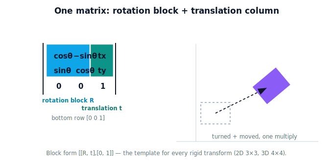

!!! abstract "You are here"
    **Module 2 — Spatial Transformations and SE(3)**  ·  **Unit 2 — Homogeneous Coordinates**  ·  **Lesson 2.4 — Rotation and Translation in One Matrix**

# Lesson 2.4 — Rotation and Translation in One Matrix

## 1. Why This Matters

Rotation was a matrix (Module 1). Translation is now a matrix (2.3). The whole point of homogeneous coordinates is that they live in the **same** matrix world — so we can put **both in one matrix**. That single object, "turn by this much and move by that much," is precisely what a frame change is, and precisely what a **pose** is. This lesson assembles it; Unit 3 names it **SE(2)**.

## 2. Physical Intuition

A frame change from camera to arm is "the camera is tilted *and* offset from the arm." Tilt is a rotation; offset is a translation. Rather than carry two separate operations, we pack them into one matrix: the top-left corner does the turning, the last column does the moving, and one multiply applies both. Reading such a matrix is easy once you know where to look — **upper-left = how it turns, last column = where it moves.**

## 3. Mathematical Foundations

The combined 2D homogeneous transform (rotation by $\theta$, then translation by $(t_x, t_y)$):

$$M = \begin{bmatrix} \cos\theta & -\sin\theta & t_x \\ \sin\theta & \cos\theta & t_y \\ 0 & 0 & 1 \end{bmatrix}
= \begin{bmatrix} R & \mathbf{t} \\ \mathbf{0}^\top & 1 \end{bmatrix}.$$

The $2\times2$ **rotation block** $R$ is the upper-left; the **translation column** $\mathbf{t}=(t_x,t_y)$ is the last column; the bottom row is $[0\ 0\ 1]$. Applied to a point: $M(x,y,1)^\top$ rotates $(x,y)$ by $\theta$ **and** adds $(t_x,t_y)$ — in one multiply. This block structure (rotation block + translation column + $[0\ 0\ 1]$) is the template for every rigid transform in this module, in 2D ($3\times3$) and 3D ($4\times4$).

## 4. Visual Explanation

<figure markdown>
  { width="680" }
</figure>

## 5. Engineering Example

The camera-to-arm transform is exactly this matrix: the camera's tilt fills the rotation block, its mounting offset fills the translation column. One matrix, built once, converts every detection. Stacking such matrices (camera→arm, arm→world) by multiplication gives the camera→world transform — the chain we'll formalize in Units 5 and 7.

## 6. Worked Example

Rotate by $90°$ and translate by $(1, 0)$, applied to $(1, 0)$:
$$M = \begin{bmatrix}0&-1&1\\1&0&0\\0&0&1\end{bmatrix},\quad M\begin{bmatrix}1\\0\\1\end{bmatrix} = \begin{bmatrix}0\cdot1-1\cdot0+1\\1\cdot1+0\cdot0+0\\1\end{bmatrix} = \begin{bmatrix}1\\1\\1\end{bmatrix} = (1,1).$$
The point was rotated $90°$ (to $(0,1)$) and then shifted by $(1,0)$ (to $(1,1)$) — both, in a single multiply. (Order is baked into the matrix; reversing rotation and translation gives a different matrix, per Module 1's order-matters lesson.)

## 7. Interactive Demonstration

**Guided prediction.** Using the block-form matrix above, predict where (1, 0) lands after rotating 90° and translating by (1, 0) in one multiply. Then predict whether translating first and rotating second gives the same point, and identify which part of the matrix would differ.
## 8. Coding Exercise

!!! tip "Run the hands-on notebook"
    `modules/module02/notebooks/M02_U02_L2_4_Rotation_And_Translation_In_One_Matrix.ipynb` — open in JupyterLab and run **Kernel → Restart & Run All**.

Assemble the 3×3 matrix from a rotation angle and a translation vector, apply it to points, and confirm it equals "rotate then translate" done in two steps.

## 9. Knowledge Check

Formative — unlimited attempts, immediate feedback; does not affect your grade.

<iframe src="../../quizzes/module02/lesson08_quiz.html" title="Rotation and Translation in One Matrix knowledge check" style="width:100%;height:720px;border:1px solid #e2e8f0;border-radius:12px"></iframe>

[Open this quiz in a new tab ↗](../quizzes/module02/lesson08_quiz.html)

A check that one 3×3 holds a rotation block + translation column + [0 0 1], and applies both in one multiply.

## 10. Challenge Problem

Build two matrices: rotate-then-translate vs translate-then-rotate (same angle and offset). Apply each to a point, show the results differ, and point to which part of each matrix ended up different.

## 11. Common Mistakes

- Swapping the rotation block and translation column placement.
- Assuming rotate-then-translate equals translate-then-rotate (it doesn't).
- Forgetting the bottom row $[0\ 0\ 1]$, which keeps it a valid homogeneous transform.

## 12. Key Takeaways

- One $3\times3$ homogeneous matrix holds **rotation (upper-left) + translation (last column)**.
- Applying it rotates and offsets a point in a **single multiply**.
- The block form $\begin{bmatrix}R&\mathbf{t}\\\mathbf{0}^\top&1\end{bmatrix}$ is the template for all rigid transforms (2D and 3D).
- This combined matrix is the seed of **SE(2)** (Unit 3) and the way poses are represented.

---

## AI Learning Companion

Copy any prompt below into ChatGPT, Claude, or another AI assistant.

**Tutor prompt** — explain it another way
```
Explain Lesson 2.4 (Module 2) — Rotation and Translation in One Matrix — by showing where the rotation block and translation column live in a 3x3 homogeneous matrix and how one multiply turns and moves a point. Use a camera-to-arm tilt+offset example.
```

**Practice prompt** — generate more exercises
```
Give me 6 exercises assembling 3x3 matrices from a rotation angle and translation vector, applying them to points, and comparing rotate-then-translate vs translate-then-rotate. Include answers.
```

**Explore prompt** — connect it to the real world
```
Show me how a camera-to-arm transform fills the rotation block with the camera tilt and the translation column with the mounting offset, and how chaining such matrices gives camera-to-world.
```

## Global Learning Support

Need this lesson explained in another language? Copy one of the prompts below into an AI assistant. English remains the authoritative source.

**Supported languages (initial):** English · Español · 中文 (Simplified Chinese) · Türkçe

**Español**
```
I just completed Lesson 2.4 (Module 2) — Rotation and Translation in One Matrix.
Explain this lesson in Spanish. Keep robotics and mathematical terminology in English when appropriate.
Then provide: a summary, three practice questions, and one challenge problem.
```

**中文 (Simplified Chinese)**
```
I just completed Lesson 2.4 (Module 2) — Rotation and Translation in One Matrix.
Explain this lesson in Simplified Chinese. Keep mathematical notation unchanged.
Then provide: a summary, three practice questions, and one challenge problem.
```

**Türkçe**
```
I just completed Lesson 2.4 (Module 2) — Rotation and Translation in One Matrix.
Explain this lesson in Turkish. Keep robotics terminology in English where commonly used.
Then provide: a summary, three practice questions, and one challenge problem.
```

---

*Next lesson: 2.5 — Homogeneous Coordinates in Physical AI (Unit 2 recap).*
