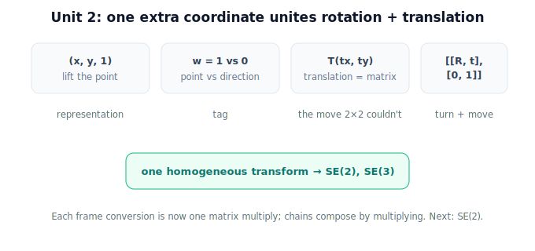

!!! abstract "You are here"
    **Module 2 — Spatial Transformations and SE(3)**  ·  **Unit 2 — Homogeneous Coordinates**  ·  **Lesson 2.5 — Homogeneous Coordinates in Physical AI (Unit 2 Recap)**

# Lesson 2.5 — Homogeneous Coordinates in Physical AI (Unit 2 Recap)

*A short synthesis — no new mathematics. It ties Unit 2 together and names what comes next.*

---

## The one idea, paid off

Unit 1 left a gap: rotation was a matrix, translation wasn't. Unit 2 closed it with a single move:

> **Add one coordinate — write points as $(x, y, 1)$ — and translation becomes a matrix too. Now rotation and translation live in one matrix.**

That single homogeneous transform is the representation real robots use to carry pose between frames, thousands of times a second.

## What Unit 2 established

| Lesson | Point |
|---|---|
| 2.1 One Extra Coordinate | Write points as $(x, y, 1)$; transforms become $3\times3$. The extra "1" enables translation. |
| 2.2 Points vs Directions | $w=1$ = point (translates); $w=0$ = direction (doesn't). The same transform treats both correctly. |
| 2.3 Translation as a Matrix | $T(t_x,t_y)$ puts the offset in the last column — the move no $2\times2$ could do. |
| 2.4 Rotation + Translation | One $3\times3$ holds a rotation block + translation column + $[0\ 0\ 1]$ — turn and move together. |

The block form $\begin{bmatrix}R & \mathbf{t}\\ \mathbf{0}^\top & 1\end{bmatrix}$ is the template for every rigid transform in this module.

## Why this solves the robot's constant problem

The robot must carry **pose** between **offset, rotated frames**, over and over (Unit 1). Homogeneous transforms make each such conversion **one matrix multiply**, and chains of conversions (camera→arm→world) compose by multiplying matrices. The representation is uniform, composable, and invertible — exactly what the constant problem demanded.

## What comes next

Units 3 and 4 give this template its proper names: **SE(2)** (rigid motion in the plane, $3\times3$) and **SE(3)** (rigid motion in 3D, $4\times4$). Unit 5 composes them into chains; Unit 6 reads them as **poses**; Unit 7 applies them to the camera→robot→world pipeline.

## Visual Explanation

<figure markdown>
  { width="680" }
</figure>

## Coding Exercise

!!! tip "Run the hands-on notebook"
    `modules/module02/notebooks/M02_U02_L2_5_Homogeneous_Coordinates_In_Physical_AI_Unit_2_Recap.ipynb` — open in JupyterLab and run **Kernel → Restart & Run All**.

A short capstone: chain two combined homogeneous transforms by multiplication and apply to a point; confirm a direction keeps w = 0.

## Knowledge Check

Formative — unlimited attempts, immediate feedback; does not affect your grade.

<iframe src="../../quizzes/module02/lesson09_quiz.html" title="Homogeneous Coordinates in Physical AI (Unit 2 Recap) knowledge check" style="width:100%;height:720px;border:1px solid #e2e8f0;border-radius:12px"></iframe>

[Open this quiz in a new tab ↗](../quizzes/module02/lesson09_quiz.html)

A brief consolidation quiz across Unit 2 (formative — unlimited attempts).

## Key Takeaways
- $w$ distinguishes **points** (translate) from **directions** (don't).
- **Translation is now a matrix**, so rotation + translation combine into one transform.
- This is the representation behind **SE(2)/SE(3)** and the robot's whole transform system.

---

## AI Learning Companion

Copy any prompt below into ChatGPT, Claude, or another AI assistant.

**Tutor prompt** — explain it another way
```
Summarize Unit 2 of Module 2 as one story: how adding a single coordinate (x, y, 1) makes translation a matrix, distinguishes points from directions, and lets rotation and translation combine into one homogeneous transform.
```

**Practice prompt** — generate more exercises
```
Give me a 10-question mixed review of homogeneous coordinates: points vs directions, building translation matrices, and combining rotation + translation in one 3x3. Include answers.
```

**Explore prompt** — connect it to the real world
```
Show me how a robot's transform system uses homogeneous matrices to carry pose between camera, arm, and world frames, and why one matrix multiply per conversion matters.
```

## Global Learning Support

Need this lesson explained in another language? Copy one of the prompts below into an AI assistant. English remains the authoritative source.

**Supported languages (initial):** English · Español · 中文 (Simplified Chinese) · Türkçe

**Español**
```
I just completed Lesson 2.5 (Module 2) — Homogeneous Coordinates in Physical AI (Unit 2 Recap).
Explain this lesson in Spanish. Keep robotics and mathematical terminology in English when appropriate.
Then provide: a summary, three practice questions, and one challenge problem.
```

**中文 (Simplified Chinese)**
```
I just completed Lesson 2.5 (Module 2) — Homogeneous Coordinates in Physical AI (Unit 2 Recap).
Explain this lesson in Simplified Chinese. Keep mathematical notation unchanged.
Then provide: a summary, three practice questions, and one challenge problem.
```

**Türkçe**
```
I just completed Lesson 2.5 (Module 2) — Homogeneous Coordinates in Physical AI (Unit 2 Recap).
Explain this lesson in Turkish. Keep robotics terminology in English where commonly used.
Then provide: a summary, three practice questions, and one challenge problem.
```

---

*Next: Unit 3 — SE(2) Transformations (rigid motion in the plane, with inverses).*
