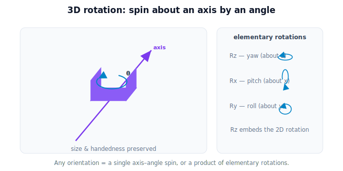

!!! abstract "You are here"
    **Module 2 — Spatial Transformations and SE(3)**  ·  **Unit 4 — SE(3) Transformations**  ·  **Lesson 4.2 — 3D Rotation**

# Lesson 4.2 — 3D Rotation

## 1. Why This Matters

Orientation is the harder half of a 3D pose. In the plane, "which way" was one angle; in space, an object can be turned in far more ways. The clean way to picture any 3D rotation is **an axis to spin about, and an angle to spin by**. Before any matrix, this axis-and-angle picture lets you *see* what a 3D rotation does — which is what you need to reason about a tilted fruit or a slanted camera.

## 2. Physical Intuition

Hold a tomato. You can spin it about a vertical axis (like a top — that's the planar "yaw" you already know), tip it forward/back about a side-to-side axis (pitch), or roll it about a front-to-back axis. Every possible reorientation is *some* single spin about *some* axis by *some* angle — that's the axis–angle picture. The three special cases — rotating about the **x**, **y**, or **z** axis — are the building blocks; more general tilts combine them. Crucially, a rotation never changes the object's size or flips it inside-out: lengths and handedness are preserved.

## 3. Mathematical Foundations

A 3D rotation is a $3\times3$ matrix $R$ that is **orthogonal** ($R^\top R = I$) with $\det R = +1$ — it preserves all lengths and angles and does not reflect (preserves handedness). The elementary rotations by angle $\theta$ about each axis:

$$R_z = \begin{bmatrix} \cos\theta & -\sin\theta & 0 \\ \sin\theta & \cos\theta & 0 \\ 0 & 0 & 1 \end{bmatrix},\;
R_x = \begin{bmatrix} 1 & 0 & 0 \\ 0 & \cos\theta & -\sin\theta \\ 0 & \sin\theta & \cos\theta \end{bmatrix},\;
R_y = \begin{bmatrix} \cos\theta & 0 & \sin\theta \\ 0 & 1 & 0 \\ -\sin\theta & 0 & \cos\theta \end{bmatrix}.$$

Notice $R_z$ leaves $z$ untouched — it *is* the 2D rotation from Module 1, embedded in 3D (the planar case is just "rotation about the vertical axis"). Any orientation can be reached by an axis–angle rotation, or by composing elementary ones (their product is another rotation matrix). We keep the emphasis on the geometric picture; the matrices are the bookkeeping.

## 4. Visual Explanation

<figure markdown>
  { width="680" }
</figure>

## 5. Engineering Example

The gripper must match a fruit's orientation: if the tomato hangs tilted forward, the gripper rotates about a horizontal axis to meet it; if the stem is rotated around, the gripper yaws to align. The camera, mounted at a tilt, has its own 3D rotation relative to the arm. Each is a $3\times3$ rotation; the robot composes them to align tool with target.

## 6. Worked Example

Rotate the point $(1, 0, 0)$ by $90°$ about the **z**-axis: $R_z(90°)(1,0,0)^\top = (0, 1, 0)$ — it swung in the x–y plane, $z$ unchanged, exactly like the 2D case. Now rotate $(0, 1, 0)$ by $90°$ about the **x**-axis: $R_x(90°)(0,1,0)^\top = (0, 0, 1)$ — the point tipped up out of the floor plane. Same length (1) before and after; only the direction changed.

## 7. Interactive Demonstration

**Guided prediction.** Picture the point $(1, 0, 0)$. Predict where it lands after a $90°$ rotation about the z-axis, then about the y-axis. For each, predict which coordinate stays fixed (the one on the rotation axis). Confirm that the distance from the origin is unchanged in every case — rotations preserve length.

## 8. Coding Exercise

!!! tip "Run the hands-on notebook"
    `modules/module02/notebooks/M02_U04_L4_2_3D_Rotation.ipynb` — open in JupyterLab and run **Kernel → Restart & Run All**.

Implement `Rz`, `Rx`, `Ry` as 3×3 matrices; rotate a few points and assert lengths are preserved and the on-axis coordinate is unchanged.

## 9. Knowledge Check

Formative — unlimited attempts, immediate feedback; does not affect your grade.

<iframe src="../../quizzes/module02/lesson16_quiz.html" title="3D Rotation knowledge check" style="width:100%;height:720px;border:1px solid #e2e8f0;border-radius:12px"></iframe>

[Open this quiz in a new tab ↗](../quizzes/module02/lesson16_quiz.html)

A check that 3D rotation = axis + angle, is a 3×3 orthogonal matrix (det +1), preserves length/handedness, and that Rz embeds the 2D rotation.

## 10. Challenge Problem

Explain why rotating about the z-axis leaves the z-coordinate unchanged but rotating about the x-axis does not, by looking at which row/column of each matrix is the identity. Then argue why every rotation matrix must preserve length.

## 11. Common Mistakes

- Treating 3D orientation as a single angle (it isn't).
- Forgetting which coordinate a given axis-rotation leaves fixed.
- Allowing $\det R = -1$ (that's a reflection, not a rotation).

## 12. Key Takeaways

- A 3D rotation is **a spin about an axis by an angle**.
- It's a $3\times3$ **orthogonal** matrix with $\det = +1$: preserves lengths, angles, and handedness.
- Elementary rotations $R_x, R_y, R_z$ are the building blocks; $R_z$ embeds the 2D rotation.
- General orientations combine these — the geometric axis–angle picture is the intuition.

---

## AI Learning Companion

Copy any prompt below into ChatGPT, Claude, or another AI assistant.

**Tutor prompt** — explain it another way
```
Explain Lesson 4.2 (Module 2) — 3D Rotation — using the axis-and-angle picture (spin a tomato about an axis by an angle). Cover the three elementary rotations (x, y, z) and why rotation preserves size and handedness.
```

**Practice prompt** — generate more exercises
```
Give me 6 exercises rotating 3D points about the x, y, or z axis by 90°, predicting which coordinate stays fixed and confirming length is preserved. Include answers.
```

**Explore prompt** — connect it to the real world
```
Show me how a gripper rotates about an axis to match a tilted fruit's orientation, and how a tilted camera's 3D rotation relates to the arm.
```

## Global Learning Support

Need this lesson explained in another language? Copy one of the prompts below into an AI assistant. English remains the authoritative source.

**Supported languages (initial):** English · Español · 中文 (Simplified Chinese) · Türkçe

**Español**
```
I just completed Lesson 4.2 (Module 2) — 3D Rotation.
Explain this lesson in Spanish. Keep robotics and mathematical terminology in English when appropriate.
Then provide: a summary, three practice questions, and one challenge problem.
```

**中文 (Simplified Chinese)**
```
I just completed Lesson 4.2 (Module 2) — 3D Rotation.
Explain this lesson in Simplified Chinese. Keep mathematical notation unchanged.
Then provide: a summary, three practice questions, and one challenge problem.
```

**Türkçe**
```
I just completed Lesson 4.2 (Module 2) — 3D Rotation.
Explain this lesson in Turkish. Keep robotics terminology in English where commonly used.
Then provide: a summary, three practice questions, and one challenge problem.
```

---

*Next lesson: 4.3 — The SE(3) Transformation (4×4 homogeneous form).*
