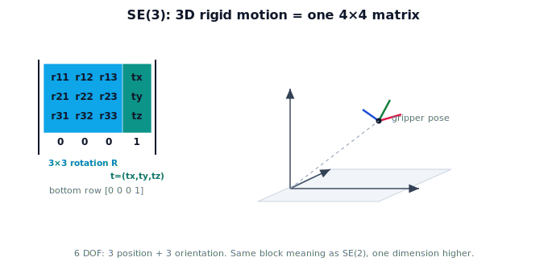

!!! abstract "You are here"
    **Module 2 — Spatial Transformations and SE(3)**  ·  **Unit 4 — SE(3) Transformations**  ·  **Lesson 4.3 — The SE(3) Transformation**

# Lesson 4.3 — The SE(3) Transformation

## 1. Why This Matters

Now we assemble the full tool: 3D rotation (Lesson 4.2) plus a 3D translation, packed into one **4×4 matrix** — **SE(3)**. This single object represents every pose, every frame relationship, every rigid move a robot makes in space. It is the workhorse of real robotics: the camera's pose, the arm's pose, the fruit's pose — all SE(3). If you can read its four blocks, you can read a robot's 3D world.

## 2. Physical Intuition

It's the SE(2) idea with one more dimension. The **upper-left** is now a $3\times3$ rotation (how the object is oriented in space); the **last column** is now a 3-vector (where it is: x, y, z); the **bottom row** is $[0\ 0\ 0\ 1]$. Read an SE(3) matrix the same way you read SE(2): top-left = orientation, right column = position. The matrix grew by a row and a column, but the meaning of each region is unchanged.

## 3. Mathematical Foundations

An **SE(3)** transformation is a $4\times4$ homogeneous matrix:

$$T = \begin{bmatrix} R & \mathbf{t} \\ \mathbf{0}^\top & 1 \end{bmatrix} = \begin{bmatrix} r_{11} & r_{12} & r_{13} & t_x \\ r_{21} & r_{22} & r_{23} & t_y \\ r_{31} & r_{32} & r_{33} & t_z \\ 0 & 0 & 0 & 1 \end{bmatrix},$$

where $R$ is a $3\times3$ rotation ($R^\top R = I$, $\det R = +1$) and $\mathbf{t}=(t_x,t_y,t_z)$ is the translation. It preserves all distances and angles (rigid) and orientation (special). A full 3D pose has **six degrees of freedom**: three for position, three for orientation. The structure is identical to SE(2) with each block bumped up one dimension and the bottom row extended to $[0\ 0\ 0\ 1]$.

## 4. Visual Explanation

<figure markdown>
  { width="680" }
</figure>

## 5. Engineering Example

The camera's mounting on the arm is a fixed SE(3) matrix (a 3D rotation for its tilt, a translation for its offset). The arm's pose in the world is an SE(3) matrix that changes as it moves. A detected fruit's pose is SE(3). The robot's entire spatial bookkeeping — and the camera→robot→world chain coming in Unit 7 — is multiplication of these 4×4 matrices.

## 6. Worked Example

A gripper is at position $(0.4, 0.3, 0.9)$ with no rotation (aligned to the world). Its SE(3) pose:
$$T = \begin{bmatrix} 1 & 0 & 0 & 0.4 \\ 0 & 1 & 0 & 0.3 \\ 0 & 0 & 1 & 0.9 \\ 0 & 0 & 0 & 1 \end{bmatrix}.$$
Now suppose it's also rolled $90°$ about $z$: replace the upper-left block with $R_z(90°)$, keep the same translation column. Orientation lives entirely in the block; position entirely in the column — read each independently.

## 7. Interactive Demonstration

<iframe src="../../demos/module02/lesson17_se3_viewer.html" title="The SE(3) Transformation interactive demo" style="width:100%;height:520px;border:1px solid #e2e8f0;border-radius:12px"></iframe>

[Open this demo in a new tab ↗](../demos/module02/lesson17_se3_viewer.html)

Adjust a 3D rotation (about an axis) and a 3D translation and watch a gripper frame move rigidly in a faux-3D greenhouse scene, with the live 4×4 matrix shown. Rotating changes only the upper-left block; translating changes only the last column — the size and shape of the frame never change, because SE(3) is rigid.

## 8. Coding Exercise

!!! tip "Run the hands-on notebook"
    `modules/module02/notebooks/M02_U04_L4_3_The_SE3_Transformation.ipynb` — open in JupyterLab and run **Kernel → Restart & Run All**.

Write `se3(R, t)` assembling a 4×4 from a 3×3 rotation and a 3-vector; build a pose, read back R and t, and confirm the bottom row is [0 0 0 1].

## 9. Knowledge Check

Formative — unlimited attempts, immediate feedback; does not affect your grade.

<iframe src="../../quizzes/module02/lesson17_quiz.html" title="The SE(3) Transformation knowledge check" style="width:100%;height:720px;border:1px solid #e2e8f0;border-radius:12px"></iframe>

[Open this quiz in a new tab ↗](../quizzes/module02/lesson17_quiz.html)

A check on SE(3) structure: 3×3 rotation block, 3D translation column, [0 0 0 1], and six DOF (3 + 3).

## 10. Challenge Problem

A 4×4 matrix has a valid rotation block and translation column but its bottom row is $[0\ 0\ 1\ 1]$. Explain why it is not a valid SE(3) transform and what the bottom row must always be.

## 11. Common Mistakes

- Putting position in the bottom row instead of the last column.
- Using a non-rotation (scaled/sheared) upper-left block.
- Forgetting the bottom row is $[0\ 0\ 0\ 1]$ (four entries now).

## 12. Key Takeaways

- **SE(3)** = 3D rigid motion as a $4\times4$ matrix.
- Structure: $3\times3$ **rotation block**, 3D **translation column**, bottom row $[0\ 0\ 0\ 1]$.
- A 3D pose has **6 DOF**: 3 position + 3 orientation.
- Same block meaning as SE(2), lifted one dimension — the robot's core spatial tool.

---

## AI Learning Companion

Copy any prompt below into ChatGPT, Claude, or another AI assistant.

**Tutor prompt** — explain it another way
```
Explain Lesson 4.3 (Module 2) — The SE(3) Transformation — as the SE(2) idea with one more dimension: a 4x4 matrix with a 3x3 rotation block, a 3D translation column, and bottom row [0 0 0 1]. Show how to read orientation and position off it.
```

**Practice prompt** — generate more exercises
```
Give me 6 exercises building SE(3) matrices from a rotation and a translation, and reading R and t back, in a greenhouse-robot context. Include answers.
```

**Explore prompt** — connect it to the real world
```
Show me how a camera's mount, an arm's pose, and a fruit's pose are all SE(3) matrices, and why the robot's spatial bookkeeping is 4x4 matrix multiplication.
```

## Global Learning Support

Need this lesson explained in another language? Copy one of the prompts below into an AI assistant. English remains the authoritative source.

**Supported languages (initial):** English · Español · 中文 (Simplified Chinese) · Türkçe

**Español**
```
I just completed Lesson 4.3 (Module 2) — The SE(3) Transformation.
Explain this lesson in Spanish. Keep robotics and mathematical terminology in English when appropriate.
Then provide: a summary, three practice questions, and one challenge problem.
```

**中文 (Simplified Chinese)**
```
I just completed Lesson 4.3 (Module 2) — The SE(3) Transformation.
Explain this lesson in Simplified Chinese. Keep mathematical notation unchanged.
Then provide: a summary, three practice questions, and one challenge problem.
```

**Türkçe**
```
I just completed Lesson 4.3 (Module 2) — The SE(3) Transformation.
Explain this lesson in Turkish. Keep robotics terminology in English where commonly used.
Then provide: a summary, three practice questions, and one challenge problem.
```

---

*Next lesson: 4.4 — Translation Vectors in 3D.*
