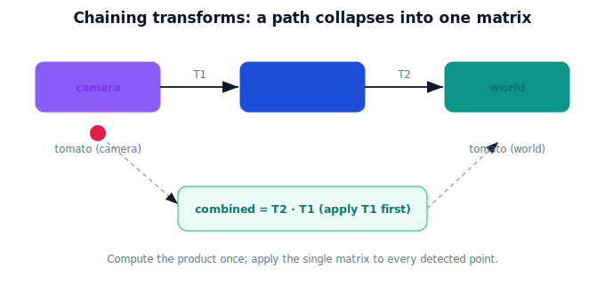

!!! abstract "You are here"
    **Module 2 — Spatial Transformations and SE(3)**  ·  **Unit 5 — Transformation Composition**  ·  **Lesson 5.1 — Chaining Transforms**

# Lesson 5.1 — Chaining Transforms

## 1. Why This Matters

A robot rarely uses one transform alone. A tomato seen by the camera must travel camera → arm → world — three frame changes, one after another. **Composition** is how we chain transforms: do one, then the next, then the next. The beautiful part, inherited from Module 1, is that the whole chain collapses into a **single matrix** you compute once and reuse. This lesson is the engine of the perception-to-pose pipeline coming later.

## 2. Physical Intuition

Think of directions given in stages: "from the camera, the fruit is here; the camera sits there on the arm; the arm sits there in the world." Follow the stages in order and you land on the fruit's place in the world. Each stage is a rigid transform; doing them in sequence is composition. And just as folding three folds into a sheet of paper is still one transformation of the paper, chaining three rigid motions is still one rigid motion — you can bake them into a single matrix and apply it in one step.

## 3. Mathematical Foundations

If transform $A$ then transform $B$ is applied to a point, the result is $B(A\mathbf{p}) = (BA)\mathbf{p}$. So **composition is matrix multiplication**, and the combined transform is the product — written right-to-left in the order applied:

$$T_{\text{chain}} = T_n \cdots T_2\, T_1 \quad (\text{apply } T_1 \text{ first}).$$

For SE(2)/SE(3) elements, the product of rigid motions is again a rigid motion (the rotation blocks multiply to another rotation; the structure is closed), so $T_{\text{chain}}$ is itself SE(2)/SE(3). Compute the product once; apply the single matrix to as many points as you like. This is exactly Module 1's "a matrix is an action, and actions compose" — now with translation included.

## 4. Visual Explanation

<figure markdown>
  { width="680" }
</figure>

## 5. Engineering Example

The robot precomputes the camera→world transform as the product of the fixed camera→arm mount and the current arm→world pose. Every detected point is then converted to the world with one matrix multiply, instead of three. When the arm moves, only that one factor changes; recompute the product and the pipeline keeps running. Composition is what makes the whole chain efficient and uniform.

## 6. Worked Example

$T_1$ rotates $90°$ (no translation); $T_2$ translates by $(2, 0)$ (no rotation). Apply $T_1$ then $T_2$ to $(1, 0)$:
- step by step: $T_1(1,0) = (0,1)$, then $T_2(0,1) = (2,1)$.
- as one matrix: $T_2 T_1$ applied to $(1,0)$ gives $(2,1)$ — same answer.
The product $T_2 T_1$ is a single SE(2) matrix capturing "rotate then move," ready to apply to any point.

## 7. Interactive Demonstration

<iframe src="../../demos/module02/lesson21_composition_chain.html" title="Chaining Transforms interactive demo" style="width:100%;height:520px;border:1px solid #e2e8f0;border-radius:12px"></iframe>

[Open this demo in a new tab ↗](../demos/module02/lesson21_composition_chain.html)

Chain two SE(2) transforms and watch the combined matrix and its effect on a shape; a single arrow shows the net motion equals doing both in sequence. (Reordering is explored in the next lesson.)

## 8. Coding Exercise

!!! tip "Run the hands-on notebook"
    `modules/module02/notebooks/M02_U05_L5_1_Chaining_Transforms.ipynb` — open in JupyterLab and run **Kernel → Restart & Run All**.

Build two SE(2)/SE(3) matrices, compute the product, and confirm that applying the product equals applying the two transforms in sequence to several points.

## 9. Knowledge Check

Formative — unlimited attempts, immediate feedback; does not affect your grade.

<iframe src="../../quizzes/module02/lesson21_quiz.html" title="Chaining Transforms knowledge check" style="width:100%;height:720px;border:1px solid #e2e8f0;border-radius:12px"></iframe>

[Open this quiz in a new tab ↗](../quizzes/module02/lesson21_quiz.html)

A check that composition = applying in sequence = matrix product (right-to-left), and that a chain of rigid motions is rigid.

## 10. Challenge Problem

A pipeline has camera→arm ($T_1$) and arm→world ($T_2$). Write the single transform that sends a camera-frame point to the world, and explain why it is $T_2 T_1$ and not $T_1 T_2$.

## 11. Common Mistakes

- Writing the product in the wrong order (the first-applied transform is on the **right**).
- Assuming the chain isn't rigid (it is — rigid motions are closed under composition).
- Recomputing the whole chain when only one factor changed.

## 12. Key Takeaways

- **Composition** = apply transforms in sequence; the combined effect is their **product**.
- Order in the product is **right-to-left**: $T_2 T_1$ means "apply $T_1$ first."
- A chain of SE(2)/SE(3) motions is **itself** SE(2)/SE(3).
- Precompute the product once; apply the single matrix many times.

---

## AI Learning Companion

Copy any prompt below into ChatGPT, Claude, or another AI assistant.

**Tutor prompt** — explain it another way
```
Explain Lesson 5.1 (Module 2) — Chaining Transforms — using camera → arm → world directions given in stages. Make clear that composition is matrix multiplication (right-to-left) and that the chain collapses into one matrix.
```

**Practice prompt** — generate more exercises
```
Give me 6 exercises composing two SE(2)/SE(3) transforms: compute the product and confirm it equals applying them in sequence to a point. Include answers.
```

**Explore prompt** — connect it to the real world
```
Show me how a robot precomputes the camera→world transform as a product and applies it to every detection with one matrix multiply.
```

## Global Learning Support

Need this lesson explained in another language? Copy one of the prompts below into an AI assistant. English remains the authoritative source.

**Supported languages (initial):** English · Español · 中文 (Simplified Chinese) · Türkçe

**Español**
```
I just completed Lesson 5.1 (Module 2) — Chaining Transforms.
Explain this lesson in Spanish. Keep robotics and mathematical terminology in English when appropriate.
Then provide: a summary, three practice questions, and one challenge problem.
```

**中文 (Simplified Chinese)**
```
I just completed Lesson 5.1 (Module 2) — Chaining Transforms.
Explain this lesson in Simplified Chinese. Keep mathematical notation unchanged.
Then provide: a summary, three practice questions, and one challenge problem.
```

**Türkçe**
```
I just completed Lesson 5.1 (Module 2) — Chaining Transforms.
Explain this lesson in Turkish. Keep robotics terminology in English where commonly used.
Then provide: a summary, three practice questions, and one challenge problem.
```

---

*Next lesson: 5.2 — Order Matters, Revisited.*
