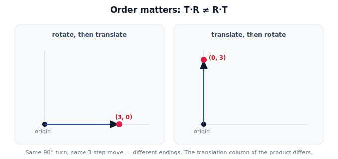

!!! abstract "You are here"
    **Module 2 — Spatial Transformations and SE(3)**  ·  **Unit 5 — Transformation Composition**  ·  **Lesson 5.2 — Order Matters, Revisited**

# Lesson 5.2 — Order Matters, Revisited

## 1. Why This Matters

Module 1 showed that composing transformations is **order-dependent** for rotations and scalings. Now that translation lives in the matrix too, the lesson sharpens: "rotate then move" lands somewhere different from "move then rotate." For a robot, getting the order wrong sends the gripper to the wrong pose — a silent, confident error. Knowing *why* order matters, and how to predict the difference, is essential before building the pipeline.

## 2. Physical Intuition

Stand at the origin facing east. **Option A:** turn left 90° (now facing north), then walk 3 steps — you end up 3 steps *north*. **Option B:** walk 3 steps first (3 steps east), then turn left 90° — you end up 3 steps *east*, just facing north. Same turn, same walk, totally different ending spot. The turn changes which way "forward" points, so doing it before or after the move changes where the move takes you. That's non-commutativity, and it's exactly why $T_2 T_1 \neq T_1 T_2$ in general.

## 3. Mathematical Foundations

Matrix multiplication is **not commutative**: in general $AB \neq BA$. For rigid transforms this shows up most clearly between a rotation $R$ and a translation $T$:

$$T\,R \neq R\,T \quad \text{(in general)}.$$

"Rotate then translate" ($T R$) rotates first, then adds the offset in the *original* axes; "translate then rotate" ($R T$) moves first, then the rotation also spins that offset about the origin. The combined matrices differ in their translation column. (Two pure translations *do* commute — $T_a T_b = T_b T_a$ — and a rotation commutes with itself; non-commutativity bites when rotation and translation mix, or when two rotations are about different axes in 3D.) Always compose in the intended physical order.

## 4. Visual Explanation

<figure markdown>
  { width="680" }
</figure>

## 5. Engineering Example

Building the camera→world chain, the robot must multiply the mount and pose transforms in the physically correct order. Swapping them computes a valid-looking matrix that places fruit in the wrong spot — the arm then reaches confidently to empty air. The same care applies to stacking joint transforms along an arm: each is rigid, but the order is dictated by the physical chain.

## 6. Worked Example

$R = R(90°)$, $T = $ translate $(3, 0)$, applied to the origin $(0,0)$:
- **$T R$** (rotate then translate): rotate $(0,0)\to(0,0)$, then $+(3,0) \to (3, 0)$.
- **$R T$** (translate then rotate): translate $(0,0)\to(3,0)$, then rotate $90° \to (0, 3)$.
Same two operations, results $(3,0)$ vs $(0,3)$ — a different place. The matrices $TR$ and $RT$ differ; only the intended order gives the correct pose.

## 7. Interactive Demonstration

**Guided prediction.** Take a rotation of $90°$ and a translation of $(3, 0)$ applied to the origin. Predict the ending point for "rotate then translate" and for "translate then rotate" *before* computing. Then predict which order a robot should use to place a detection that was measured in a rotated camera frame. Confirm the two orders give different points.

## 8. Coding Exercise

!!! tip "Run the hands-on notebook"
    `modules/module02/notebooks/M02_U05_L5_2_Order_Matters_Revisited.ipynb` — open in JupyterLab and run **Kernel → Restart & Run All**.

Build a rotation and a translation; compute T·R and R·T; apply both to the same points and show the results differ; identify which matrix entries differ (the translation column).

## 9. Knowledge Check

Formative — unlimited attempts, immediate feedback; does not affect your grade.

<iframe src="../../quizzes/module02/lesson22_quiz.html" title="Order Matters, Revisited knowledge check" style="width:100%;height:720px;border:1px solid #e2e8f0;border-radius:12px"></iframe>

[Open this quiz in a new tab ↗](../quizzes/module02/lesson22_quiz.html)

A check that composition is non-commutative, that T·R ≠ R·T in general, and that two pure translations do commute.

## 10. Challenge Problem

Give one case where order does *not* matter (the transforms commute) and one where it clearly does, and explain the difference in terms of whether a rotation is involved.

## 11. Common Mistakes

- Assuming transforms commute (they generally don't once rotation is involved).
- Building a chain in convenient order rather than physical order.
- Forgetting that two pure translations are the commuting exception.

## 12. Key Takeaways

- Composition is **non-commutative**: $T_2 T_1 \neq T_1 T_2$ in general.
- "Rotate then translate" ≠ "translate then rotate" — different ending pose.
- The difference appears in the **translation column** of the product.
- Pure translations commute; mixing rotation and translation (or different-axis rotations) does not.

---

## AI Learning Companion

Copy any prompt below into ChatGPT, Claude, or another AI assistant.

**Tutor prompt** — explain it another way
```
Explain Lesson 5.2 (Module 2) — Order Matters, Revisited — using "turn then walk" vs "walk then turn" from the origin. Make clear why T·R ≠ R·T and where the difference shows up in the matrix.
```

**Practice prompt** — generate more exercises
```
Give me 6 exercises composing a rotation and a translation in both orders, computing the two different endpoints. Include answers.
```

**Explore prompt** — connect it to the real world
```
Show me how getting transform order wrong in a camera→world chain sends a robot arm to the wrong place, and how to keep the physical order correct.
```

## Global Learning Support

Need this lesson explained in another language? Copy one of the prompts below into an AI assistant. English remains the authoritative source.

**Supported languages (initial):** English · Español · 中文 (Simplified Chinese) · Türkçe

**Español**
```
I just completed Lesson 5.2 (Module 2) — Order Matters, Revisited.
Explain this lesson in Spanish. Keep robotics and mathematical terminology in English when appropriate.
Then provide: a summary, three practice questions, and one challenge problem.
```

**中文 (Simplified Chinese)**
```
I just completed Lesson 5.2 (Module 2) — Order Matters, Revisited.
Explain this lesson in Simplified Chinese. Keep mathematical notation unchanged.
Then provide: a summary, three practice questions, and one challenge problem.
```

**Türkçe**
```
I just completed Lesson 5.2 (Module 2) — Order Matters, Revisited.
Explain this lesson in Turkish. Keep robotics terminology in English where commonly used.
Then provide: a summary, three practice questions, and one challenge problem.
```

---

*Next lesson: 5.3 — Frames as a Graph.*
