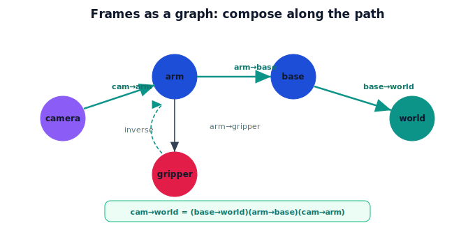

!!! abstract "You are here"
    **Module 2 — Spatial Transformations and SE(3)**  ·  **Unit 5 — Transformation Composition**  ·  **Lesson 5.3 — Frames as a Graph**

# Lesson 5.3 — Frames as a Graph

## 1. Why This Matters

A robot has many frames — world, base, arm, gripper, camera, each detected object. Keeping them straight is easier with one picture: a **graph**, where frames are nodes and the known transforms are edges. To relate any two frames, you walk the path between them, **composing** the edges (and **inverting** any you traverse backward). This is exactly how real robot transform systems work, and it sets up the camera→robot→world pipeline as a path through the graph.

## 2. Physical Intuition

Picture a map of places connected by one-way roads. Each road is a known transform: "camera → arm," "arm → world." If you know the road from A to B, you can also drive B to A — just go in reverse (the inverse). To get from any place to any other, find a path and travel its roads in order, flipping any you take backward. Composition is "drive these roads in sequence"; inversion is "drive this one backward." With the graph in mind, no frame relationship is ever lost — you just trace a route.

## 3. Mathematical Foundations

Let frames be nodes and let a directed edge $A \to B$ carry the transform $T_{B \leftarrow A}$ that re-expresses a point from frame $A$ in frame $B$. To relate frames along a path $A \to B \to C$, **compose**:

$$T_{C \leftarrow A} = T_{C \leftarrow B}\, T_{B \leftarrow A}.$$

To traverse an edge backward, use the **inverse**: $T_{A \leftarrow B} = (T_{B \leftarrow A})^{-1}$. Because each edge is SE(2)/SE(3) and the group is closed under product and inverse, any path yields a valid rigid transform between its endpoints. If two paths connect the same frames, consistent data makes them agree. The subscript convention ($T_{B\leftarrow A}$ reads "B from A") makes the chaining cancel cleanly: $T_{C\leftarrow B}T_{B\leftarrow A}$ — the inner $B$'s match.

## 4. Visual Explanation

<figure markdown>
  { width="680" }
</figure>

## 5. Engineering Example

Robot middleware maintains exactly this graph and answers queries like "give me the gripper pose in the world" by finding the path and composing the edges, inverting where needed — automatically, many times a second. When a new object is detected, it's added as a node hanging off the camera frame; its world pose is then just the camera→world path composed with the detection edge.

## 6. Worked Example

Known edges: $T_{\text{arm}\leftarrow\text{cam}}$ (camera→arm) and $T_{\text{world}\leftarrow\text{arm}}$ (arm→world). A tomato at $\mathbf{p}_{\text{cam}}$ in the camera frame, expressed in the world:
$$\mathbf{p}_{\text{world}} = T_{\text{world}\leftarrow\text{arm}}\, T_{\text{arm}\leftarrow\text{cam}}\; \mathbf{p}_{\text{cam}}.$$
Need the reverse (a world goal in the camera frame)? Travel the path backward with inverses: $T_{\text{cam}\leftarrow\text{world}} = (T_{\text{world}\leftarrow\text{arm}} T_{\text{arm}\leftarrow\text{cam}})^{-1} = T_{\text{arm}\leftarrow\text{cam}}^{-1} T_{\text{world}\leftarrow\text{arm}}^{-1}$.

## 7. Interactive Demonstration

**Guided prediction.** Given edges camera→arm and arm→world, predict the product that takes a camera-frame point to the world, and predict the product that goes world→camera (which edges, in what order, inverted how). Confirm the inner frame names cancel in $T_{C\leftarrow B}T_{B\leftarrow A}$.

## 8. Coding Exercise

!!! tip "Run the hands-on notebook"
    `modules/module02/notebooks/M02_U05_L5_3_Frames_As_A_Graph.ipynb` — open in JupyterLab and run **Kernel → Restart & Run All**.

Represent two edges as SE(3) matrices; compose them along a path to get camera→world; invert the path to get world→camera; confirm world→camera ∘ camera→world is the identity.

## 9. Knowledge Check

Formative — unlimited attempts, immediate feedback; does not affect your grade.

<iframe src="../../quizzes/module02/lesson23_quiz.html" title="Frames as a Graph knowledge check" style="width:100%;height:720px;border:1px solid #e2e8f0;border-radius:12px"></iframe>

[Open this quiz in a new tab ↗](../quizzes/module02/lesson23_quiz.html)

A check that frames are nodes, transforms are edges, paths compose by product, and backward traversal uses the inverse.

## 10. Challenge Problem

Two different paths connect the camera to the world (e.g. via the arm, or via the base). Explain what must be true of the data for both paths to give the same camera→world transform, and what it means if they disagree.

## 11. Common Mistakes

- Composing in an order where the inner frame names don't match (mis-chained subscripts).
- Forgetting to invert an edge traversed backward.
- Assuming a single global frame instead of relationships along a path.

## 12. Key Takeaways

- Frames are **nodes**; transforms are directed **edges**.
- Relate any two frames by **composing along the path** ($T_{C\leftarrow A} = T_{C\leftarrow B}T_{B\leftarrow A}$).
- Traverse an edge backward with its **inverse**.
- This graph view is exactly how robot transform systems answer pose queries.

---

## AI Learning Companion

Copy any prompt below into ChatGPT, Claude, or another AI assistant.

**Tutor prompt** — explain it another way
```
Explain Lesson 5.3 (Module 2) — Frames as a Graph — using places connected by one-way roads (edges = transforms). Make clear how composing along a path relates two frames and how an inverse drives a road backward.
```

**Practice prompt** — generate more exercises
```
Give me 6 exercises building frame graphs and composing transforms along a path (with one inverse) to relate two frames. Include answers.
```

**Explore prompt** — connect it to the real world
```
Show me how robot middleware keeps a frame graph and answers "gripper pose in the world" by composing edges and inverting where needed.
```

## Global Learning Support

Need this lesson explained in another language? Copy one of the prompts below into an AI assistant. English remains the authoritative source.

**Supported languages (initial):** English · Español · 中文 (Simplified Chinese) · Türkçe

**Español**
```
I just completed Lesson 5.3 (Module 2) — Frames as a Graph.
Explain this lesson in Spanish. Keep robotics and mathematical terminology in English when appropriate.
Then provide: a summary, three practice questions, and one challenge problem.
```

**中文 (Simplified Chinese)**
```
I just completed Lesson 5.3 (Module 2) — Frames as a Graph.
Explain this lesson in Simplified Chinese. Keep mathematical notation unchanged.
Then provide: a summary, three practice questions, and one challenge problem.
```

**Türkçe**
```
I just completed Lesson 5.3 (Module 2) — Frames as a Graph.
Explain this lesson in Turkish. Keep robotics terminology in English where commonly used.
Then provide: a summary, three practice questions, and one challenge problem.
```

---

*Next lesson: 5.4 — Composing Rigid Motions (Unit 5 recap).*
