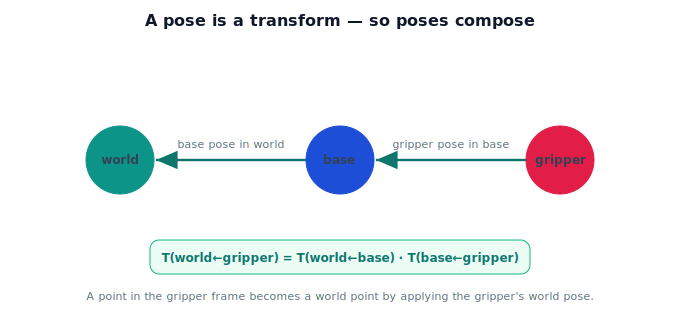

!!! abstract "You are here"
    **Module 2 — Spatial Transformations and SE(3)**  ·  **Unit 6 — Robot Pose Representation**  ·  **Lesson 6.2 — A Pose Is a Transformation**

# Lesson 6.2 — A Pose Is a Transformation

## 1. Why This Matters

Here's the unification that makes everything click: an object's **pose** in a frame *is* a **transform** between frames. "The gripper's pose in the base frame" is the SE(3) transform that converts base coordinates to gripper coordinates (and its inverse goes the other way). This means poses chain by composition exactly like the transforms of Unit 5 — so "gripper in world" is just "gripper in base" composed with "base in world." This is the bridge from pose to the full pipeline.

## 2. Physical Intuition

Saying "the gripper sits *here*, turned *this way*, relative to the base" is the same as giving the recipe to go from the base's coordinates to the gripper's. The pose *is* that recipe. And recipes chain: if you know the gripper relative to the base, and the base relative to the world, you know the gripper relative to the world — just follow both recipes in turn. So tracking where everything is becomes tracking a set of poses and **composing** them along the frame graph from Unit 5.

## 3. Mathematical Foundations

Write $T_{B\leftarrow A}$ for the pose of frame $A$ expressed in frame $B$ — equivalently, the transform taking $A$-coordinates to $B$-coordinates: $\mathbf{p}_B = T_{B\leftarrow A}\,\mathbf{p}_A$. Then poses compose just like transforms:

$$T_{\text{world}\leftarrow \text{gripper}} = T_{\text{world}\leftarrow \text{base}}\; T_{\text{base}\leftarrow \text{gripper}}.$$

A point given in the gripper frame becomes a world point by applying the gripper's world pose. The inverse swaps the roles: $T_{A\leftarrow B} = (T_{B\leftarrow A})^{-1}$ (the base's pose relative to the gripper is the inverse of the gripper's pose relative to the base). Pose = transform is why the Unit 5 machinery (compose along the path, invert backward edges) applies directly to poses.

## 4. Visual Explanation

<figure markdown>
  { width="680" }
</figure>

## 5. Engineering Example

The robot stores each link's pose relative to the previous frame (gripper→base, base→world). To find the gripper in the world, it composes them — exactly the frame-graph path from Unit 5. To bring a world-frame waypoint into the gripper's own frame (to act on it), it uses the inverse. Pose bookkeeping and transform composition are literally the same operation.

## 6. Worked Example

Base pose in world: $T_{w\leftarrow b}$ = translate $(1, 0, 0)$, no rotation. Gripper pose in base: $T_{b\leftarrow g}$ = translate $(0, 0, 0.5)$, no rotation. Gripper pose in world:
$$T_{w\leftarrow g} = T_{w\leftarrow b}\,T_{b\leftarrow g} = \text{translate}(1, 0, 0.5).$$
A point at the gripper's origin $(0,0,0,1)$ in the gripper frame maps to $(1, 0, 0.5)$ in the world — composing the two poses placed it correctly.

## 7. Interactive Demonstration

**Guided prediction.** Given the gripper's pose in the base and the base's pose in the world, predict the product that gives the gripper's pose in the world (which order?). Then predict how you'd express a world-frame target in the gripper's own frame (which inverse?). Confirm the inner frame names cancel.

## 8. Coding Exercise

!!! tip "Run the hands-on notebook"
    `modules/module02/notebooks/M02_U06_L6_2_A_Pose_Is_A_Transformation.ipynb` — open in JupyterLab and run **Kernel → Restart & Run All**.

Represent base→world and gripper→base poses as SE(3) matrices; compose to get gripper→world; carry a gripper-frame point to the world; use the inverse to bring a world point into the gripper frame.

## 9. Knowledge Check

Formative — unlimited attempts, immediate feedback; does not affect your grade.

<iframe src="../../quizzes/module02/lesson26_quiz.html" title="A Pose Is a Transformation knowledge check" style="width:100%;height:720px;border:1px solid #e2e8f0;border-radius:12px"></iframe>

[Open this quiz in a new tab ↗](../quizzes/module02/lesson26_quiz.html)

A check that a pose is the frame-to-frame transform, that poses compose like transforms, and that the inverse swaps the frame roles.

## 10. Challenge Problem

You have gripper→base and base→world. A camera is mounted on the gripper with known camera→gripper. Write the camera→world pose, and the transform that expresses a world goal in the camera frame.

## 11. Common Mistakes

- Composing poses in the wrong order (inner frame labels must match).
- Forgetting that the inverse swaps which frame is the reference.
- Treating pose bookkeeping as separate from transform composition (they're the same).

## 12. Key Takeaways

- An object's **pose** in a frame **is** the transform between those frames.
- Poses **compose** like transforms: $T_{w\leftarrow g} = T_{w\leftarrow b}\,T_{b\leftarrow g}$.
- The **inverse** swaps reference and object frames.
- This is why Unit 5's compose/invert machinery applies directly to poses.

---

## AI Learning Companion

Copy any prompt below into ChatGPT, Claude, or another AI assistant.

**Tutor prompt** — explain it another way
```
Explain Lesson 6.2 (Module 2) — A Pose Is a Transformation — using "recipes" to go from one frame's coordinates to another. Make clear that a pose is the frame-to-frame transform and that poses chain like transforms.
```

**Practice prompt** — generate more exercises
```
Give me 6 exercises composing poses (gripper→base, base→world) to get gripper→world, and using inverses to swap frames. Include answers.
```

**Explore prompt** — connect it to the real world
```
Show me how a robot stores each link's pose relative to the previous frame and composes them to locate the gripper in the world.
```

## Global Learning Support

Need this lesson explained in another language? Copy one of the prompts below into an AI assistant. English remains the authoritative source.

**Supported languages (initial):** English · Español · 中文 (Simplified Chinese) · Türkçe

**Español**
```
I just completed Lesson 6.2 (Module 2) — A Pose Is a Transformation.
Explain this lesson in Spanish. Keep robotics and mathematical terminology in English when appropriate.
Then provide: a summary, three practice questions, and one challenge problem.
```

**中文 (Simplified Chinese)**
```
I just completed Lesson 6.2 (Module 2) — A Pose Is a Transformation.
Explain this lesson in Simplified Chinese. Keep mathematical notation unchanged.
Then provide: a summary, three practice questions, and one challenge problem.
```

**Türkçe**
```
I just completed Lesson 6.2 (Module 2) — A Pose Is a Transformation.
Explain this lesson in Turkish. Keep robotics terminology in English where commonly used.
Then provide: a summary, three practice questions, and one challenge problem.
```

---

*Next lesson: 6.3 — Reading and Writing Poses.*
