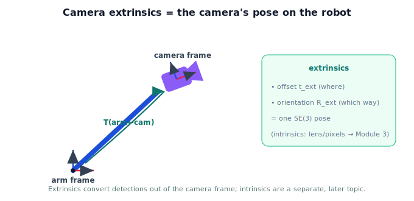

!!! abstract "You are here"
    **Module 2 — Spatial Transformations and SE(3)**  ·  **Unit 7 — Camera-to-Robot Transformations**  ·  **Lesson 7.2 — Camera Extrinsics**

# Lesson 7.2 — Camera Extrinsics

## 1. Why This Matters

Last lesson left one unknown: the camera's pose on the robot. That pose has a name — the camera's **extrinsics** — and it's the single piece of information that links what the camera sees to where the robot can act. Extrinsics are *just a pose* (an SE(3) transform), so everything you learned in Unit 6 applies directly. Naming it and pinning down its meaning is the heart of this unit.

## 2. Physical Intuition

Bolt a camera onto the robot's wrist. Two facts fully describe how it's mounted: **where** it sits relative to the wrist (a few centimeters out and down) and **which way** it points (angled toward the workspace). That "where + which way" is a pose — and because it describes the camera *relative to a robot frame*, we call it the **extrinsics**. It's fixed as long as the camera stays bolted in place (for a wrist camera it moves *with* the wrist, but its pose *relative to the wrist* stays constant). Extrinsics answer "how is the camera placed on the robot?" — nothing about lenses or pixels.

## 3. Mathematical Foundations

The **extrinsics** of a camera are its pose relative to a robot frame, written as an SE(3) transform — for a camera mounted on the arm, $T_{\text{arm}\leftarrow\text{cam}}$:

$$T_{\text{arm}\leftarrow\text{cam}} = \begin{bmatrix} R_{\text{ext}} & \mathbf{t}_{\text{ext}} \\ \mathbf{0}^\top & 1 \end{bmatrix}.$$

Here $\mathbf{t}_{\text{ext}}$ is the camera's position on the arm and $R_{\text{ext}}$ its orientation (which way it looks). This transform takes a point in the camera frame and re-expresses it in the arm frame: $\mathbf{p}_{\text{arm}} = T_{\text{arm}\leftarrow\text{cam}}\,\mathbf{p}_{\text{cam}}$. **Extrinsics = the camera's pose (an SE(3) element).** Contrast **intrinsics** — focal length, image center, lens distortion — which describe how the camera turns 3D points into pixels; those are *not* a pose and are deferred to Module 3. This unit uses extrinsics only.

## 4. Visual Explanation

<figure markdown>
  { width="680" }
</figure>

## 5. Engineering Example

When a camera is installed, a calibration step measures its extrinsics — the SE(3) pose relating it to the mounting frame — and stores it. From then on, the robot uses that fixed transform to convert every detection out of the camera frame. If the camera is bumped and its extrinsics change, detections convert wrong until it's recalibrated. The extrinsics are a single, reusable pose at the front of the pipeline.

## 6. Worked Example

A wrist camera's extrinsics: $\mathbf{t}_{\text{ext}} = (0.0, 0.0, 0.1)$ (10 cm out along the wrist's axis), $R_{\text{ext}} = I$ (aligned with the wrist). Then
$$T_{\text{arm}\leftarrow\text{cam}} = \begin{bmatrix} 1 & 0 & 0 & 0 \\ 0 & 1 & 0 & 0 \\ 0 & 0 & 1 & 0.1 \\ 0 & 0 & 0 & 1 \end{bmatrix}.$$
A tomato at $\mathbf{p}_{\text{cam}} = (0, 0, 0.3)$ (0.3 m in front of the camera) is, in the arm frame, $(0, 0, 0.4)$ — the 10 cm mount offset added to the 0.3 m depth.

## 7. Interactive Demonstration

**Guided prediction.** A wrist camera is mounted 0.1 m out along the wrist axis, aligned with the wrist ($R_{\text{ext}}=I$). For a tomato detected 0.3 m in front of the camera, predict its coordinates in the arm frame. Then predict how the answer changes if the camera were tilted (a non-identity $R_{\text{ext}}$). Confirm the offset and orientation both come from the extrinsics pose.

## 8. Coding Exercise

!!! tip "Run the hands-on notebook"
    `modules/module02/notebooks/M02_U07_L7_2_Camera_Extrinsics.ipynb` — open in JupyterLab and run **Kernel → Restart & Run All**.

Build a camera-extrinsics SE(3) from an offset and orientation; apply it to convert several camera-frame detections into the arm frame; show that changing the extrinsics changes the arm-frame result.

## 9. Knowledge Check

Formative — unlimited attempts, immediate feedback; does not affect your grade.

<iframe src="../../quizzes/module02/lesson30_quiz.html" title="Camera Extrinsics knowledge check" style="width:100%;height:720px;border:1px solid #e2e8f0;border-radius:12px"></iframe>

[Open this quiz in a new tab ↗](../quizzes/module02/lesson30_quiz.html)

A check that extrinsics = the camera's pose on the robot (an SE(3) transform), distinct from intrinsics.

## 10. Challenge Problem

A camera's extrinsics record a translation but an identity rotation. Describe physically how the camera is mounted, and what a non-identity rotation block would mean. Why are intrinsics *not* part of this matrix?

## 11. Common Mistakes

- Confusing extrinsics (pose) with intrinsics (lens/pixel parameters).
- Forgetting the orientation part of extrinsics (it's a full pose, not just an offset).
- Assuming extrinsics never change (a bumped camera needs recalibration).

## 12. Key Takeaways

- **Extrinsics** = the camera's **pose** relative to a robot frame, an SE(3) transform $T_{\text{arm}\leftarrow\text{cam}}$.
- It carries both the mount **offset** and the camera's **orientation**.
- It converts detections from the camera frame into a robot frame.
- **Intrinsics** (lens/pixels/projection) are different and deferred to **Module 3**.

---

## AI Learning Companion

Copy any prompt below into ChatGPT, Claude, or another AI assistant.

**Tutor prompt** — explain it another way
```
Explain Lesson 7.2 (Module 2) — Camera Extrinsics — as the "where + which way" of a camera bolted to the robot: its pose (an SE(3) transform) relative to a robot frame. Contrast extrinsics (pose) with intrinsics (lens/pixels), which come later.
```

**Practice prompt** — generate more exercises
```
Give me 6 exercises building camera-extrinsics SE(3) matrices from a mount offset and orientation, and using them to convert camera-frame detections into the arm frame. Include answers.
```

**Explore prompt** — connect it to the real world
```
Show me what a camera-calibration step measures for extrinsics, why it's stored as a pose, and what goes wrong if the camera is bumped.
```

## Global Learning Support

Need this lesson explained in another language? Copy one of the prompts below into an AI assistant. English remains the authoritative source.

**Supported languages (initial):** English · Español · 中文 (Simplified Chinese) · Türkçe

**Español**
```
I just completed Lesson 7.2 (Module 2) — Camera Extrinsics.
Explain this lesson in Spanish. Keep robotics and mathematical terminology in English when appropriate.
Then provide: a summary, three practice questions, and one challenge problem.
```

**中文 (Simplified Chinese)**
```
I just completed Lesson 7.2 (Module 2) — Camera Extrinsics.
Explain this lesson in Simplified Chinese. Keep mathematical notation unchanged.
Then provide: a summary, three practice questions, and one challenge problem.
```

**Türkçe**
```
I just completed Lesson 7.2 (Module 2) — Camera Extrinsics.
Explain this lesson in Turkish. Keep robotics terminology in English where commonly used.
Then provide: a summary, three practice questions, and one challenge problem.
```

---

*Next lesson: 7.3 — Building the Transformation Chain.*
