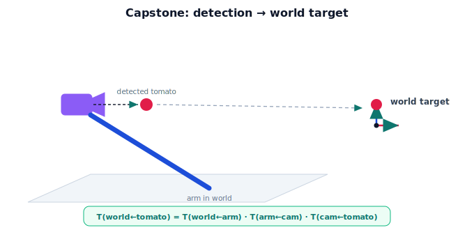

!!! abstract "You are here"
    **Module 2 — Spatial Transformations and SE(3)**  ·  **Unit 8 — Mini Project: Perception-to-Pose Pipeline**  ·  **Lesson 8.1 — The Mini Project: From Detection to Reach**

# Lesson 8.1 — The Mini Project: From Detection to Reach

## 1. Why This Matters

This is the Module 2 capstone — where every idea you've built comes together to answer the driving question: **how does a detected object become a robot pose the arm can reach?** A camera spots a tomato; by the end of this project you'll have turned that detection into a world-frame target pose, verified it numerically, and visualized it. No new theory — just the assembly of coordinate frames, homogeneous coordinates, SE(2)/SE(3), composition, pose, and camera extrinsics into one working pipeline.

## 2. Physical Intuition

Picture the whole act in slow motion: the camera sees a tomato and reports it *in its own view*. You know how the camera is bolted to the arm, and where the arm is in the greenhouse. Reading those facts in order — tomato-in-camera, camera-on-arm, arm-in-world — places the tomato in the world. That world pose is what the planner hands to the arm to reach. The project is exactly this story, made precise: a chain of "who is where relative to whom," composed into a single answer.

## 3. The problem statement

**Given:**
- a **detected tomato pose** in the camera frame, $T_{\text{cam}\leftarrow\text{tomato}}$ (position, and orientation if available);
- the camera's **extrinsics**, $T_{\text{arm}\leftarrow\text{cam}}$ (its fixed pose on the arm);
- the arm's **pose** in the world, $T_{\text{world}\leftarrow\text{arm}}$ (read from the robot).

**Find:** the tomato's pose in the **world** frame, $T_{\text{world}\leftarrow\text{tomato}}$, suitable as a reach target — and verify it.

$$\boxed{\,T_{\text{world}\leftarrow\text{tomato}} = T_{\text{world}\leftarrow\text{arm}}\; T_{\text{arm}\leftarrow\text{cam}}\; T_{\text{cam}\leftarrow\text{tomato}}\,}$$

Every factor is an SE(3) pose; the answer is their composition along the camera→arm→world path.

## 4. How each Module 2 idea contributes

| Module 2 idea | Role in the project |
|---|---|
| Coordinate frames (Unit 1, M1-U3) | Naming camera, arm, world, tomato frames. |
| Homogeneous coordinates (Unit 2) | Writing poses as $4\times4$ matrices; points as $(x,y,z,1)$. |
| SE(2) / SE(3) (Units 3–4) | Each pose is a rigid transform. |
| Composition (Unit 5) | Chaining the three poses in the right order. |
| Pose representation (Unit 6) | Treating the detection and answer as poses, not just points. |
| Camera extrinsics (Unit 7) | The camera→arm factor. |

## 5. Visual Explanation

<figure markdown>
  { width="680" }
</figure>

## 6. Worked Example (preview)

With extrinsics = translate $(0,0,0.1)$, arm pose = translate $(1.0, 0.5, 0)$, and a detected tomato at $(0, 0, 0.3)$ in the camera frame (no rotation), the world position works out to $(1.0, 0.5, 0.4)$ — the same chain you built in Unit 7, now framed as the project's answer. The next lessons build this in code with full poses, verify it, and visualize it.

## 7. Interactive Demonstration

<iframe src="../../demos/module02/lesson33_perception_to_pose.html" title="The Mini Project: From Detection to Reach interactive demo" style="width:100%;height:520px;border:1px solid #e2e8f0;border-radius:12px"></iframe>

[Open this demo in a new tab ↗](../demos/module02/lesson33_perception_to_pose.html)

The flagship **perception-to-pose** demo: set the detected tomato pose, the camera extrinsics, and the arm pose, and watch the composed world target appear — the live embodiment of the boxed equation. Use it to build intuition before coding the pipeline in 8.2.

## 8. Coding Exercise

!!! tip "Run the hands-on notebook"
    `modules/module02/notebooks/M02_U08_L8_1_The_Mini_Project_From_Detection_To_Reach.ipynb` — open in JupyterLab and run **Kernel → Restart & Run All**.

Set up the project scaffold: define the three given poses as SE(3) matrices (placeholder values) and write the composition that will produce the tomato's world pose; print the structure (you'll fill in real values in 8.2).

## 9. Knowledge Check

Formative — unlimited attempts, immediate feedback; does not affect your grade.

<iframe src="../../quizzes/module02/lesson33_quiz.html" title="The Mini Project: From Detection to Reach knowledge check" style="width:100%;height:720px;border:1px solid #e2e8f0;border-radius:12px"></iframe>

[Open this quiz in a new tab ↗](../quizzes/module02/lesson33_quiz.html)

A check that the project composes detection, extrinsics, and arm pose into a world target, and that each factor is an SE(3) pose.

## 10. Challenge Problem

Before building it: predict which given factor changes most often during operation (per detection, per arm move, or never), and explain how that affects what you'd recompute each cycle.

## 11. Common Mistakes

- Treating the detection as a world point from the start (it's in the camera frame).
- Forgetting the project answer is a **pose** (target orientation matters for grasping).
- Planning to compose in the wrong order.

## 12. Key Takeaways

- The capstone answers: **how does a detected object become a robot pose?**
- Given the detection, extrinsics, and arm pose, the target is their **composition**: $T_{\text{world}\leftarrow\text{tomato}} = T_{\text{world}\leftarrow\text{arm}}\,T_{\text{arm}\leftarrow\text{cam}}\,T_{\text{cam}\leftarrow\text{tomato}}$.
- Every Module 2 idea contributes a piece.
- Next: build it in code (8.2), verify and visualize (8.3), wrap up (8.4).

---

## AI Learning Companion

Copy any prompt below into ChatGPT, Claude, or another AI assistant.

**Tutor prompt** — explain it another way
```
Explain Lesson 8.1 (Module 2) — the perception-to-pose mini project — as the story "tomato in camera, camera on arm, arm in world" composed into a world target. List what is given and what we solve for.
```

**Practice prompt** — generate more exercises
```
Give me 5 variations of the perception-to-pose setup (different extrinsics and arm poses) and ask me to predict the world target; include answers.
```

**Explore prompt** — connect it to the real world
```
Show me how a real harvesting robot turns a detected tomato into a reach target each cycle, and which transforms it recomputes versus keeps fixed.
```

## Global Learning Support

Need this lesson explained in another language? Copy one of the prompts below into an AI assistant. English remains the authoritative source.

**Supported languages (initial):** English · Español · 中文 (Simplified Chinese) · Türkçe

**Español**
```
I just completed Lesson 8.1 (Module 2) — The Mini Project: From Detection to Reach.
Explain this lesson in Spanish. Keep robotics and mathematical terminology in English when appropriate.
Then provide: a summary, three practice questions, and one challenge problem.
```

**中文 (Simplified Chinese)**
```
I just completed Lesson 8.1 (Module 2) — The Mini Project: From Detection to Reach.
Explain this lesson in Simplified Chinese. Keep mathematical notation unchanged.
Then provide: a summary, three practice questions, and one challenge problem.
```

**Türkçe**
```
I just completed Lesson 8.1 (Module 2) — The Mini Project: From Detection to Reach.
Explain this lesson in Turkish. Keep robotics terminology in English where commonly used.
Then provide: a summary, three practice questions, and one challenge problem.
```

---

*Next lesson: 8.2 — Building the Pipeline.*
