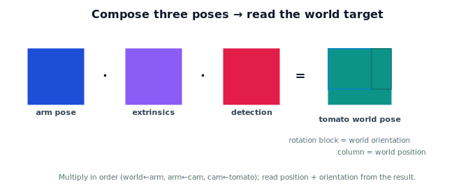

!!! abstract "You are here"
    **Module 2 — Spatial Transformations and SE(3)**  ·  **Unit 8 — Mini Project: Perception-to-Pose Pipeline**  ·  **Lesson 8.2 — Building the Pipeline**

# Lesson 8.2 — Building the Pipeline

## 1. Why This Matters

Time to build it. This lesson turns the boxed equation from 8.1 into a working pipeline: three SE(3) poses in, one world-frame target pose out. This is the part you'd actually run on a robot each detection cycle. The emphasis is correct construction — right matrices, right order — because a clean build is what makes verification (8.3) pass.

## 2. Physical Intuition

You're writing down the three facts and reading them outward. Fact one: the tomato's pose as the camera sees it. Fact two: where the camera sits on the arm. Fact three: where the arm sits in the world. Multiply them in that outward order and the tomato's world pose drops out. Then you "read" the answer the way Unit 6 taught: position from the translation column, orientation from the rotation block — exactly what the planner needs to aim the gripper.

## 3. Building blocks

Each given is an SE(3) matrix $\begin{bmatrix} R & \mathbf{t} \\ \mathbf{0}^\top & 1\end{bmatrix}$:

- **Detection** $T_{\text{cam}\leftarrow\text{tomato}}$: the tomato's pose in the camera frame (position from the detector; orientation if estimated, else identity).
- **Extrinsics** $T_{\text{arm}\leftarrow\text{cam}}$: the camera's fixed pose on the arm.
- **Arm pose** $T_{\text{world}\leftarrow\text{arm}}$: read from the robot's state.

Compose:

$$T_{\text{world}\leftarrow\text{tomato}} = T_{\text{world}\leftarrow\text{arm}}\;T_{\text{arm}\leftarrow\text{cam}}\;T_{\text{cam}\leftarrow\text{tomato}}.$$

Then **read** the target: world position $= $ translation column of $T_{\text{world}\leftarrow\text{tomato}}$; world orientation $=$ its rotation block. If you only need the tomato's *point*, apply the chain to $(0,0,0,1)$ in the tomato frame (its own origin).

## 4. Visual Explanation

<figure markdown>
  { width="680" }
</figure>

## 5. Engineering Example

In a real node, the detection arrives each frame, the arm pose is read from the robot at that instant, and the extrinsics are loaded once at startup. The node multiplies the three, reads the world target pose, and publishes it to the planner. The whole computation is a few matrix multiplies — cheap enough to run many times a second.

## 6. Worked Example

Detection $T_{\text{cam}\leftarrow\text{tomato}}$ = translate $(0, 0, 0.3)$, orientation identity. Extrinsics = translate $(0,0,0.1)$. Arm pose = translate $(1.0, 0.5, 0)$. Compose:
$$T_{\text{world}\leftarrow\text{tomato}} = \text{translate}(1.0, 0.5, 0.4),$$
so the world position is $(1.0, 0.5, 0.4)$ and the orientation is identity (aligned with the world). With a non-identity detection or extrinsics rotation, the rotation block would carry the tomato's world orientation too.

## 7. Interactive Demonstration

**Guided prediction.** Using the flagship demo (or by hand), set detection = translate $(0,0,0.3)$, extrinsics = translate $(0,0,0.1)$, arm pose = translate $(1.0,0.5,0)$. Predict the world position before composing. Then predict what happens to the world *orientation* if you add a rotation to the detection pose. Confirm by reading the result matrix.

## 8. Coding Exercise

!!! tip "Run the hands-on notebook"
    `modules/module02/notebooks/M02_U08_L8_2_Building_The_Pipeline.ipynb` — open in JupyterLab and run **Kernel → Restart & Run All**.

Implement `tomato_world_pose(T_world_arm, T_arm_cam, T_cam_tomato)` returning the composed SE(3); run it on the worked-example values; extract and print the world position and orientation. Then apply the chain to the tomato-frame origin to get the world point.

## 9. Knowledge Check

Formative — unlimited attempts, immediate feedback; does not affect your grade.

<iframe src="../../quizzes/module02/lesson34_quiz.html" title="Building the Pipeline knowledge check" style="width:100%;height:720px;border:1px solid #e2e8f0;border-radius:12px"></iframe>

[Open this quiz in a new tab ↗](../quizzes/module02/lesson34_quiz.html)

A check on building the three poses, composing in the correct order, and reading position/orientation from the result.

## 10. Challenge Problem

Modify the pipeline so the detection includes a $90°$ rotation about the camera's $z$-axis. Show how the world orientation changes while the world position (of the tomato's origin) stays the same, and explain why.

## 11. Common Mistakes

- Composing in the wrong order (must be world←arm, then arm←cam, then cam←tomato).
- Dropping the detection's orientation (defaulting to identity when a real estimate exists).
- Reading position from the bottom row instead of the translation column.

## 12. Key Takeaways

- Build each given as an **SE(3)** matrix; **compose** in order to get $T_{\text{world}\leftarrow\text{tomato}}$.
- **Read** the target: position = translation column, orientation = rotation block.
- For just the point, apply the chain to the tomato frame's origin.
- This is the runnable core of the perception-to-pose pipeline. Next: verify and visualize.

---

## AI Learning Companion

Copy any prompt below into ChatGPT, Claude, or another AI assistant.

**Tutor prompt** — explain it another way
```
Explain Lesson 8.2 (Module 2) — Building the Pipeline — as writing down three SE(3) facts (detection, extrinsics, arm pose) and composing them into the tomato's world pose, then reading position and orientation from the result.
```

**Practice prompt** — generate more exercises
```
Give me 5 perception-to-pose builds with different SE(3) inputs; ask me to compose and read off the world position and orientation. Include answers.
```

**Explore prompt** — connect it to the real world
```
Show me what a real perception-to-pose node computes each cycle: which transforms are loaded once, which are read live, and how the world target is published.
```

## Global Learning Support

Need this lesson explained in another language? Copy one of the prompts below into an AI assistant. English remains the authoritative source.

**Supported languages (initial):** English · Español · 中文 (Simplified Chinese) · Türkçe

**Español**
```
I just completed Lesson 8.2 (Module 2) — Building the Pipeline.
Explain this lesson in Spanish. Keep robotics and mathematical terminology in English when appropriate.
Then provide: a summary, three practice questions, and one challenge problem.
```

**中文 (Simplified Chinese)**
```
I just completed Lesson 8.2 (Module 2) — Building the Pipeline.
Explain this lesson in Simplified Chinese. Keep mathematical notation unchanged.
Then provide: a summary, three practice questions, and one challenge problem.
```

**Türkçe**
```
I just completed Lesson 8.2 (Module 2) — Building the Pipeline.
Explain this lesson in Turkish. Keep robotics terminology in English where commonly used.
Then provide: a summary, three practice questions, and one challenge problem.
```

---

*Next lesson: 8.3 — Verifying and Visualizing.*
