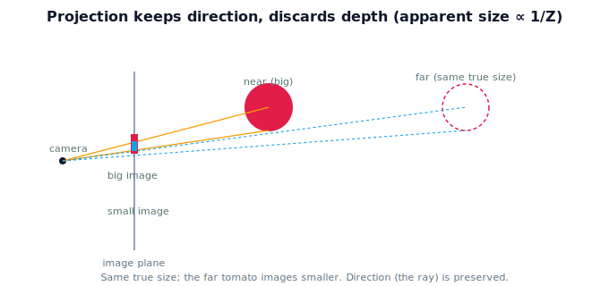

!!! abstract "You are here"
    **Module 3 — Camera Geometry and Robotic Perception**  ·  **Unit 1 — Why Perception**  ·  **Lesson 1.3 — What Projection Keeps and Discards**

# Lesson 1.3 — What Projection Keeps and Discards

## 1. Why This Matters

To use a camera well, you have to know exactly what an image preserves and what it throws away. The headline: projection keeps **direction** (which ray a point sits on) and discards **distance along that ray**. That single fact explains apparent size, why faraway fruit looks small, and why depth must be supplied separately. Pinning down "kept vs discarded" now makes the pinhole model (Unit 2) feel inevitable rather than arbitrary.

## 2. Physical Intuition

Hold two identical tomatoes, one at arm's length and one close to your eye. The near one looks huge, the far one small — yet they're the same size. The camera records **apparent** size (how much of the image the object spans), which shrinks with distance. What's preserved is *direction*: each tomato sits along a definite line of sight from the camera. What's lost is *how far* along that line. Move a tomato straight toward or away from the camera along its ray and its direction (pixel) barely changes while its apparent size does — the image cannot, on its own, separate "small and near" from "large and far."

## 3. Mathematical Foundations

Under perspective projection, a camera-frame point $(X, Y, Z)$ maps (up to intrinsics) to image coordinates proportional to

$$x \propto \frac{X}{Z}, \qquad y \propto \frac{Y}{Z}.$$

The division by $Z$ (depth) is the whole story: it preserves the **ratios** $X/Z, Y/Z$ — the **direction** of the point — and collapses the absolute scale. Two points with the same $X/Z$ and $Y/Z$ (i.e. on the same ray through the camera) project identically regardless of $Z$. **Apparent size** of an object of true size $s$ at depth $Z$ scales like $s/Z$: double the distance, half the image size. Direction is kept; depth (and hence absolute size/position) is discarded. Straight lines stay straight, but parallel lines may appear to converge (perspective) — a kept-vs-transformed subtlety we revisit with the pinhole model.

## 4. Visual Explanation

<figure markdown>
  { width="680" }
</figure>

## 5. Engineering Example

A harvesting robot can't judge a tomato's distance from its pixel size alone unless it knows the fruit's true size — and tomatoes vary. That's why the robot uses a depth source rather than guessing distance from apparent size. Conversely, the robot *can* trust the direction: the pixel reliably says which ray the fruit is on, which is half the localization problem. Knowing what's trustworthy (direction) vs unreliable (size→distance) shapes the whole perception design.

## 6. Worked Example

A tomato of true diameter 6 cm appears 60 pixels wide at depth $Z = 0.3$ m. Move it to $Z = 0.6$ m (twice as far): apparent width scales like $1/Z$, so it now appears about 30 pixels wide — same fruit, half the image size. Its center pixel (direction) stays essentially the same if it moved straight along the ray. The image faithfully reports direction; size alone can't distinguish this fruit at 0.6 m from a 12 cm fruit at 0.6 m... or a 12 cm fruit at 1.2 m without extra info.

## 7. Interactive Demonstration

**Guided prediction.** Using the figure, predict what happens to a tomato's apparent size and to its center pixel as it moves straight away from the camera along its ray. Then predict whether the image can tell "a small near tomato" from "a large far tomato." Confirm that direction is preserved and depth/size is not.

## 8. Coding Exercise

!!! tip "Run the hands-on notebook"
    `modules/module03/notebooks/M03_U01_L1_3_What_Projection_Keeps_And_Discards.ipynb` — open in JupyterLab and run **Kernel → Restart & Run All**.

Project a fixed-size object at several depths using $x \propto X/Z$; record apparent size vs depth and confirm the $1/Z$ relationship; show two different (size, depth) pairs that yield identical apparent size.

## 9. Knowledge Check

Formative — unlimited attempts, immediate feedback; does not affect your grade.

<iframe src="../../quizzes/module03/lesson03_quiz.html" title="What Projection Keeps and Discards knowledge check" style="width:100%;height:720px;border:1px solid #e2e8f0;border-radius:12px"></iframe>

[Open this quiz in a new tab ↗](../quizzes/module03/lesson03_quiz.html)

A check that projection preserves direction (ray) and discards depth, that apparent size scales like $1/Z$, and that size alone can't give distance.

## 10. Challenge Problem

Two tomatoes produce the same apparent size in the image. Give the relationship their (true size, depth) pairs must satisfy, and explain what single measurement would let you distinguish them.

## 11. Common Mistakes

- Treating apparent size as true size.
- Assuming a bigger image blob means a closer object (only true at fixed real size).
- Forgetting that the pixel still reliably encodes direction.

## 12. Key Takeaways

- Projection **keeps direction** (the ray, via $X/Z, Y/Z$) and **discards depth**.
- **Apparent size** $\propto 1/Z$: farther looks smaller, same true size.
- Size alone **cannot** give distance without knowing true size.
- Direction (pixel) is trustworthy; depth must come from elsewhere.

---

## AI Learning Companion

Copy any prompt below into ChatGPT, Claude, or another AI assistant.

**Tutor prompt** — explain it another way
```
Explain Lesson 1.3 (Module 3) — What Projection Keeps and Discards — using two identical tomatoes at different distances. Make clear projection keeps direction (x ∝ X/Z) and discards depth, so apparent size scales like 1/Z.
```

**Practice prompt** — generate more exercises
```
Give me 6 exercises on apparent size vs depth (the 1/Z relationship) and what projection preserves vs discards, in a greenhouse context. Include answers.
```

**Explore prompt** — connect it to the real world
```
Show me why a robot trusts a fruit's pixel (direction) but not its apparent size for distance, and how this shapes the choice of a depth sensor.
```

## Global Learning Support

Need this lesson explained in another language? Copy one of the prompts below into an AI assistant. English remains the authoritative source.

**Supported languages (initial):** English · Español · 中文 (Simplified Chinese) · Türkçe

**Español**
```
I just completed Lesson 1.3 (Module 3) — What Projection Keeps and Discards.
Explain this lesson in Spanish. Keep robotics and mathematical terminology in English when appropriate.
Then provide: a summary, three practice questions, and one challenge problem.
```

**中文 (Simplified Chinese)**
```
I just completed Lesson 1.3 (Module 3) — What Projection Keeps and Discards.
Explain this lesson in Simplified Chinese. Keep mathematical notation unchanged.
Then provide: a summary, three practice questions, and one challenge problem.
```

**Türkçe**
```
I just completed Lesson 1.3 (Module 3) — What Projection Keeps and Discards.
Explain this lesson in Turkish. Keep robotics terminology in English where commonly used.
Then provide: a summary, three practice questions, and one challenge problem.
```

---

*Next lesson: 1.4 — Why Perception (Unit 1 recap).*
