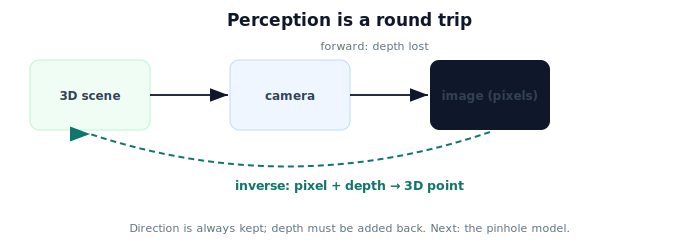

!!! abstract "You are here"
    **Module 3 — Camera Geometry and Robotic Perception**  ·  **Unit 1 — Why Perception**  ·  **Lesson 1.4 — Why Perception (Unit 1 Recap)**

# Lesson 1.4 — Why Perception (Unit 1 Recap)

*A short synthesis — no new mathematics. It ties Unit 1 together and points into the pinhole model.*

---

## Why the robot needs this

Module 2 assumed a 3D detection; Unit 1 explained where it comes from and why it's hard:

> **The camera turns the 3D world into pixels (easy, automatic) but discards depth; perception is the inverse craft of turning a pixel back into a 3D location by supplying what was lost.**

Seeing is the first link in the perception-to-action chain.

## What Unit 1 established

| Lesson | Point |
|---|---|
| 1.1 The Robot Needs to See | The camera is a sensor mapping the 3D scene to a 2D pixel image; an image gives direction, not a full 3D position. |
| 1.2 World → Pixels → World | Forward (world→pixels) is many-to-one and loses depth; the inverse (pixels→world) needs extra information (depth). |
| 1.3 What Projection Keeps and Discards | Projection keeps **direction** ($X/Z, Y/Z$) and discards **depth**; apparent size $\propto 1/Z$. |

## Why this matters

Every later unit is a response to these facts. The **pinhole model** (Unit 2) makes the forward map precise. **Intrinsics** (Unit 3) put it in pixel units. **Projection in practice** (Unit 4) computes it (and meets OpenCV). **Distortion** (Unit 5) corrects real lenses. **Back-projection** (Unit 6) inverts the map by adding depth. **From pixels to the robot** (Unit 7) hands the camera-frame point to Module 2. The **mini project** (Unit 8) does the whole round trip for a real fruit.

## Visual Explanation

<figure markdown>
  { width="680" }
</figure>

## Coding Exercise

!!! tip "Run the hands-on notebook"
    `modules/module03/notebooks/M03_U01_L1_4_Why_Perception_Unit_1_Recap.ipynb` — open in JupyterLab and run **Kernel → Restart & Run All**.

A short consolidation: project a 3D point to a pixel (forward), show another point on the same ray gives the same pixel, then recover a unique 3D point only after supplying depth.

## Knowledge Check

Formative — unlimited attempts, immediate feedback; does not affect your grade.

<iframe src="../../quizzes/module03/lesson04_quiz.html" title="Why Perception (Unit 1 Recap) knowledge check" style="width:100%;height:720px;border:1px solid #e2e8f0;border-radius:12px"></iframe>

[Open this quiz in a new tab ↗](../quizzes/module03/lesson04_quiz.html)

A brief consolidation quiz across Unit 1 (formative — unlimited attempts).

## Key Takeaways

- The camera maps **3D scene → 2D pixels**; perception inverts this.
- Forward is **many-to-one** (depth lost); inverse needs **depth**.
- Projection **keeps direction, discards depth**; apparent size $\propto 1/Z$.
- Next: the **pinhole camera model** makes the forward projection precise.

---

## AI Learning Companion

Copy any prompt below into ChatGPT, Claude, or another AI assistant.

**Tutor prompt** — explain it another way
```
Summarize Unit 1 of Module 3 as one story: the camera turns the 3D world into pixels (losing depth), perception inverts this by adding depth, and projection always keeps direction. Use the greenhouse tomato example.
```

**Practice prompt** — generate more exercises
```
Give me a 10-question mixed review of Module 3 Unit 1: camera as sensor, forward vs inverse, and what projection keeps vs discards. Include answers.
```

**Explore prompt** — connect it to the real world
```
Show me how Unit 1's ideas set up the rest of Module 3 (pinhole model, intrinsics, distortion, back-projection) and the bridge to Module 2.
```

## Global Learning Support

Need this lesson explained in another language? Copy one of the prompts below into an AI assistant. English remains the authoritative source.

**Supported languages (initial):** English · Español · 中文 (Simplified Chinese) · Türkçe

**Español**
```
I just completed Lesson 1.4 (Module 3) — Why Perception (Unit 1 Recap).
Explain this lesson in Spanish. Keep robotics and mathematical terminology in English when appropriate.
Then provide: a summary, three practice questions, and one challenge problem.
```

**中文 (Simplified Chinese)**
```
I just completed Lesson 1.4 (Module 3) — Why Perception (Unit 1 Recap).
Explain this lesson in Simplified Chinese. Keep mathematical notation unchanged.
Then provide: a summary, three practice questions, and one challenge problem.
```

**Türkçe**
```
I just completed Lesson 1.4 (Module 3) — Why Perception (Unit 1 Recap).
Explain this lesson in Turkish. Keep robotics terminology in English where commonly used.
Then provide: a summary, three practice questions, and one challenge problem.
```

---

*Next: Unit 2 — The Pinhole Camera Model.*
