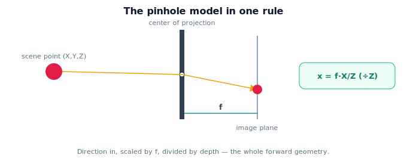

!!! abstract "You are here"
    **Module 3 — Camera Geometry and Robotic Perception**  ·  **Unit 2 — The Pinhole Camera Model**  ·  **Lesson 2.4 — The Pinhole Camera Model (Unit 2 Recap)**

# Lesson 2.4 — The Pinhole Camera Model (Unit 2 Recap)

*A short synthesis — no new mathematics. It ties Unit 2 together and points into intrinsics.*

---

## One rule for camera geometry

Unit 2 reduced "how a camera sees" to a single, exact rule:

> **Project each 3D point through the center of projection onto an image plane at focal distance $f$: $x = fX/Z,\ y = fY/Z$.**

Direction in, scaled by $f$, divided by depth — the whole forward geometry.

## What Unit 2 established

| Lesson | Point |
|---|---|
| 2.1 The Pinhole Idea | One ray per point through the center of projection; image plane at $f$; image inverted. |
| 2.2 The Image Plane and Focal Length | $f$ = hole-to-plane distance; sets magnification and field of view (a trade-off). |
| 2.3 Perspective Projection | $x=fX/Z,\ y=fY/Z$; the divide-by-$Z$ is what makes it perspective (non-linear, many-to-one). |

## Why this matters

Everything else in the module is this rule, refined. **Intrinsics** (Unit 3) rewrite $x=fX/Z$ in **pixel** coordinates with a principal point, packaged as the matrix $K$. **Projection in practice** (Unit 4) computes $K$-based projection (and meets OpenCV). **Distortion** (Unit 5) corrects where real lenses deviate from the ideal pinhole. **Back-projection** (Unit 6) inverts the rule using depth. The pinhole model is the trunk; the rest are branches.

## Visual Explanation

<figure markdown>
  { width="680" }
</figure>

## Coding Exercise

!!! tip "Run the hands-on notebook"
    `modules/module03/notebooks/M03_U02_L2_4_The_Pinhole_Camera_Model_Unit_2_Recap.ipynb` — open in JupyterLab and run **Kernel → Restart & Run All**.

A short consolidation: implement pinhole projection, project a few points for a chosen $f$, and confirm (a) points on a ray share an image point, (b) image scales with $f$, (c) image position scales with $1/Z$.

## Knowledge Check

Formative — unlimited attempts, immediate feedback; does not affect your grade.

<iframe src="../../quizzes/module03/lesson08_quiz.html" title="The Pinhole Camera Model (Unit 2 Recap) knowledge check" style="width:100%;height:720px;border:1px solid #e2e8f0;border-radius:12px"></iframe>

[Open this quiz in a new tab ↗](../quizzes/module03/lesson08_quiz.html)

A brief consolidation quiz across Unit 2 (formative — unlimited attempts).

## Key Takeaways

- The **pinhole model**: one ray per point through the center of projection onto a plane at $f$.
- **Focal length** sets magnification and field of view (a trade-off).
- **Perspective projection**: $x=fX/Z,\ y=fY/Z$; the divide-by-$Z$ is the essence.
- Next: **intrinsics** express this in pixels via the matrix $K$.

---

## AI Learning Companion

Copy any prompt below into ChatGPT, Claude, or another AI assistant.

**Tutor prompt** — explain it another way
```
Summarize Unit 2 of Module 3 as one rule: project through the center of projection onto a plane at focal length f, giving x = fX/Z. Cover the pinhole mechanism, focal length / FOV, and the divide-by-Z.
```

**Practice prompt** — generate more exercises
```
Give me a 10-question mixed review of the pinhole camera model: the mechanism, focal length and FOV, and perspective projection x = fX/Z. Include answers.
```

**Explore prompt** — connect it to the real world
```
Show me how the pinhole model is the foundation that intrinsics, distortion, and back-projection all build on for a harvesting robot's camera.
```

## Global Learning Support

Need this lesson explained in another language? Copy one of the prompts below into an AI assistant. English remains the authoritative source.

**Supported languages (initial):** English · Español · 中文 (Simplified Chinese) · Türkçe

**Español**
```
I just completed Lesson 2.4 (Module 3) — The Pinhole Camera Model (Unit 2 Recap).
Explain this lesson in Spanish. Keep robotics and mathematical terminology in English when appropriate.
Then provide: a summary, three practice questions, and one challenge problem.
```

**中文 (Simplified Chinese)**
```
I just completed Lesson 2.4 (Module 3) — The Pinhole Camera Model (Unit 2 Recap).
Explain this lesson in Simplified Chinese. Keep mathematical notation unchanged.
Then provide: a summary, three practice questions, and one challenge problem.
```

**Türkçe**
```
I just completed Lesson 2.4 (Module 3) — The Pinhole Camera Model (Unit 2 Recap).
Explain this lesson in Turkish. Keep robotics terminology in English where commonly used.
Then provide: a summary, three practice questions, and one challenge problem.
```

---

*Next: Unit 3 — Camera Intrinsics (the matrix K).*
