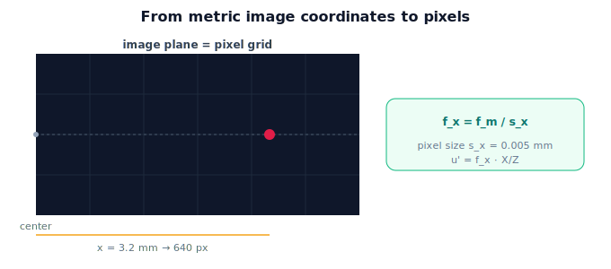

!!! abstract "You are here"
    **Module 3 — Camera Geometry and Robotic Perception**  ·  **Unit 3 — Camera Intrinsics**  ·  **Lesson 3.1 — From Metric to Pixels**

# Lesson 3.1 — From Metric to Pixels

## 1. Why This Matters

The pinhole rule $x = fX/Z$ produces image coordinates in **metric** units (say millimetres on the image plane). But a camera doesn't hand you millimetres — it hands you a **pixel**: row and column indices into an image array. To use a detector's pixel output, or to draw where a 3D point lands, we need the bridge from metric image coordinates to pixels. That bridge is the first half of camera **intrinsics**, and it's why focal length ends up measured "in pixels."

## 2. Physical Intuition

Think of the image plane as graph paper laid over the sensor. Projection tells you a point lands "3.2 mm right and 1.8 mm up" on that paper. The sensor, though, is a grid of little light buckets (pixels), each a fixed physical size — maybe 0.005 mm wide. So "3.2 mm right" is really "640 pixels right" (3.2 / 0.005). Converting metric to pixels is just counting how many pixel-widths fit into the metric distance. If pixels were larger, the same metric offset would be fewer pixels; smaller pixels, more. The conversion factor is baked into the camera.

## 3. Mathematical Foundations

Let projection give metric image coordinates $(x, y)$ (e.g. mm) via $x = f_m X/Z$, with $f_m$ the focal length in metric units. If each pixel has width $s_x$ and height $s_y$ (metres/pixel), the pixel offsets from the image center are

$$u' = \frac{x}{s_x} = \frac{f_m}{s_x}\,\frac{X}{Z}, \qquad v' = \frac{y}{s_y} = \frac{f_m}{s_y}\,\frac{Y}{Z}.$$

Define **focal length in pixels** $f_x = f_m/s_x$ and $f_y = f_m/s_y$. Then

$$u' = f_x\,\frac{X}{Z}, \qquad v' = f_y\,\frac{Y}{Z}.$$

This is the same perspective projection, now in pixel units, with $f_x, f_y$ absorbing both the lens focal length and the pixel size. (If pixels are square, $f_x = f_y$.) These are offsets from the image *center*; the next lesson adds the **principal point** to get absolute pixel coordinates, and packages everything as the matrix $K$.

## 4. Visual Explanation

<figure markdown>
  { width="680" }
</figure>

## 5. Engineering Example

A camera's datasheet lists a lens focal length in mm and a sensor pixel pitch in µm; calibration combines them into $f_x, f_y$ in pixels — the numbers actually used in code. The robot never works in mm on the image plane; it works in pixels, because that's what the detector and image array speak. Knowing $f_x = f_m/s_x$ explains why two cameras with the same lens but different sensors have different focal lengths *in pixels*.

## 6. Worked Example

Lens focal length $f_m = 4$ mm; pixel size $s_x = s_y = 0.005$ mm. Then $f_x = f_y = 4/0.005 = 800$ pixels — the value we've been using. A point at $(X, Y, Z) = (0.06, 0, 0.3)$ m projects to $u' = 800\cdot(0.06/0.3) = 160$ pixels right of center. If the same lens sat on a sensor with $s_x = 0.0025$ mm (smaller pixels), $f_x = 1600$ and the offset would be 320 pixels — same lens, twice the pixel offset, because each pixel covers half the distance.

## 7. Interactive Demonstration

**Guided prediction.** Using the figure, predict $f_x$ in pixels for a 4 mm lens on a sensor with 0.005 mm pixels, then for 0.0025 mm pixels. Predict whether a point's pixel offset grows or shrinks when pixels get smaller (for a fixed lens). Confirm $f_x = f_m/s_x$.

## 8. Coding Exercise

!!! tip "Run the hands-on notebook"
    `modules/module03/notebooks/M03_U03_L3_1_From_Metric_To_Pixels.ipynb` — open in JupyterLab and run **Kernel → Restart & Run All**.

Convert metric projection to pixels: given $f_m$, pixel size, and a 3D point, compute $f_x, f_y$ and the pixel offsets $u' = f_x X/Z$; verify that halving pixel size doubles the offset.

## 9. Knowledge Check

Formative — unlimited attempts, immediate feedback; does not affect your grade.

<iframe src="../../quizzes/module03/lesson09_quiz.html" title="From Metric to Pixels knowledge check" style="width:100%;height:720px;border:1px solid #e2e8f0;border-radius:12px"></iframe>

[Open this quiz in a new tab ↗](../quizzes/module03/lesson09_quiz.html)

A check that projected coordinates are metric, that pixel size converts metric→pixels, and that $f_x = f_m/s_x$ is focal length in pixels.

## 10. Challenge Problem

Two cameras share a lens ($f_m = 6$ mm) but have pixel sizes 0.006 mm and 0.003 mm. For the same 3D point, relate their pixel offsets, and explain which "sees" the point at a larger pixel coordinate and why.

## 11. Common Mistakes

- Treating the projected $(x, y)$ as already in pixels.
- Forgetting that focal length in pixels depends on the **sensor**, not just the lens.
- Assuming $f_x = f_y$ always (only when pixels are square).

## 12. Key Takeaways

- Projection yields **metric** image coordinates; cameras report **pixels**.
- Convert by pixel size: $u' = (f_m/s_x)\,X/Z = f_x\,X/Z$.
- **Focal length in pixels** $f_x = f_m/s_x$ (and $f_y = f_m/s_y$) absorbs lens + pixel size.
- These are offsets from center; the **principal point** (next) gives absolute pixels.

---

## AI Learning Companion

Copy any prompt below into ChatGPT, Claude, or another AI assistant.

**Tutor prompt** — explain it another way
```
Explain Lesson 3.1 (Module 3) — From Metric to Pixels — using graph paper over a pixel grid. Make clear projection gives metric coordinates, pixel size converts to pixels, and focal length in pixels is f_x = f_m / s_x.
```

**Practice prompt** — generate more exercises
```
Give me 6 exercises converting metric image coordinates to pixels and computing focal length in pixels (f_x = f_m/s_x) for various lenses and sensors. Include answers.
```

**Explore prompt** — connect it to the real world
```
Show me why two cameras with the same lens but different sensors have different focal lengths in pixels, and why code works in pixels not millimetres.
```

## Global Learning Support

Need this lesson explained in another language? Copy one of the prompts below into an AI assistant. English remains the authoritative source.

**Supported languages (initial):** English · Español · 中文 (Simplified Chinese) · Türkçe

**Español**
```
I just completed Lesson 3.1 (Module 3) — From Metric to Pixels.
Explain this lesson in Spanish. Keep robotics and mathematical terminology in English when appropriate.
Then provide: a summary, three practice questions, and one challenge problem.
```

**中文 (Simplified Chinese)**
```
I just completed Lesson 3.1 (Module 3) — From Metric to Pixels.
Explain this lesson in Simplified Chinese. Keep mathematical notation unchanged.
Then provide: a summary, three practice questions, and one challenge problem.
```

**Türkçe**
```
I just completed Lesson 3.1 (Module 3) — From Metric to Pixels.
Explain this lesson in Turkish. Keep robotics terminology in English where commonly used.
Then provide: a summary, three practice questions, and one challenge problem.
```

---

*Next lesson: 3.2 — The Intrinsic Matrix K.*
