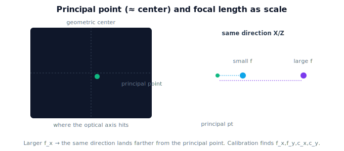

!!! abstract "You are here"
    **Module 3 — Camera Geometry and Robotic Perception**  ·  **Unit 3 — Camera Intrinsics**  ·  **Lesson 3.3 — Principal Point and Focal Length in Pixels**

# Lesson 3.3 — Principal Point and Focal Length in Pixels

## 1. Why This Matters

The four numbers in $K$ — $f_x, f_y, c_x, c_y$ — are the camera's identity card. This lesson gives each a concrete meaning you can reason about: the **principal point** is where "straight ahead" lands in the image, and **focal length in pixels** is how strongly the image is scaled. Understanding them lets you sanity-check a $K$ (is the principal point near the center? is $f_x$ plausible?) and understand what camera **calibration** hands you.

## 2. Physical Intuition

Point the camera at a wall and mark the spot that is *exactly* straight ahead of the lens — that mark is the **principal point**. Ideally it's the dead center of the image, but manufacturing and alignment nudge it a little off, so it's usually *near* center but not exactly. **Focal length in pixels** is the zoom: a big value spreads the scene out (objects land far from center for a given direction — telephoto feel), a small value packs more in (wide-angle). The camera's whole geometric personality is "where is straight-ahead" plus "how zoomed in," and that's what these four numbers say.

## 3. Mathematical Foundations

The **principal point** $(c_x, c_y)$ is the pixel where the optical axis pierces the image plane — the image of a point at $(0,0,Z)$. For a $W\times H$ image it is *approximately* $(W/2, H/2)$ but determined precisely by calibration. **Focal length in pixels** $f_x = f_m/s_x$, $f_y = f_m/s_y$ (Lesson 3.1) sets how many pixels a unit of $X/Z$ moves the image point: $\partial u/\partial(X/Z) = f_x$. When pixels are square, $f_x = f_y$; a small difference encodes non-square pixels. **Camera calibration** is the procedure (e.g. imaging a known checkerboard from several views) that *estimates* $f_x, f_y, c_x, c_y$ (and distortion, Unit 5) for a specific camera. We treat $K$ as **given** by calibration; deriving it by optimization is deferred. A quick reasonableness check: $c_x, c_y$ near the image center; $f_x \approx f_y$ on the order of the image width for a normal lens.

## 4. Visual Explanation

<figure markdown>
  { width="680" }
</figure>

## 5. Engineering Example

When the robot loads a calibration file, it reads $f_x, f_y, c_x, c_y$ (and distortion). If the principal point came back far from center or $f_x$ and $f_y$ differed wildly, that signals a bad calibration to investigate before trusting any 3D estimate. These four numbers, found once, are reused on every frame to turn detections into directions — so their accuracy directly bounds how accurately the robot can localize fruit.

## 6. Worked Example

A $640\times480$ camera calibrates to $f_x = 805$, $f_y = 802$, $(c_x, c_y) = (318, 244)$. Checks: principal point is within a few pixels of the geometric center $(320, 240)$ ✓; $f_x \approx f_y$ (near-square pixels) ✓; focal length is on the order of the image width ✓ — a believable normal lens. A point straight ahead $(0,0,Z)$ images at $(318, 244)$, the principal point — not exactly the array center, by design. A direction $X/Z = 0.2$ lands at $u = 805\cdot0.2 + 318 = 479$.

## 7. Interactive Demonstration

Adjust $f_x$, $f_y$, $c_x$, $c_y$ and watch where a fixed 3D direction lands in the image: moving the principal point shifts everything; raising focal length pushes the point farther from the principal point. A point straight ahead always sits exactly at the principal point. Confirm $u = f_x X/Z + c_x$ entry by entry.

## 8. Coding Exercise

!!! tip "Run the hands-on notebook"
    `modules/module03/notebooks/M03_U03_L3_3_Principal_Point_And_Focal_Length_In_Pixels.ipynb` — open in JupyterLab and run **Kernel → Restart & Run All**.

Given a calibrated $K$, verify a point on the optical axis maps to $(c_x, c_y)$; vary $f_x$ and record how far a fixed direction lands from the principal point; implement a simple "is this K reasonable?" check (principal point near center, $f_x\approx f_y$).

## 9. Knowledge Check

Formative — unlimited attempts, immediate feedback; does not affect your grade.

<iframe src="../../quizzes/module03/lesson11_quiz.html" title="Principal Point and Focal Length in Pixels knowledge check" style="width:100%;height:720px;border:1px solid #e2e8f0;border-radius:12px"></iframe>

[Open this quiz in a new tab ↗](../quizzes/module03/lesson11_quiz.html)

A check on the meaning of the principal point, focal length in pixels as scale, and what calibration produces.

## 10. Challenge Problem

You're handed a $K$ with principal point $(600, 50)$ for a $640\times480$ image. Explain why this is suspicious, what real-world issues could cause it, and what you'd verify before using it to localize fruit.

## 11. Common Mistakes

- Assuming the principal point is *exactly* the image center.
- Reading focal length in pixels as a physical distance.
- Trusting a calibration without sanity-checking $K$.

## 12. Key Takeaways

- **Principal point** $(c_x, c_y)$: where the optical axis hits the image (≈ center, set by calibration).
- **Focal length in pixels** $f_x, f_y$: the image scale; $f_x = f_y$ for square pixels.
- **Calibration** estimates these four numbers (plus distortion) for a specific camera; we take $K$ as given.
- Sanity-check $K$: principal point near center, $f_x \approx f_y$, focal length on the order of image width.

---

## AI Learning Companion

Copy any prompt below into ChatGPT, Claude, or another AI assistant.

**Tutor prompt** — explain it another way
```
Explain Lesson 3.3 (Module 3) — Principal Point and Focal Length in Pixels — by pointing a camera at a wall. Make clear the principal point is "straight ahead" (≈ center), focal length in pixels is the zoom, and calibration finds these four numbers.
```

**Practice prompt** — generate more exercises
```
Give me 6 exercises interpreting K's entries (f_x, f_y, c_x, c_y), sanity-checking a calibration, and projecting directions to pixels. Include answers.
```

**Explore prompt** — connect it to the real world
```
Show me what camera calibration produces and how a robot uses f_x, f_y, c_x, c_y on every frame, plus how to spot a bad calibration.
```

## Global Learning Support

Need this lesson explained in another language? Copy one of the prompts below into an AI assistant. English remains the authoritative source.

**Supported languages (initial):** English · Español · 中文 (Simplified Chinese) · Türkçe

**Español**
```
I just completed Lesson 3.3 (Module 3) — Principal Point and Focal Length in Pixels.
Explain this lesson in Spanish. Keep robotics and mathematical terminology in English when appropriate.
Then provide: a summary, three practice questions, and one challenge problem.
```

**中文 (Simplified Chinese)**
```
I just completed Lesson 3.3 (Module 3) — Principal Point and Focal Length in Pixels.
Explain this lesson in Simplified Chinese. Keep mathematical notation unchanged.
Then provide: a summary, three practice questions, and one challenge problem.
```

**Türkçe**
```
I just completed Lesson 3.3 (Module 3) — Principal Point and Focal Length in Pixels.
Explain this lesson in Turkish. Keep robotics terminology in English where commonly used.
Then provide: a summary, three practice questions, and one challenge problem.
```

---

*Next lesson: 3.4 — Camera Intrinsics (Unit 3 recap).*
