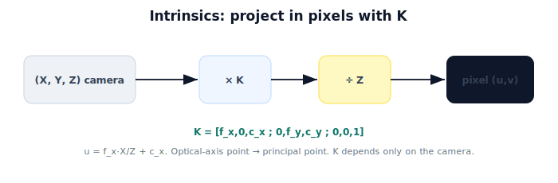

!!! abstract "You are here"
    **Module 3 — Camera Geometry and Robotic Perception**  ·  **Unit 3 — Camera Intrinsics**  ·  **Lesson 3.4 — Camera Intrinsics (Unit 3 Recap)**

# Lesson 3.4 — Camera Intrinsics (Unit 3 Recap)

*A short synthesis — no new mathematics. It ties Unit 3 together and points into projecting in practice.*

---

## One matrix turns directions into pixels

Unit 3 finished the forward map by moving it into pixel units:

> **Project in pixels with the intrinsic matrix $K$: $\tilde{\mathbf p} = K(X,Y,Z)$, then divide by $Z$, giving $u = f_x X/Z + c_x,\ v = f_y Y/Z + c_y$.**

$K$ is the camera's identity card; it depends only on the camera, not its pose.

## What Unit 3 established

| Lesson | Point |
|---|---|
| 3.1 From Metric to Pixels | Projection gives metric coords; pixel size converts to pixels; focal length in pixels $f_x = f_m/s_x$. |
| 3.2 The Intrinsic Matrix K | $K$ packages $f_x, f_y, c_x, c_y$; projection is $K(X,Y,Z)$ then ÷Z. |
| 3.3 Principal Point and Focal Length in Pixels | $(c_x,c_y)$ = where the optical axis hits (≈ center); $f_x,f_y$ = image scale; calibration finds them. |

## Why this matters

$K$ is the form every vision tool uses. **Unit 4** puts it to work — the full projection pipeline (extrinsics place the point in the camera frame, $K$ projects it), projecting points with $K$, and the same computation in **OpenCV**. **Unit 5** adds distortion (real lenses deviate from the ideal pinhole + $K$). **Unit 6** inverts the map with depth. From here on, "project" means "apply $K$ then divide by $Z$."

## Visual Explanation

<figure markdown>
  { width="680" }
</figure>

## Coding Exercise

!!! tip "Run the hands-on notebook"
    `modules/module03/notebooks/M03_U03_L3_4_Camera_Intrinsics_Unit_3_Recap.ipynb` — open in JupyterLab and run **Kernel → Restart & Run All**.

A short consolidation: build $K$, project a few camera-frame points to pixels, confirm the optical-axis point lands at the principal point, and show focal length scales the offset from the principal point.

## Knowledge Check

Formative — unlimited attempts, immediate feedback; does not affect your grade.

<iframe src="../../quizzes/module03/lesson12_quiz.html" title="Camera Intrinsics (Unit 3 Recap) knowledge check" style="width:100%;height:720px;border:1px solid #e2e8f0;border-radius:12px"></iframe>

[Open this quiz in a new tab ↗](../quizzes/module03/lesson12_quiz.html)

A brief consolidation quiz across Unit 3 (formative — unlimited attempts).

## Key Takeaways

- Projection in pixels: $\tilde{\mathbf p} = K(X,Y,Z)$, then ÷Z.
- $K$ holds $f_x, f_y$ (scale) and $c_x, c_y$ (principal point); it depends only on the camera.
- Calibration provides $K$; sanity-check it (principal point ≈ center, $f_x \approx f_y$).
- Next: **projecting in practice** and **OpenCV**.

---

## AI Learning Companion

Copy any prompt below into ChatGPT, Claude, or another AI assistant.

**Tutor prompt** — explain it another way
```
Summarize Unit 3 of Module 3: intrinsics move the pinhole rule into pixels via K = [[f_x,0,c_x],[0,f_y,c_y],[0,0,1]], projection is K·(X,Y,Z) then divide-by-Z. Explain each parameter.
```

**Practice prompt** — generate more exercises
```
Give me a 10-question mixed review of camera intrinsics: metric-to-pixels, building and applying K, and interpreting f_x, f_y, c_x, c_y. Include answers.
```

**Explore prompt** — connect it to the real world
```
Show me how K sets up the full projection pipeline and OpenCV usage for a harvesting robot's camera.
```

## Global Learning Support

Need this lesson explained in another language? Copy one of the prompts below into an AI assistant. English remains the authoritative source.

**Supported languages (initial):** English · Español · 中文 (Simplified Chinese) · Türkçe

**Español**
```
I just completed Lesson 3.4 (Module 3) — Camera Intrinsics (Unit 3 Recap).
Explain this lesson in Spanish. Keep robotics and mathematical terminology in English when appropriate.
Then provide: a summary, three practice questions, and one challenge problem.
```

**中文 (Simplified Chinese)**
```
I just completed Lesson 3.4 (Module 3) — Camera Intrinsics (Unit 3 Recap).
Explain this lesson in Simplified Chinese. Keep mathematical notation unchanged.
Then provide: a summary, three practice questions, and one challenge problem.
```

**Türkçe**
```
I just completed Lesson 3.4 (Module 3) — Camera Intrinsics (Unit 3 Recap).
Explain this lesson in Turkish. Keep robotics terminology in English where commonly used.
Then provide: a summary, three practice questions, and one challenge problem.
```

---

*Next: Unit 4 — Projection in Practice (OpenCV introduced).*
