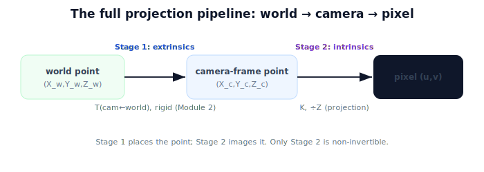

!!! abstract "You are here"
    **Module 3 — Camera Geometry and Robotic Perception**  ·  **Unit 4 — Projection in Practice**  ·  **Lesson 4.1 — The Full Projection Pipeline**

# Lesson 4.1 — The Full Projection Pipeline

## 1. Why This Matters

We can now connect both halves of the course. Module 2 gave us **extrinsics** — how to move a point between world, robot, and camera frames. Module 3 gave us **intrinsics** — how the camera turns a camera-frame point into a pixel. Put them in sequence and you have the complete forward map: where any point in the world appears in the image. This pipeline is the backbone of perception; understanding its two clean stages prevents the most common localization confusion (mixing up "where the camera is" with "how the camera images").

## 2. Physical Intuition

Imagine pointing at a tomato and asking "which pixel is that?" Two questions must be answered in order. First: *where is the tomato relative to the camera?* That depends on where the camera sits and faces — its pose — and is pure Module 2 geometry. Second: *given its position in front of the camera, where on the image does it land?* That depends only on the camera's lens and sensor — its intrinsics $K$. The world placement and the camera's optics are independent concerns, handled one after the other. Get the point into the camera's frame, then let $K$ image it.

## 3. Mathematical Foundations

A world point $\mathbf{P}_w = (X_w, Y_w, Z_w)$ becomes a pixel in two stages:

**Stage 1 — Extrinsics (Module 2).** Transform into the camera frame using the camera's pose:
$$\begin{bmatrix} X_c \\ Y_c \\ Z_c \\ 1 \end{bmatrix} = T_{\text{cam}\leftarrow\text{world}} \begin{bmatrix} X_w \\ Y_w \\ Z_w \\ 1 \end{bmatrix}, \qquad T_{\text{cam}\leftarrow\text{world}} = \begin{bmatrix} R & \mathbf{t} \\ \mathbf{0}^\top & 1\end{bmatrix}.$$

**Stage 2 — Intrinsics (Unit 3).** Project the camera-frame point with $K$ and divide by depth:
$$\tilde{\mathbf p} = K\begin{bmatrix} X_c \\ Y_c \\ Z_c\end{bmatrix}, \qquad u = f_x\frac{X_c}{Z_c} + c_x,\quad v = f_y\frac{Y_c}{Z_c} + c_y.$$

Together: **world → (extrinsics) → camera frame → (intrinsics $K$, ÷Z) → pixel.** The extrinsics are a *rigid* transform (Module 2); only the intrinsic stage is the non-invertible projection. Note $T_{\text{cam}\leftarrow\text{world}}$ is the inverse of the $T_{\text{world}\leftarrow\text{cam}}$ pose from Module 2 — same relationship, viewed from the camera's side.

## 4. Visual Explanation

<figure markdown>
  { width="680" }
</figure>

## 5. Engineering Example

The robot's perception node holds two calibrated assets: the **extrinsics** (camera pose on the arm, from Module 2's calibration) and the **intrinsics** $K$ (from camera calibration). To predict where a known 3D fruit will appear — or to overlay a planned grasp point on the live image — it runs exactly this pipeline. Keeping the two stages separate means a pose error and a lens error can be diagnosed independently.

## 6. Worked Example

Camera at the world origin looking down $+Z$ (so $T_{\text{cam}\leftarrow\text{world}} = I$ for simplicity), $K$ with $f_x=f_y=800$, $(c_x,c_y)=(320,240)$. World tomato at $(0.06, -0.03, 0.3)$.
Stage 1: $\mathbf{P}_c = (0.06, -0.03, 0.3)$ (identity pose). Stage 2: $u = 800\cdot0.06/0.3 + 320 = 480$, $v = 800\cdot(-0.03)/0.3 + 240 = 160$ → pixel $(480, 160)$. If instead the camera were translated/rotated, Stage 1 would first move the point into the camera frame; Stage 2 is unchanged. (We'll run a non-identity pose in code.)

## 7. Interactive Demonstration

<iframe src="../../demos/module03/lesson13_projection_pipeline.html" title="The Full Projection Pipeline interactive demo" style="width:100%;height:520px;border:1px solid #e2e8f0;border-radius:12px"></iframe>

[Open this demo in a new tab ↗](../demos/module03/lesson13_projection_pipeline.html)

**Guided prediction.** With the camera at identity pose and $K$ as above, predict the pixel for a world point $(0,0,0.5)$ (straight ahead) and for $(0.06,-0.03,0.3)$. Then predict what changes if the camera is moved 0.1 m to the side (which stage handles it?). Confirm extrinsics handle placement, $K$ handles imaging.

## 8. Coding Exercise

!!! tip "Run the hands-on notebook"
    `modules/module03/notebooks/M03_U04_L4_1_The_Full_Projection_Pipeline.ipynb` — open in JupyterLab and run **Kernel → Restart & Run All**.

Implement the two-stage pipeline `world_to_pixel(P_w, T_cam_world, K)`; run it with an identity pose (matching the worked example) and with a non-identity pose; confirm the extrinsic stage alone changes when the camera moves.

## 9. Knowledge Check

Formative — unlimited attempts, immediate feedback; does not affect your grade.

<iframe src="../../quizzes/module03/lesson13_quiz.html" title="The Full Projection Pipeline knowledge check" style="width:100%;height:720px;border:1px solid #e2e8f0;border-radius:12px"></iframe>

[Open this quiz in a new tab ↗](../quizzes/module03/lesson13_quiz.html)

A check on the two stages, which stage is rigid vs projective, and applying the pipeline end to end.

## 10. Challenge Problem

The same world tomato images at two different pixels from two camera poses. Explain which stage of the pipeline accounts for the difference and why the intrinsic stage is identical in both.

## 11. Common Mistakes

- Skipping the extrinsic stage (projecting world coordinates with $K$ directly).
- Confusing $T_{\text{cam}\leftarrow\text{world}}$ with $T_{\text{world}\leftarrow\text{cam}}$ (they're inverses).
- Blaming $K$ for an error that's actually in the camera pose (or vice versa).

## 12. Key Takeaways

- Full forward map: **world → (extrinsics) → camera frame → (intrinsics $K$, ÷Z) → pixel.**
- **Stage 1** (extrinsics) is rigid (Module 2); **Stage 2** (intrinsics) is the projection.
- The two stages are independent: placement vs imaging.
- $T_{\text{cam}\leftarrow\text{world}}$ is the inverse of Module 2's $T_{\text{world}\leftarrow\text{cam}}$.

---

## AI Learning Companion

Copy any prompt below into ChatGPT, Claude, or another AI assistant.

**Tutor prompt** — explain it another way
```
Explain Lesson 4.1 (Module 3) — The Full Projection Pipeline — as two questions: where is the tomato relative to the camera (extrinsics, Module 2), then where on the image does it land (intrinsics K). Show world → camera → pixel.
```

**Practice prompt** — generate more exercises
```
Give me 6 exercises running the full world→camera→pixel pipeline with different camera poses and a fixed K. Include answers.
```

**Explore prompt** — connect it to the real world
```
Show me how a robot uses calibrated extrinsics and intrinsics together to predict where a known 3D fruit appears, and why separating the two stages helps debugging.
```

## Global Learning Support

Need this lesson explained in another language? Copy one of the prompts below into an AI assistant. English remains the authoritative source.

**Supported languages (initial):** English · Español · 中文 (Simplified Chinese) · Türkçe

**Español**
```
I just completed Lesson 4.1 (Module 3) — The Full Projection Pipeline.
Explain this lesson in Spanish. Keep robotics and mathematical terminology in English when appropriate.
Then provide: a summary, three practice questions, and one challenge problem.
```

**中文 (Simplified Chinese)**
```
I just completed Lesson 4.1 (Module 3) — The Full Projection Pipeline.
Explain this lesson in Simplified Chinese. Keep mathematical notation unchanged.
Then provide: a summary, three practice questions, and one challenge problem.
```

**Türkçe**
```
I just completed Lesson 4.1 (Module 3) — The Full Projection Pipeline.
Explain this lesson in Turkish. Keep robotics terminology in English where commonly used.
Then provide: a summary, three practice questions, and one challenge problem.
```

---

*Next lesson: 4.2 — Projecting Points with K.*
