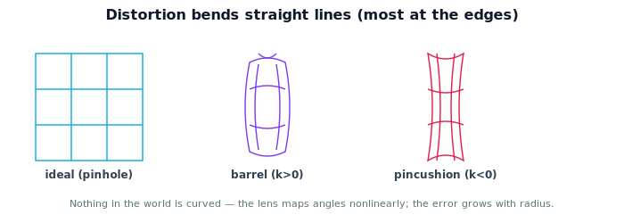

!!! abstract "You are here"
    **Module 3 — Camera Geometry and Robotic Perception**  ·  **Unit 5 — Lens Distortion**  ·  **Lesson 5.1 — Why Straight Lines Bend**

# Lesson 5.1 — Why Straight Lines Bend

## 1. Why This Matters

The pinhole model and $K$ assume light travels in perfectly straight lines through an infinitesimal hole. Real cameras use **lenses**, and lenses bend light slightly more or less than the ideal at different points — so a straight fence rail can bow outward or pinch inward in the image. For a harvesting robot, that bend means a detected fruit's pixel is *off* from where the ideal model predicts, and that error propagates into a wrong 3D estimate. Before we can invert the camera (back-projection, Unit 6), we must account for distortion. This unit names it, models it, and removes it.

## 2. Physical Intuition

Hold a cheap wide-angle lens up to a window grid: the lines near the edges curve, as if the image were painted on a gently bulging balloon. That's **barrel distortion** — magnification falls off toward the edges, so straight lines bow outward. The opposite, where lines pinch inward like a cushion pulled at the corners, is **pincushion distortion**. The center of the image is usually almost perfect; the bending grows with distance from the center. Nothing in the *world* is curved — the lens is mapping angles to the sensor slightly nonlinearly, most visibly at the periphery.

## 3. Mathematical Foundations

The ideal pinhole gives a normalized image point $(x_n, y_n) = (X/Z, Y/Z)$ before $K$. Distortion acts on these normalized coordinates *before* they become pixels: the observed point is a function $(x_d, y_d) = \text{distort}(x_n, y_n)$, and only then does $K$ map to pixels. The dominant effect is **radial**: it depends on the radius $r = \sqrt{x_n^2 + y_n^2}$ from the optical axis, and grows with $r$ — which is why the center looks fine and the edges bend. A positive radial coefficient bows lines outward (barrel); negative pinches them inward (pincushion). The full forward map becomes:

$$\text{world} \to (\text{extrinsics}) \to (x_n, y_n) \to (\text{distortion}) \to (x_d, y_d) \to (K) \to \text{pixel}.$$

Distortion sits between the ideal projection and $K$. The next lesson writes the radial (and tangential) terms explicitly; here the key point is *where* distortion enters and *that it grows with radius*.

## 4. Visual Explanation

<figure markdown>
  { width="680" }
</figure>

## 5. Engineering Example

A greenhouse robot often uses a wide field of view to see many plants at once — and wide lenses distort the most. If the perception code treats a distorted pixel as if it obeyed the ideal pinhole, a fruit near the image edge will be back-projected along the wrong ray, and the arm reaches to the wrong place. Calibration measures the distortion so the code can correct it; this is why distortion coefficients sit right alongside $K$ in every calibration file.

## 6. Worked Example

A camera images a straight horizontal rail. Under the ideal model, the rail's pixels should lie on a perfectly straight line. With barrel distortion, the measured pixels bow: near the center they match the ideal within a pixel, but 280 pixels out toward the edge they sit several pixels *above* the straight line (the line bulges). Plotting "measured minus ideal" against radius shows the error is near zero at the center and grows with $r$ — the signature of radial distortion. This is exactly what a calibration routine fits.

## 7. Interactive Demonstration

**Guided prediction.** Using the figure, predict whether barrel distortion moves edge points *toward* or *away from* the center relative to the ideal, and where the distortion is smallest. Predict what a straight vertical line at the image edge looks like under pincushion distortion. Confirm: error grows with radius, center is least affected.

## 8. Coding Exercise

!!! tip "Run the hands-on notebook"
    `modules/module03/notebooks/M03_U05_L5_1_Why_Straight_Lines_Bend.ipynb` — open in JupyterLab and run **Kernel → Restart & Run All**.

Generate ideal projected points on a grid, apply a simple radial model $r_d = r(1 + k_1 r^2)$ to each, and plot both — observe straight grid lines bow with $k_1 > 0$ (barrel) and pinch with $k_1 < 0$ (pincushion), most at the edges.

## 9. Knowledge Check

Formative — unlimited attempts, immediate feedback; does not affect your grade.

<iframe src="../../quizzes/module03/lesson17_quiz.html" title="Why Straight Lines Bend knowledge check" style="width:100%;height:720px;border:1px solid #e2e8f0;border-radius:12px"></iframe>

[Open this quiz in a new tab ↗](../quizzes/module03/lesson17_quiz.html)

A check that distortion is a deviation from the ideal pinhole, that it grows with radius, and that barrel vs pincushion bow outward vs inward.

## 10. Challenge Problem

A robot's fruit detections are accurate near the image center but consistently mislocalized near the edges. Explain how lens distortion could produce exactly this pattern, and what you'd add to the perception pipeline to fix it.

## 11. Common Mistakes

- Believing the world objects are actually curved (it's the lens mapping).
- Expecting uniform distortion across the image (it grows with radius).
- Ignoring distortion because the center looks fine.

## 12. Key Takeaways

- Real lenses **distort**: straight world lines can appear curved, most at the edges.
- **Barrel** bows outward, **pincushion** pinches inward; the center is least affected.
- Distortion acts on normalized coordinates **before $K$**: world → projection → distortion → $K$ → pixel.
- Distortion must be modeled for accurate projection and back-projection.

---

## AI Learning Companion

Copy any prompt below into ChatGPT, Claude, or another AI assistant.

**Tutor prompt** — explain it another way
```
Explain Lesson 5.1 (Module 3) — Why Straight Lines Bend — using a wide-angle lens on a window grid. Make clear distortion is a deviation from the ideal pinhole, grows with radius, and barrel vs pincushion bow outward vs inward.
```

**Practice prompt** — generate more exercises
```
Give me 6 exercises identifying barrel vs pincushion distortion and reasoning about where in the image distortion is largest. Include answers.
```

**Explore prompt** — connect it to the real world
```
Show me why wide-FOV greenhouse cameras distort most at the edges and how that causes edge fruit to be mislocalized if uncorrected.
```

## Global Learning Support

Need this lesson explained in another language? Copy one of the prompts below into an AI assistant. English remains the authoritative source.

**Supported languages (initial):** English · Español · 中文 (Simplified Chinese) · Türkçe

**Español**
```
I just completed Lesson 5.1 (Module 3) — Why Straight Lines Bend.
Explain this lesson in Spanish. Keep robotics and mathematical terminology in English when appropriate.
Then provide: a summary, three practice questions, and one challenge problem.
```

**中文 (Simplified Chinese)**
```
I just completed Lesson 5.1 (Module 3) — Why Straight Lines Bend.
Explain this lesson in Simplified Chinese. Keep mathematical notation unchanged.
Then provide: a summary, three practice questions, and one challenge problem.
```

**Türkçe**
```
I just completed Lesson 5.1 (Module 3) — Why Straight Lines Bend.
Explain this lesson in Turkish. Keep robotics terminology in English where commonly used.
Then provide: a summary, three practice questions, and one challenge problem.
```

---

*Next lesson: 5.2 — Radial and Tangential Distortion.*
