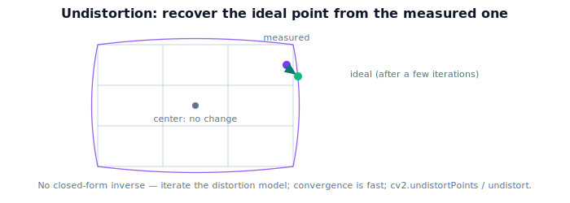

!!! abstract "You are here"
    **Module 3 — Camera Geometry and Robotic Perception**  ·  **Unit 5 — Lens Distortion**  ·  **Lesson 5.3 — Undistortion**

# Lesson 5.3 — Undistortion

## 1. Why This Matters

Distortion is the obstacle between a real measured pixel and the clean pinhole geometry we built in Unit 4. **Undistortion** removes that obstacle: given a distorted pixel, it recovers the ideal normalized coordinate the pinhole model would have produced. Once a detection is undistorted, every tool from Unit 4 — and back-projection in Unit 6 — applies exactly. This is the step that makes a real camera behave like the ideal one in our math.

## 2. Physical Intuition

Distortion took an ideal point and pushed it (mostly outward or inward, by radius). Undistortion asks the reverse question: "I measured a pixel *here* on a distorted image — where would it have been on a perfect pinhole image?" For the center, the answer is "right where it is" (no distortion there). For an edge point, undistortion nudges it back toward where straight-line geometry says it belongs. The result is a *virtual* perfect-pinhole view in which lines are straight again and the simple $K$ math is exact.

## 3. Mathematical Foundations

The forward distortion $(x_n, y_n) \to (x_d, y_d)$ from Lesson 5.2 is easy to evaluate but **not analytically invertible** (it's a polynomial in the unknown). So undistortion is done **iteratively**: start with the distorted point as a guess for $(x_n, y_n)$, apply the distortion model, compare to the measured $(x_d, y_d)$, correct, and repeat a few times until it converges. Concretely, to undistort a pixel:

1. Convert pixel to normalized distorted coords: $x_d = (u - c_x)/f_x,\ y_d = (v - c_y)/f_y$ (apply $K^{-1}$).
2. Iterate to recover $(x_n, y_n)$ such that $\text{distort}(x_n,y_n) = (x_d,y_d)$.
3. The undistorted normalized point $(x_n, y_n)$ now obeys the ideal pinhole.

OpenCV provides `cv2.undistortPoints(pts, K, distCoeffs)` (returns normalized undistorted points) and `cv2.undistort(img, K, distCoeffs)` (warps a whole image to a pinhole view). A few iterations converge because the correction shrinks fast. With `distCoeffs = 0`, undistortion is the identity.

## 4. Visual Explanation

<figure markdown>
  { width="680" }
</figure>

## 5. Engineering Example

The robot's perception node undistorts each fruit detection before estimating its 3D position. In practice it either undistorts the individual detected points (`undistortPoints`, cheap, exact where you need it) or undistorts the whole frame once (`undistort`, convenient for display and for detectors that assume straight lines). Either way, everything downstream — ray construction, depth fusion, the extrinsics chain to the world — then uses clean pinhole geometry.

## 6. Worked Example

A pixel is measured at $(u,v) = (600, 240)$ with $K$ ($f_x=f_y=800$, principal point $(320,240)$) and $k_1 = -0.2$ (others zero). Step 1: normalized distorted $x_d = (600-320)/800 = 0.35$, $y_d = 0$. Step 2 (iterate): guess $x_n = 0.35$; $r^2 = 0.1225$, factor $1 + (-0.2)(0.1225) = 0.9755$, predicted $x_d = 0.35(0.9755)=0.3414$ — too small vs measured $0.35$, so increase the guess; after a few iterations $x_n \approx 0.359$. The undistorted normalized point $\approx (0.359, 0)$ — slightly *further* from center than the measured value, undoing the inward (negative-$k_1$) pull. Now $x_n = 0.359$ obeys the ideal pinhole.

## 7. Interactive Demonstration

**Guided prediction.** For the worked example, predict whether undistortion moves the edge point toward or away from the center (given $k_1 < 0$ pulled it inward). Predict the undistorted result for a point at the exact center (any coefficients). Confirm: center unchanged; edges corrected; a few iterations converge.

## 8. Coding Exercise

!!! tip "Run the hands-on notebook"
    `modules/module03/notebooks/M03_U05_L5_3_Undistortion.ipynb` — open in JupyterLab and run **Kernel → Restart & Run All**.

Implement iterative `undistort_point(u,v,K,k1,k2,k3,p1,p2)`: apply $K^{-1}$, iterate the distortion model to invert it, return normalized undistorted coords; verify round-trip (distort then undistort ≈ identity) and that `cv2.undistortPoints` agrees (NumPy fallback if no OpenCV).

## 9. Knowledge Check

Formative — unlimited attempts, immediate feedback; does not affect your grade.

<iframe src="../../quizzes/module03/lesson19_quiz.html" title="Undistortion knowledge check" style="width:100%;height:720px;border:1px solid #e2e8f0;border-radius:12px"></iframe>

[Open this quiz in a new tab ↗](../quizzes/module03/lesson19_quiz.html)

A check on what undistortion produces, why it's iterative, and that undistorted points obey the ideal pinhole.

## 10. Challenge Problem

Explain why you cannot simply "subtract" the distortion to undo it, and why the iterative approach works. What property of the distortion (small near center, smooth) makes convergence fast?

## 11. Common Mistakes

- Expecting a closed-form inverse (distortion is inverted iteratively).
- Undistorting twice, or mixing distorted and undistorted points in one computation.
- Forgetting that `undistortPoints` returns **normalized** points, not pixels.

## 12. Key Takeaways

- **Undistortion** recovers the ideal pinhole point from a measured distorted pixel.
- It's done **iteratively** (no closed-form inverse); a few steps converge.
- OpenCV: `undistortPoints` (points → normalized) and `undistort` (whole image → pinhole view).
- After undistortion, all Unit 4 / back-projection geometry is exact.

---

## AI Learning Companion

Copy any prompt below into ChatGPT, Claude, or another AI assistant.

**Tutor prompt** — explain it another way
```
Explain Lesson 5.3 (Module 3) — Undistortion — as recovering the ideal pinhole point from a measured distorted pixel. Explain why it's iterative (no closed-form inverse) and how OpenCV's undistortPoints/undistort help.
```

**Practice prompt** — generate more exercises
```
Give me 6 exercises undistorting pixels with given K and distortion coefficients, including center points and round-trip checks. Include answers.
```

**Explore prompt** — connect it to the real world
```
Show me when a robot undistorts individual detections vs the whole frame, and why undistortion must happen before back-projection.
```

## Global Learning Support

Need this lesson explained in another language? Copy one of the prompts below into an AI assistant. English remains the authoritative source.

**Supported languages (initial):** English · Español · 中文 (Simplified Chinese) · Türkçe

**Español**
```
I just completed Lesson 5.3 (Module 3) — Undistortion.
Explain this lesson in Spanish. Keep robotics and mathematical terminology in English when appropriate.
Then provide: a summary, three practice questions, and one challenge problem.
```

**中文 (Simplified Chinese)**
```
I just completed Lesson 5.3 (Module 3) — Undistortion.
Explain this lesson in Simplified Chinese. Keep mathematical notation unchanged.
Then provide: a summary, three practice questions, and one challenge problem.
```

**Türkçe**
```
I just completed Lesson 5.3 (Module 3) — Undistortion.
Explain this lesson in Turkish. Keep robotics terminology in English where commonly used.
Then provide: a summary, three practice questions, and one challenge problem.
```

---

*Next lesson: 5.4 — Lens Distortion (Unit 5 recap).*
