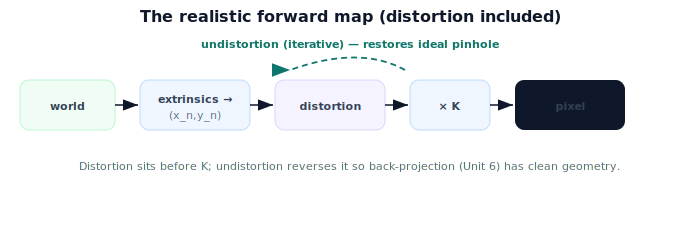

!!! abstract "You are here"
    **Module 3 — Camera Geometry and Robotic Perception**  ·  **Unit 5 — Lens Distortion**  ·  **Lesson 5.4 — Lens Distortion (Unit 5 Recap)**

# Lesson 5.4 — Lens Distortion (Unit 5 Recap)

*A short synthesis — no new mathematics. It ties Unit 5 together and points into back-projection.*

---

## Real lenses bend; we model it and undo it

Unit 5 closed the gap between the ideal pinhole and a real camera:

> **Distortion acts on normalized coordinates before $K$ (radial $k_1,k_2,k_3$ + tangential $p_1,p_2$); undistortion inverts it iteratively so a measured pixel maps back to ideal pinhole geometry.**

After undistortion, every Unit 4 tool is exact again.

## What Unit 5 established

| Lesson | Point |
|---|---|
| 5.1 Why Straight Lines Bend | Distortion = deviation from the pinhole; grows with radius; barrel (outward) vs pincushion (inward). |
| 5.2 Radial and Tangential Distortion | Model: ×(1+k1 r²+k2 r⁴+k3 r⁶) + tangential (p1,p2); distCoeffs=(k1,k2,p1,p2,k3); zeros = ideal. |
| 5.3 Undistortion | Recover the ideal point from a measured pixel; iterative (no closed form); `cv2.undistortPoints`/`undistort`. |

## Why this matters

The full forward map is now complete and *realistic*: world → extrinsics → normalized projection → **distortion** → $K$ → pixel. **Unit 6** runs the pipeline backward — starting from an (undistorted) pixel, treat it as a **ray**, and add depth to recover a 3D point. **Unit 7** carries that point into the world via Module 2's extrinsics. Undistortion is the gate: back-projection assumes clean pinhole geometry, which is exactly what undistortion provides.

## Visual Explanation

<figure markdown>
  { width="680" }
</figure>

## Coding Exercise

!!! tip "Run the hands-on notebook"
    `modules/module03/notebooks/M03_U05_L5_4_Lens_Distortion_Unit_5_Recap.ipynb` — open in JupyterLab and run **Kernel → Restart & Run All**.

A short consolidation: distort a grid of points, undistort them, and confirm the round-trip returns the originals; show the center is unaffected and edges are corrected most.

## Knowledge Check

Formative — unlimited attempts, immediate feedback; does not affect your grade.

<iframe src="../../quizzes/module03/lesson20_quiz.html" title="Lens Distortion (Unit 5 Recap) knowledge check" style="width:100%;height:720px;border:1px solid #e2e8f0;border-radius:12px"></iframe>

[Open this quiz in a new tab ↗](../quizzes/module03/lesson20_quiz.html)

A brief consolidation quiz across Unit 5 (formative — unlimited attempts).

## Key Takeaways

- Distortion model: radial $(k_1,k_2,k_3)$ + tangential $(p_1,p_2)$, applied to normalized coords before $K$.
- **Undistortion** recovers ideal pinhole points (iterative; OpenCV helpers).
- Pipeline: world → extrinsics → projection → distortion → $K$ → pixel.
- Next: **back-projection** — from an undistorted pixel (a ray) plus depth to a 3D point.

---

## AI Learning Companion

Copy any prompt below into ChatGPT, Claude, or another AI assistant.

**Tutor prompt** — explain it another way
```
Summarize Unit 5 of Module 3: lens distortion (radial k1,k2,k3 + tangential p1,p2) applied before K, and undistortion (iterative) that restores the ideal pinhole. Show where distortion sits in the pipeline.
```

**Practice prompt** — generate more exercises
```
Give me a 10-question review of lens distortion: barrel vs pincushion, the coefficient model, and undistortion round-trips. Include answers.
```

**Explore prompt** — connect it to the real world
```
Show me why undistortion must happen before back-projection in a harvesting robot's perception pipeline.
```

## Global Learning Support

Need this lesson explained in another language? Copy one of the prompts below into an AI assistant. English remains the authoritative source.

**Supported languages (initial):** English · Español · 中文 (Simplified Chinese) · Türkçe

**Español**
```
I just completed Lesson 5.4 (Module 3) — Lens Distortion (Unit 5 Recap).
Explain this lesson in Spanish. Keep robotics and mathematical terminology in English when appropriate.
Then provide: a summary, three practice questions, and one challenge problem.
```

**中文 (Simplified Chinese)**
```
I just completed Lesson 5.4 (Module 3) — Lens Distortion (Unit 5 Recap).
Explain this lesson in Simplified Chinese. Keep mathematical notation unchanged.
Then provide: a summary, three practice questions, and one challenge problem.
```

**Türkçe**
```
I just completed Lesson 5.4 (Module 3) — Lens Distortion (Unit 5 Recap).
Explain this lesson in Turkish. Keep robotics terminology in English where commonly used.
Then provide: a summary, three practice questions, and one challenge problem.
```

---

*Next: Unit 6 — Back-Projection: Pixels to 3D.*
