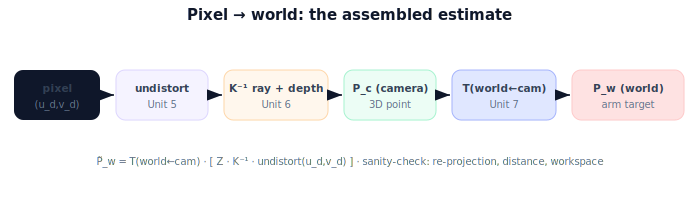

!!! abstract "You are here"
    **Module 3 — Camera Geometry and Robotic Perception**  ·  **Unit 7 — From Pixels to the Robot**  ·  **Lesson 7.3 — Estimating the Fruit's World Position**

# Lesson 7.3 — Estimating the Fruit's World Position

## 1. Why This Matters

Every piece is now on the table: intrinsics, distortion, back-projection, extrinsics. This lesson assembles them into the one computation the robot actually runs — **pixel → world position** — and shows how to sanity-check it. This is the payoff of Module 3: a detected fruit becomes a 3D target the arm can reach.

## 2. Physical Intuition

The journey of a single detection: the detector says "fruit at this pixel." Undistort it so the geometry is clean. Treat it as a ray and slide to the measured depth — now it's a 3D point, but in the camera's coordinates. Finally, carry it through the camera→arm→world hops so it's expressed where the arm lives. Five steps, each one a lesson you've already done; here they run in sequence on real data.

## 3. Mathematical Foundations

Given a raw detected pixel $(u_d, v_d)$, depth $Z$, intrinsics $K$, distortion coefficients, and extrinsics $T_{w\leftarrow c}$:

1. **Undistort:** $(u_d,v_d) \to$ ideal normalized $(x_n, y_n)$ (Unit 5).
2. **Back-project + depth:** $\mathbf{P}_c = Z\,(x_n, y_n, 1)$ (Unit 6).
3. **Transform:** $\tilde{\mathbf{P}}_w = T_{w\leftarrow c}\,\tilde{\mathbf{P}}_c$ (Unit 7 / Module 2).

In one line: $\boxed{\tilde{\mathbf{P}}_w = T_{w\leftarrow c}\,\big[\,Z\cdot K^{-1}\,\text{undistort}(u_d,v_d)\,\big]}$ (with the third coordinate set to $Z$ and homogenized). The result $\mathbf{P}_w$ is the fruit's position in the world frame. Sanity checks: $\mathbf{P}_w$ should lie in the plausible workspace; re-projecting it (world→camera→pixel) should return near the original detection; and the camera-to-fruit distance should equal $\lVert \mathbf{P}_c\rVert$ regardless of frame (rigid transforms preserve distance — a Module 2 invariant).

## 4. Visual Explanation

<figure markdown>
  { width="680" }
</figure>

## 5. Engineering Example

The greenhouse robot's perception node runs exactly this on every detection: undistort, deproject the masked depth, average to a stable $\mathbf{P}_c$, transform to $\mathbf{P}_w$, and publish the world-frame target. A watchdog runs the re-projection sanity check; if the reprojected pixel drifts beyond a few pixels, it flags a calibration or depth-alignment fault before the arm moves. This is the production shape of everything Module 3 taught.

## 6. Worked Example

Detection at undistorted pixel $(480,160)$, $K$ ($f=800$, pp $(320,240)$), depth $Z=0.3$. Back-project: $\mathbf{P}_c=(0.06,-0.03,0.3)$. Extrinsics (from 7.2): $T_{a\leftarrow c}$ translation $(0,0,0.1)$, $T_{w\leftarrow a}$ translation $(1.0,0.5,0)$, identity rotations. Then $\mathbf{P}_w=(1.06, 0.47, 0.4)$. Check: $\lVert\mathbf{P}_c\rVert=\sqrt{0.06^2+0.03^2+0.3^2}\approx 0.307$ m; the camera-to-fruit distance in the world is identical (rigid transform preserves it) ✓. Re-projecting $\mathbf{P}_w$ back through the inverse chain and $K$ returns $(480,160)$ ✓.

## 7. Interactive Demonstration

**Guided prediction.** For the worked example, predict $\mathbf{P}_c$, then $\mathbf{P}_w$ after the two hops. Predict whether the camera-to-fruit distance changes between frames (no — rigid). Confirm the re-projection returns the original pixel.

## 8. Coding Exercise

!!! tip "Run the hands-on notebook"
    `modules/module03/notebooks/M03_U07_L7_3_Estimating_The_Fruits_World_Position.ipynb` — open in JupyterLab and run **Kernel → Restart & Run All**.

Write `pixel_to_world(u,v,Z,K,distCoeffs,T_wc)` chaining undistort → deproject → transform; verify $\mathbf{P}_w=(1.06,0.47,0.4)$ for the worked example; assert distance preservation and a re-projection round-trip.

## 9. Knowledge Check

Formative — unlimited attempts, immediate feedback; does not affect your grade.

<iframe src="../../quizzes/module03/lesson27_quiz.html" title="Estimating the Fruit's World Position knowledge check" style="width:100%;height:720px;border:1px solid #e2e8f0;border-radius:12px"></iframe>

[Open this quiz in a new tab ↗](../quizzes/module03/lesson27_quiz.html)

A check on the five-stage order, the one-line formula, and the sanity checks (workspace, re-projection, distance preservation).

## 10. Challenge Problem

Your $\mathbf{P}_w$ is consistently 5 cm too high in $z$. The detection re-projects perfectly to the pixel. Where is the error most likely to be — perception or extrinsics — and why does a perfect re-projection point you there?

## 11. Common Mistakes

- Running steps out of order (e.g., transforming before back-projecting).
- Skipping undistortion, so the world point inherits the lens error.
- Forgetting the result depends on depth quality (bad $Z$ → bad $\mathbf{P}_w$).

## 12. Key Takeaways

- End-to-end: **undistort → back-project (+depth) → transform** = pixel to world.
- One line: $\tilde{\mathbf{P}}_w = T_{w\leftarrow c}[Z\cdot K^{-1}\,\text{undistort}(u,v)]$.
- Sanity-check with workspace bounds, re-projection, and distance preservation.
- $\mathbf{P}_w$ is the fruit's world position — the arm's target.

---

## AI Learning Companion

Copy any prompt below into ChatGPT, Claude, or another AI assistant.

**Tutor prompt** — explain it another way
```
Explain Lesson 7.3 (Module 3) — Estimating the Fruit's World Position — as the five-stage pixel→world pipeline (undistort, K⁻¹ ray, +depth, transform). Show the one-line formula and the re-projection / distance-preservation sanity checks.
```

**Practice prompt** — generate more exercises
```
Give me 6 exercises running the full pixel-to-world estimate with given K, distortion, depth, and extrinsics, including sanity checks. Include answers.
```

**Explore prompt** — connect it to the real world
```
Show me how a robot's perception node turns a detection into a world-frame target and uses a re-projection watchdog to catch calibration faults.
```

## Global Learning Support

Need this lesson explained in another language? Copy one of the prompts below into an AI assistant. English remains the authoritative source.

**Supported languages (initial):** English · Español · 中文 (Simplified Chinese) · Türkçe

**Español**
```
I just completed Lesson 7.3 (Module 3) — Estimating the Fruit's World Position.
Explain this lesson in Spanish. Keep robotics and mathematical terminology in English when appropriate.
Then provide: a summary, three practice questions, and one challenge problem.
```

**中文 (Simplified Chinese)**
```
I just completed Lesson 7.3 (Module 3) — Estimating the Fruit's World Position.
Explain this lesson in Simplified Chinese. Keep mathematical notation unchanged.
Then provide: a summary, three practice questions, and one challenge problem.
```

**Türkçe**
```
I just completed Lesson 7.3 (Module 3) — Estimating the Fruit's World Position.
Explain this lesson in Turkish. Keep robotics terminology in English where commonly used.
Then provide: a summary, three practice questions, and one challenge problem.
```

---

*Next lesson: 7.4 — Unit 7 recap.*
