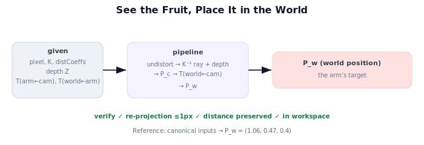

!!! abstract "You are here"
    **Module 3 — Camera Geometry and Robotic Perception**  ·  **Unit 8 — Mini Project: See the Fruit, Place It in the World**  ·  **Lesson 8.1 — The Project: Pixel to World**

# Lesson 8.1 — The Project: Pixel to World

## 1. Why This Matters

This is where Module 3 becomes a working capability. The mini project — **"See the Fruit, Place It in the World"** — takes a fruit detection and produces a world-frame position the robot arm could reach, with verification. It integrates every Module 3 unit (intrinsics, distortion, projection, back-projection) with Module 2 (transforms). Completing it is the evidence that you can turn pixels into action.

## 2. Physical Intuition

You're handed what a real robot sees: a pixel where the detector fired, the camera's calibration (intrinsics + distortion), a depth reading at that pixel, and the camera's pose on the robot. Your job is to answer the one question that matters for grasping: *where is that fruit in the world?* — and to prove your answer is right before trusting it. The project is the disciplined version of "see it, locate it, check it."

## 3. Mathematical Foundations

**Given:** detected pixel $(u_d, v_d)$; intrinsics $K$ and distortion coefficients; depth $Z$ at that pixel; extrinsics chain $T_{a\leftarrow c}$ (calibration) and $T_{w\leftarrow a}$ (robot pose).

**Produce:** the world-frame fruit position $\mathbf{P}_w$, via the Module 3 pipeline:

$$\mathbf{P}_w = T_{w\leftarrow c}\,\big[\,Z\cdot K^{-1}\,\text{undistort}(u_d,v_d)\,\big], \qquad T_{w\leftarrow c}=T_{w\leftarrow a}T_{a\leftarrow c}.$$

**Acceptance checks** (all must pass):
1. **Re-projection:** projecting $\mathbf{P}_w$ back (world→camera→distort→$K$) returns within ~1 px of $(u_d,v_d)$.
2. **Distance preservation:** $\lVert \mathbf{P}_w - \mathbf{t}_{w\leftarrow c}\rVert = \lVert \mathbf{P}_c\rVert$ (camera-to-fruit distance unchanged by the rigid transform).
3. **Workspace plausibility:** $\mathbf{P}_w$ lies within the robot's reachable bounds.

This lesson defines the contract; 8.2 implements it, 8.3 verifies and visualizes, 8.4 wraps up.

## 4. Visual Explanation

<figure markdown>
  { width="680" }
</figure>

## 5. Engineering Example

This is the literal job of a harvesting robot's perception module: every fruit it intends to pick goes through this pipeline, and the acceptance checks are the guardrails that keep a miscalibrated camera or a bad depth pixel from driving the arm into the wrong place. Framing the project around acceptance checks mirrors how production perception code is actually tested.

## 6. Worked Example

Canonical inputs: $(u_d,v_d)=(480,160)$ (already undistorted for simplicity), $K$ ($f=800$, pp $(320,240)$), $Z=0.3$, $T_{a\leftarrow c}$ translation $(0,0,0.1)$, $T_{w\leftarrow a}$ translation $(1.0,0.5,0)$. Pipeline → $\mathbf{P}_c=(0.06,-0.03,0.3)$, $\mathbf{P}_w=(1.06,0.47,0.4)$. Checks: re-projection returns $(480,160)$ ✓; $\lVert\mathbf{P}_c\rVert\approx0.307$ m preserved ✓; $(1.06,0.47,0.4)$ within a 1.5 m workspace ✓. This is the reference the implementation must reproduce.

## 7. Interactive Demonstration

<iframe src="../../demos/module03/lesson29_see_fruit_place_world.html" title="The Project: Pixel to World interactive demo" style="width:100%;height:520px;border:1px solid #e2e8f0;border-radius:12px"></iframe>

[Open this demo in a new tab ↗](../demos/module03/lesson29_see_fruit_place_world.html)

**Guided prediction.** Before coding, predict $\mathbf{P}_c$ and $\mathbf{P}_w$ for the canonical inputs, and which of the three checks is most likely to catch a wrong depth value. Confirm against the worked example.

## 8. Coding Exercise

!!! tip "Run the hands-on notebook"
    `modules/module03/notebooks/M03_U08_L8_1_The_Project_Pixel_To_World.ipynb` — open in JupyterLab and run **Kernel → Restart & Run All**.

Set up the project scaffold: a function signature `see_fruit_place_in_world(pixel, Z, K, distCoeffs, T_ac, T_wa)` returning $\mathbf{P}_w$ plus a checks dict; stub the stages; assert the canonical worked example once implemented in 8.2.

## 9. Knowledge Check

Formative — unlimited attempts, immediate feedback; does not affect your grade.

<iframe src="../../quizzes/module03/lesson29_quiz.html" title="The Project: Pixel to World knowledge check" style="width:100%;height:720px;border:1px solid #e2e8f0;border-radius:12px"></iframe>

[Open this quiz in a new tab ↗](../quizzes/module03/lesson29_quiz.html)

A check on the given/produce contract, the pipeline order, and the three acceptance checks.

## 10. Challenge Problem

Propose a fourth acceptance check that would catch a *frame* error (e.g., camera-frame point handed to the arm without transforming). What signature would that bug have that the existing three checks might miss?

## 11. Common Mistakes

- Treating the project as "just detection" (the locating + verifying is the point).
- Skipping the acceptance checks (then you can't trust $\mathbf{P}_w$).
- Mixing distorted and undistorted pixels across stages.

## 12. Key Takeaways

- The capstone: detection + calibration + depth + extrinsics → **verified** world position.
- Pipeline: undistort → back-project (+depth) → transform.
- Three acceptance checks: re-projection, distance preservation, workspace.
- Reference result: $\mathbf{P}_w=(1.06,0.47,0.4)$ for the canonical inputs.

---

## AI Learning Companion

Copy any prompt below into ChatGPT, Claude, or another AI assistant.

**Tutor prompt** — explain it another way
```
Explain Lesson 8.1 (Module 3) — The Project: Pixel to World — as the capstone contract: given pixel, K, distortion, depth, extrinsics → verified world position, with re-projection, distance-preservation, and workspace checks.
```

**Practice prompt** — generate more exercises
```
Give me 5 variations of the pixel-to-world project with different inputs and expected world positions, plus the acceptance-check outcomes. Include answers.
```

**Explore prompt** — connect it to the real world
```
Show me how a harvesting robot's perception module uses acceptance checks as guardrails before moving the arm.
```

## Global Learning Support

Need this lesson explained in another language? Copy one of the prompts below into an AI assistant. English remains the authoritative source.

**Supported languages (initial):** English · Español · 中文 (Simplified Chinese) · Türkçe

**Español**
```
I just completed Lesson 8.1 (Module 3) — The Project: Pixel to World.
Explain this lesson in Spanish. Keep robotics and mathematical terminology in English when appropriate.
Then provide: a summary, three practice questions, and one challenge problem.
```

**中文 (Simplified Chinese)**
```
I just completed Lesson 8.1 (Module 3) — The Project: Pixel to World.
Explain this lesson in Simplified Chinese. Keep mathematical notation unchanged.
Then provide: a summary, three practice questions, and one challenge problem.
```

**Türkçe**
```
I just completed Lesson 8.1 (Module 3) — The Project: Pixel to World.
Explain this lesson in Turkish. Keep robotics terminology in English where commonly used.
Then provide: a summary, three practice questions, and one challenge problem.
```

---

*Next lesson: 8.2 — Building the Perception→World Pipeline.*
