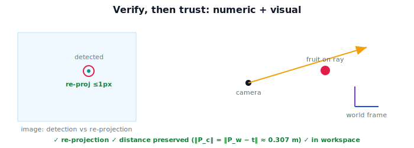

!!! abstract "You are here"
    **Module 3 — Camera Geometry and Robotic Perception**  ·  **Unit 8 — Mini Project: See the Fruit, Place It in the World**  ·  **Lesson 8.3 — Verifying and Visualizing**

# Lesson 8.3 — Verifying and Visualizing

## 1. Why This Matters

A world position you can't verify is a guess. This lesson implements the acceptance checks from 8.1 and visualizes the result so the answer is both *provably* and *visibly* correct. Verification is what separates a demo from a system you'd let move a real arm.

## 2. Physical Intuition

Two complementary ways to trust a result: *check the numbers* and *look at the picture*. The numeric checks ask "if I run the pipeline backward, do I get my pixel again?" and "is the fruit the same distance away as the camera measured?" The picture shows the camera, the ray through the pixel, the fruit on that ray, and the world frame — so a frame error or a depth blunder is obvious to the eye. Together they catch different failure modes.

## 3. Mathematical Foundations

**Re-projection check:** transform $\mathbf{P}_w$ back to the camera frame ($T_{c\leftarrow w}=T_{w\leftarrow c}^{-1}$), distort, apply $K$ → pixel; require $\lVert\text{pixel}-(u_d,v_d)\rVert \lesssim 1$ px. **Distance check:** $\big|\,\lVert\mathbf{P}_w-\mathbf{t}_{w\leftarrow c}\rVert - \lVert\mathbf{P}_c\rVert\,\big| < \varepsilon$ (rigid transforms preserve distance — Module 2). **Workspace check:** $\mathbf{P}_w$ within reachable bounds. **Visualization:** plot the camera center, the back-projected ray, $\mathbf{P}_c$/$\mathbf{P}_w$, and the world axes; a correct result shows the fruit on the ray at the right depth and in a sensible world location.

Failure signatures: re-projection fails but distance holds → likely an extrinsics/frame issue; distance fails → likely a depth or scaling bug; both fail → intrinsics/undistortion.

## 4. Visual Explanation

<figure markdown>
  { width="680" }
</figure>

## 5. Engineering Example

The robot logs these checks for every pick attempt. A re-projection that drifts over time signals the camera shifted on its mount (recalibrate). A distance mismatch flags depth-sensor trouble. The visualization is what an operator glances at to confirm the robot "sees" correctly before harvesting a row — the human-trust layer on top of the numeric guardrails.

## 6. Worked Example

For the canonical $\mathbf{P}_w=(1.06,0.47,0.4)$: invert $T_{w\leftarrow c}$ to get $\mathbf{P}_c=(0.06,-0.03,0.3)$, apply $K$ → $(480,160)$, matching the detection (0 px error) ✓. Distance: $\lVert\mathbf{P}_c\rVert\approx0.307$ m; $\lVert\mathbf{P}_w-\mathbf{t}_{w\leftarrow c}\rVert$ with $\mathbf{t}_{w\leftarrow c}=(1.0,0.5,0.1)$ gives $\lVert(0.06,-0.03,0.3)\rVert\approx0.307$ m ✓. Workspace: within 1.5 m ✓. All three pass; the visualization shows the tomato on the ray.

## 7. Interactive Demonstration

**Guided prediction.** Predict which check fails if depth is read as $0.6$ instead of $0.3$ (distance? re-projection? both?). Predict which fails if $\mathbf{P}_c$ is handed to the arm without transforming. Confirm by toggling each fault.

## 8. Coding Exercise

!!! tip "Run the hands-on notebook"
    `modules/module03/notebooks/M03_U08_L8_3_Verifying_And_Visualizing.ipynb` — open in JupyterLab and run **Kernel → Restart & Run All**.

Implement `verify(P_w, pixel, K, distCoeffs, T_wc, P_c, workspace)` returning the three check results; add a matplotlib faux-3D plot of camera/ray/fruit/world; confirm all checks pass for the canonical case and that an injected depth error trips the distance check.

## 9. Knowledge Check

Formative — unlimited attempts, immediate feedback; does not affect your grade.

<iframe src="../../quizzes/module03/lesson31_quiz.html" title="Verifying and Visualizing knowledge check" style="width:100%;height:720px;border:1px solid #e2e8f0;border-radius:12px"></iframe>

[Open this quiz in a new tab ↗](../quizzes/module03/lesson31_quiz.html)

A check on the three verification methods, their failure signatures, and the value of visualization.

## 10. Challenge Problem

Design a single scalar "health score" combining the three checks that an operator could monitor. How would you weight re-projection vs distance, and what threshold would halt the arm?

## 11. Common Mistakes

- Reporting $\mathbf{P}_w$ without running any check.
- Using $T_{w\leftarrow c}$ where its inverse $T_{c\leftarrow w}$ is needed for re-projection.
- Reading a passing distance check as proof of correctness (a frame error can still pass it).

## 12. Key Takeaways

- Verify with **re-projection**, **distance preservation**, and **workspace** checks.
- Failure signatures localize the fault (frame vs depth vs intrinsics).
- Visualize camera/ray/fruit/world to make correctness visible.
- Verification is what makes the world position trustworthy enough to act on.

---

## AI Learning Companion

Copy any prompt below into ChatGPT, Claude, or another AI assistant.

**Tutor prompt** — explain it another way
```
Explain Lesson 8.3 (Module 3) — Verifying and Visualizing — covering the re-projection, distance-preservation, and workspace checks, their failure signatures, and a camera/ray/fruit/world visualization.
```

**Practice prompt** — generate more exercises
```
Give me 6 exercises diagnosing pixel-to-world faults from which acceptance check fails. Include answers.
```

**Explore prompt** — connect it to the real world
```
Show me how a robot logs re-projection and distance checks to detect a shifted camera or a depth-sensor fault in the field.
```

## Global Learning Support

Need this lesson explained in another language? Copy one of the prompts below into an AI assistant. English remains the authoritative source.

**Supported languages (initial):** English · Español · 中文 (Simplified Chinese) · Türkçe

**Español**
```
I just completed Lesson 8.3 (Module 3) — Verifying and Visualizing.
Explain this lesson in Spanish. Keep robotics and mathematical terminology in English when appropriate.
Then provide: a summary, three practice questions, and one challenge problem.
```

**中文 (Simplified Chinese)**
```
I just completed Lesson 8.3 (Module 3) — Verifying and Visualizing.
Explain this lesson in Simplified Chinese. Keep mathematical notation unchanged.
Then provide: a summary, three practice questions, and one challenge problem.
```

**Türkçe**
```
I just completed Lesson 8.3 (Module 3) — Verifying and Visualizing.
Explain this lesson in Turkish. Keep robotics terminology in English where commonly used.
Then provide: a summary, three practice questions, and one challenge problem.
```

---

*Next lesson: 8.4 — Wrap-Up and the Road to Kinematics.*
