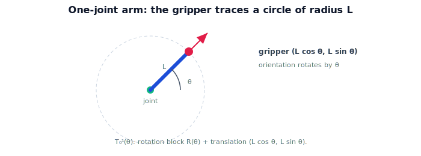

!!! abstract "You are here"
    **Module 4 — Forward Kinematics using Denavit–Hartenberg Parameters**  ·  **Unit 2 — One Joint at a Time**  ·  **Lesson 2.1 — A One-Joint Arm**

# Lesson 2.1 — A One-Joint Arm

## 1. Why This Matters

Everything in forward kinematics generalizes from one joint. If you can write the pose of a single revolute joint with one rigid link, you can chain the idea to any arm. So we start as small as possible — one joint, one link, motion in a plane — and compute the gripper's pose exactly. This is the atom of the whole module.

## 2. Physical Intuition

Picture a clock hand pinned at the center (the joint) with the tip as the gripper. Turn the hand by an angle $\theta$ and the tip sweeps a circle of radius equal to the hand's length. Two things change as you turn: the tip's **position** (it moves around the circle) and the hand's **orientation** (it points in a new direction). The joint angle $\theta$ controls both. That's the entire behavior of a one-joint arm — a rotation applied to a fixed link.

## 3. Mathematical Foundations

Place the joint at the base-frame origin, link length $L$ along the link's own $x$-axis, motion in the $xy$-plane. Rotating the joint by $\theta$ rotates the base frame by $\theta$ (a Module 2 planar rotation), and the gripper sits at distance $L$ along the rotated $x$-axis. The gripper **position** is

$$\mathbf{t}(\theta) = \big(L\cos\theta,\ L\sin\theta\big),$$

and the gripper **orientation** is the rotation by $\theta$:

$$R(\theta) = \begin{bmatrix}\cos\theta & -\sin\theta \\ \sin\theta & \cos\theta\end{bmatrix}.$$

Packed as a planar pose ($SE(2)$, a slice of the $SE(3)$ machinery from Module 2):

$$T_0^1(\theta) = \begin{bmatrix} \cos\theta & -\sin\theta & L\cos\theta \\ \sin\theta & \cos\theta & L\sin\theta \\ 0 & 0 & 1 \end{bmatrix}.$$

One joint variable $\theta$ determines the whole pose. Notice the position is the *image of the link tip* $(L,0)$ under the rotation — exactly "rotate the frame, then read off where the fixed link end lands."

## 4. Visual Explanation

<figure markdown>
  { width="680" }
</figure>

## 5. Engineering Example

The greenhouse arm's base swivel joint is essentially this: rotating it sweeps the whole arm (and gripper) around a circle. Even before adding the elbow and wrist, knowing the base joint's pose as a function of its angle is the first factor in the full chain. The one-joint formula is literally $T_0^1$ in the product we'll build.

## 6. Worked Example

Link $L=0.5$ m. At $\theta=0$: position $(0.5, 0)$, orientation $0°$. At $\theta=90°$: position $(0, 0.5)$, orientation $90°$. At $\theta=45°$: position $(0.5\cos45°, 0.5\sin45°)\approx(0.354, 0.354)$, orientation $45°$. Each angle yields one pose — position on the radius-$0.5$ circle, orientation equal to $\theta$. The pose matrix $T_0^1(45°)$ has the rotation block for $45°$ and translation $(0.354, 0.354)$.

## 7. Interactive Demonstration

<iframe src="../../demos/module04/lesson05_one_joint_arm.html" title="A One-Joint Arm interactive demo" style="width:100%;height:520px;border:1px solid #e2e8f0;border-radius:12px"></iframe>

[Open this demo in a new tab ↗](../demos/module04/lesson05_one_joint_arm.html)

**Guided prediction.** For $L=0.5$, predict the gripper position and orientation at $\theta=0°,45°,90°,180°$. Predict the path the gripper traces as $\theta$ sweeps $0\to360°$. Confirm: a circle of radius $L$; orientation equals $\theta$.

## 8. Coding Exercise

!!! tip "Run the hands-on notebook"
    `modules/module04/notebooks/M04_U02_L2_1_A_One_Joint_Arm.ipynb` — open in JupyterLab and run **Kernel → Restart & Run All**.

Implement `pose_one_joint(theta, L)` returning the $3\times3$ $SE(2)$ matrix; extract position and orientation; verify the worked-example values; plot the circle swept as $\theta$ varies.

## 9. Knowledge Check

Formative — unlimited attempts, immediate feedback; does not affect your grade.

<iframe src="../../quizzes/module04/lesson05_quiz.html" title="A One-Joint Arm knowledge check" style="width:100%;height:720px;border:1px solid #e2e8f0;border-radius:12px"></iframe>

[Open this quiz in a new tab ↗](../quizzes/module04/lesson05_quiz.html)

A check on the one-joint position/orientation formulas and that one angle sets the whole pose.

## 10. Challenge Problem

The link is mounted with a fixed $90°$ bend at the tip (the gripper points perpendicular to the link). How does the orientation part of $T_0^1$ change, and why does the *position* stay $(L\cos\theta, L\sin\theta)$?

## 11. Common Mistakes

- Reporting only position and forgetting orientation rotates with $\theta$.
- Putting $L$ in the wrong place (it scales the rotated $x$-axis: $(L\cos\theta, L\sin\theta)$).
- Mixing degrees and radians in the trig.

## 12. Key Takeaways

- A one-joint arm's gripper position is $(L\cos\theta, L\sin\theta)$; orientation is rotation by $\theta$.
- The pose is the $SE(2)$ matrix $T_0^1(\theta)$ — rotation block + translation.
- One joint variable determines the entire pose.
- This is the building block chained in later units.

---

## AI Learning Companion

Copy any prompt below into ChatGPT, Claude, or another AI assistant.

**Tutor prompt** — explain it another way
```
Explain Lesson 2.1 (Module 4) — A One-Joint Arm — using a clock hand. Show the gripper position (Lcosθ, Lsinθ), orientation = θ, and the SE(2) pose matrix T_0^1(θ).
```

**Practice prompt** — generate more exercises
```
Give me 6 exercises computing the one-joint arm's gripper position, orientation, and SE(2) pose for various θ and L. Include answers.
```

**Explore prompt** — connect it to the real world
```
Show me how a robot's base swivel joint is a one-joint arm and how its pose becomes the first factor in the forward-kinematics product.
```

## Global Learning Support

Need this lesson explained in another language? Copy one of the prompts below into an AI assistant. English remains the authoritative source.

**Supported languages (initial):** English · Español · 中文 (Simplified Chinese) · Türkçe

**Español**
```
I just completed Lesson 2.1 (Module 4) — A One-Joint Arm.
Explain this lesson in Spanish. Keep robotics and mathematical terminology in English when appropriate.
Then provide: a summary, three practice questions, and one challenge problem.
```

**中文 (Simplified Chinese)**
```
I just completed Lesson 2.1 (Module 4) — A One-Joint Arm.
Explain this lesson in Simplified Chinese. Keep mathematical notation unchanged.
Then provide: a summary, three practice questions, and one challenge problem.
```

**Türkçe**
```
I just completed Lesson 2.1 (Module 4) — A One-Joint Arm.
Explain this lesson in Turkish. Keep robotics terminology in English where commonly used.
Then provide: a summary, three practice questions, and one challenge problem.
```

---

*Next lesson: 2.2 — The Joint Transform.*
