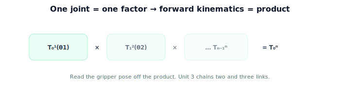

!!! abstract "You are here"
    **Module 4 — Forward Kinematics using Denavit–Hartenberg Parameters**  ·  **Unit 2 — One Joint at a Time**  ·  **Lesson 2.4 — One Joint at a Time (Unit 2 Recap)**

# Lesson 2.4 — One Joint at a Time (Unit 2 Recap)

*A short synthesis — no new mathematics. It ties Unit 2 together and points into chaining.*

---

## The atom of forward kinematics

Unit 2 built the single-joint case completely:

> **One joint = one $SE(3)$ transform of one variable ($R_z(\theta)\,G$ or $\text{Trans}_z(d)\,G$); the gripper pose is read from its translation column (position) and rotation block (orientation).**

## What Unit 2 established

| Lesson | Point |
|---|---|
| 2.1 A One-Joint Arm | Gripper position $(L\cos\theta, L\sin\theta)$, orientation $\theta$; pose $T_0^1(\theta)$. |
| 2.2 The Joint Transform | Each joint = variable motion ∘ fixed link geometry, one $SE(3)$ factor. |
| 2.3 Where Is the Tip? | Position = translation column; orientation = rotation block; matches trig. |

## Why this matters

A real arm has several joints. Because each is one transform, the gripper's pose for the whole arm is the **product** of the per-joint transforms — and that product *is* forward kinematics. **Unit 3** does exactly this: add a second (then third) joint and **compose** the transforms (Module 2 composition), reading the gripper pose off the product. **Unit 4** generalizes to $n$ joints, and **Units 5–6** introduce the DH convention so each factor comes from four numbers. We are one composition away from a general arm.

## Visual Explanation

<figure markdown>
  { width="680" }
</figure>

## Coding Exercise

!!! tip "Run the hands-on notebook"
    `modules/module04/notebooks/M04_U02_L2_4_One_Joint_At_A_Time_Unit_2_Recap.ipynb` — open in JupyterLab and run **Kernel → Restart & Run All**.

A short consolidation: build `pose_one_joint(theta, L)`, extract position and orientation, and confirm against trig for two angles — the routine that will be applied to each factor of the chain.

## Knowledge Check

Formative — unlimited attempts, immediate feedback; does not affect your grade.

<iframe src="../../quizzes/module04/lesson08_quiz.html" title="One Joint at a Time (Unit 2 Recap) knowledge check" style="width:100%;height:720px;border:1px solid #e2e8f0;border-radius:12px"></iframe>

[Open this quiz in a new tab ↗](../quizzes/module04/lesson08_quiz.html)

A brief consolidation quiz across Unit 2 (formative — unlimited attempts).

## Key Takeaways

- One joint = **one $SE(3)$ transform** of one variable (revolute or prismatic).
- Read **position** (translation column) and **orientation** (rotation block) from the pose.
- Forward kinematics for many joints is the **product** of per-joint transforms.
- Next: **Unit 3** — chaining two and three links.

---

## AI Learning Companion

Copy any prompt below into ChatGPT, Claude, or another AI assistant.

**Tutor prompt** — explain it another way
```
Summarize Unit 2 of Module 4: a single joint is one SE(3) transform of one variable; read position (translation column) and orientation (rotation block) from the pose; forward kinematics for many joints is the product of these factors.
```

**Practice prompt** — generate more exercises
```
Give me a 10-question review of the one-joint arm: pose formula, joint transform, and position/orientation extraction. Include answers.
```

**Explore prompt** — connect it to the real world
```
Show me how a multi-joint arm's gripper pose is the product of single-joint transforms, building on the one-joint case.
```

## Global Learning Support

Need this lesson explained in another language? Copy one of the prompts below into an AI assistant. English remains the authoritative source.

**Supported languages (initial):** English · Español · 中文 (Simplified Chinese) · Türkçe

**Español**
```
I just completed Lesson 2.4 (Module 4) — One Joint at a Time (Unit 2 Recap).
Explain this lesson in Spanish. Keep robotics and mathematical terminology in English when appropriate.
Then provide: a summary, three practice questions, and one challenge problem.
```

**中文 (Simplified Chinese)**
```
I just completed Lesson 2.4 (Module 4) — One Joint at a Time (Unit 2 Recap).
Explain this lesson in Simplified Chinese. Keep mathematical notation unchanged.
Then provide: a summary, three practice questions, and one challenge problem.
```

**Türkçe**
```
I just completed Lesson 2.4 (Module 4) — One Joint at a Time (Unit 2 Recap).
Explain this lesson in Turkish. Keep robotics terminology in English where commonly used.
Then provide: a summary, three practice questions, and one challenge problem.
```

---

*Next: Unit 3 — Chaining Transforms (Two and Three Links).*
