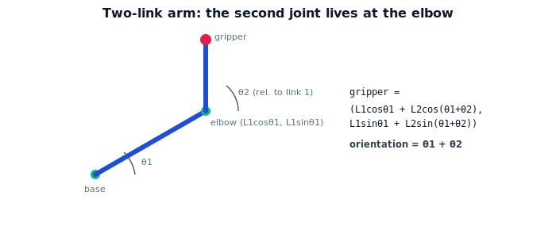

!!! abstract "You are here"
    **Module 4 — Forward Kinematics using Denavit–Hartenberg Parameters**  ·  **Unit 3 — Chaining Transforms (Two and Three Links)**  ·  **Lesson 3.1 — Adding a Second Joint**

# Lesson 3.1 — Adding a Second Joint

## 1. Why This Matters

One joint sweeps a circle — useful, but limited. Add a second joint and the arm can reach a whole region of the plane, the way your elbow vastly expands what your shoulder alone could do. The key idea is *relativity of frames*: the second joint doesn't live in the base frame, it lives at the **tip of the first link**, in the first joint's moving frame. Getting this nesting right is the whole trick of multi-joint kinematics, and it's exactly the composition Module 2 taught.

## 2. Physical Intuition

Stretch your arm out and bend only your shoulder: your whole arm swings. Now bend your elbow: your forearm swings *relative to your upper arm*, not relative to your torso. The elbow's effect on your hand depends on where the shoulder already put your upper arm. So to find your hand, you first place the elbow (via the shoulder), then add the forearm's reach measured *in the upper-arm's current direction*. Two joints, nested: the second builds on top of the first.

## 3. Mathematical Foundations

Planar 2-link arm: link lengths $L_1, L_2$, joint angles $\theta_1, \theta_2$ (the second measured *relative* to the first link). The first joint places the elbow at

$$\mathbf{e} = (L_1\cos\theta_1,\ L_1\sin\theta_1).$$

The second link extends from the elbow in the direction of the *accumulated* angle $\theta_1 + \theta_2$ (since $\theta_2$ is relative to link 1):

$$\mathbf{t} = \mathbf{e} + \big(L_2\cos(\theta_1+\theta_2),\ L_2\sin(\theta_1+\theta_2)\big).$$

So the gripper position is

$$\boxed{\,\mathbf{t} = \big(L_1\cos\theta_1 + L_2\cos(\theta_1+\theta_2),\ \ L_1\sin\theta_1 + L_2\sin(\theta_1+\theta_2)\big)\,}$$

and the gripper orientation is $\theta_1 + \theta_2$. The appearance of the *sum* $\theta_1+\theta_2$ is the signature of nesting: the second joint's motion is added **in the frame the first joint produced**. Lesson 3.2 shows this is exactly the matrix product $T_0^2 = T_0^1 T_1^2$.

## 4. Visual Explanation

<figure markdown>
  { width="680" }
</figure>

## 5. Engineering Example

The greenhouse arm's shoulder + elbow is a 2-link arm in a vertical plane: the shoulder sets the upper arm's direction, the elbow folds the forearm to push the gripper deeper into the canopy or pull it back. To compute where the gripper ends up, the controller adds the forearm's reach in the *shoulder-rotated* direction — the $\theta_1+\theta_2$ accumulation. Get the relative-angle bookkeeping wrong and the gripper lands in the wrong place.

## 6. Worked Example

$L_1 = 0.4$, $L_2 = 0.3$, $\theta_1 = 30°$, $\theta_2 = 60°$. Elbow: $(0.4\cos30°, 0.4\sin30°) = (0.346, 0.2)$. Accumulated angle $\theta_1+\theta_2 = 90°$. Forearm reach: $(0.3\cos90°, 0.3\sin90°) = (0, 0.3)$. Gripper: $(0.346 + 0,\ 0.2 + 0.3) = (0.346, 0.5)$, orientation $90°$. The gripper is up and to the right, pointing straight up — consistent with a $30°$ shoulder and a $60°$ elbow fold.

## 7. Interactive Demonstration

<iframe src="../../demos/module04/lesson09_two_link_arm.html" title="Adding a Second Joint interactive demo" style="width:100%;height:520px;border:1px solid #e2e8f0;border-radius:12px"></iframe>

[Open this demo in a new tab ↗](../demos/module04/lesson09_two_link_arm.html)

**Guided prediction.** For $L_1=0.4, L_2=0.3$, predict the gripper position at $(\theta_1,\theta_2) = (0°,0°)$, $(90°,0°)$, and $(0°,90°)$. Predict the orientation in each case. Confirm: $(0.7,0)$ orient $0°$; $(0,0.7)$ orient $90°$; $(0.4,0.3)$ orient $90°$.

## 8. Coding Exercise

!!! tip "Run the hands-on notebook"
    `modules/module04/notebooks/M04_U03_L3_1_Adding_A_Second_Joint.ipynb` — open in JupyterLab and run **Kernel → Restart & Run All**.

Implement `fk_two_link(t1, t2, L1, L2)` returning gripper position and orientation $\theta_1+\theta_2$; verify the worked example; sweep both angles to plot the reachable region (annulus).

## 9. Knowledge Check

Formative — unlimited attempts, immediate feedback; does not affect your grade.

<iframe src="../../quizzes/module04/lesson09_quiz.html" title="Adding a Second Joint knowledge check" style="width:100%;height:720px;border:1px solid #e2e8f0;border-radius:12px"></iframe>

[Open this quiz in a new tab ↗](../quizzes/module04/lesson09_quiz.html)

A check that the second joint's angle is relative to the first link and that the gripper uses the accumulated angle $\theta_1+\theta_2$.

## 10. Challenge Problem

Show that the two-link gripper can reach any point with distance $r$ from the base satisfying $|L_1 - L_2| \le r \le L_1 + L_2$. What configurations reach the inner and outer boundaries?

## 11. Common Mistakes

- Treating $\theta_2$ as measured from the base x-axis instead of relative to link 1.
- Forgetting the accumulated angle $\theta_1+\theta_2$ in the second link's reach.
- Adding link lengths as scalars instead of as vectors in their respective directions.

## 12. Key Takeaways

- A second joint lives at the **tip of the first link**, in the first joint's moving frame.
- Gripper position: $\big(L_1\cos\theta_1 + L_2\cos(\theta_1+\theta_2),\ L_1\sin\theta_1 + L_2\sin(\theta_1+\theta_2)\big)$.
- Gripper orientation: $\theta_1+\theta_2$ — the accumulated angle.
- This nesting is exactly the Module 2 composition $T_0^2 = T_0^1 T_1^2$ (next lesson).

---

## AI Learning Companion

Copy any prompt below into ChatGPT, Claude, or another AI assistant.

**Tutor prompt** — explain it another way
```
Explain Lesson 3.1 (Module 4) — Adding a Second Joint — using shoulder + elbow. Show the second joint's angle is relative to the first link, the gripper uses the accumulated angle θ1+θ2, and give the 2-link position formula.
```

**Practice prompt** — generate more exercises
```
Give me 6 exercises computing the gripper position and orientation of a planar 2-link arm for various (θ1, θ2, L1, L2). Include answers.
```

**Explore prompt** — connect it to the real world
```
Show me how a shoulder+elbow arm reaches into a canopy and why the relative-angle bookkeeping matters for landing the gripper correctly.
```

## Global Learning Support

Need this lesson explained in another language? Copy one of the prompts below into an AI assistant. English remains the authoritative source.

**Supported languages (initial):** English · Español · 中文 (Simplified Chinese) · Türkçe

**Español**
```
I just completed Lesson 3.1 (Module 4) — Adding a Second Joint.
Explain this lesson in Spanish. Keep robotics and mathematical terminology in English when appropriate.
Then provide: a summary, three practice questions, and one challenge problem.
```

**中文 (Simplified Chinese)**
```
I just completed Lesson 3.1 (Module 4) — Adding a Second Joint.
Explain this lesson in Simplified Chinese. Keep mathematical notation unchanged.
Then provide: a summary, three practice questions, and one challenge problem.
```

**Türkçe**
```
I just completed Lesson 3.1 (Module 4) — Adding a Second Joint.
Explain this lesson in Turkish. Keep robotics terminology in English where commonly used.
Then provide: a summary, three practice questions, and one challenge problem.
```

---

*Next lesson: 3.2 — Composing the Chain.*
