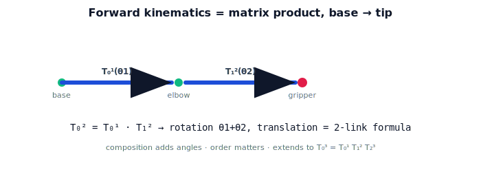

!!! abstract "You are here"
    **Module 4 — Forward Kinematics using Denavit–Hartenberg Parameters**  ·  **Unit 3 — Chaining Transforms (Two and Three Links)**  ·  **Lesson 3.2 — Composing the Chain**

# Lesson 3.2 — Composing the Chain

## 1. Why This Matters

The trig formula for the 2-link arm worked, but trig doesn't scale: by the time you have six joints in 3D, summing angles by hand is hopeless. The matrix product does scale. This lesson shows that the nested reach of the previous lesson is *exactly* the Module 2 composition $T_0^2 = T_0^1 T_1^2$ — and once you trust that, you compute any arm's forward kinematics by multiplying transforms, no trig juggling required.

## 2. Physical Intuition

Module 2 taught how to chain frames: to express something in the base frame, walk the transforms outward — base to joint 1, joint 1 to joint 2 — multiplying as you go. A robot arm *is* a chain of frames. So the gripper frame relative to the base is just the product of the link transforms, in order. Each matrix carries you across one link; multiply them and you've travelled from the base all the way to the gripper. The trig from the last lesson is what that product *says* when you read off the columns — same answer, cleaner machinery.

## 3. Mathematical Foundations

Each joint contributes a planar transform (Lesson 2.2). With $\theta_2$ measured relative to link 1:

$$T_0^1(\theta_1) = \begin{bmatrix}\cos\theta_1 & -\sin\theta_1 & L_1\cos\theta_1\\ \sin\theta_1 & \cos\theta_1 & L_1\sin\theta_1\\ 0&0&1\end{bmatrix}, \quad T_1^2(\theta_2) = \begin{bmatrix}\cos\theta_2 & -\sin\theta_2 & L_2\cos\theta_2\\ \sin\theta_2 & \cos\theta_2 & L_2\sin\theta_2\\ 0&0&1\end{bmatrix}.$$

Forward kinematics is the **product** (Module 2 composition, applied base→tip):

$$T_0^2(\theta_1,\theta_2) = T_0^1(\theta_1)\,T_1^2(\theta_2).$$

Multiply it out: the rotation block becomes the rotation by $\theta_1+\theta_2$ (angles add under composition), and the translation column becomes

$$\big(L_1\cos\theta_1 + L_2\cos(\theta_1+\theta_2),\ L_1\sin\theta_1 + L_2\sin(\theta_1+\theta_2)\big)$$

— precisely the trig formula from Lesson 3.1. The matrix product *contains* the trig; it just bookkeeps it automatically. The same right-multiplication adds a third joint: $T_0^3 = T_0^1 T_1^2 T_2^3$, and so on.

## 4. Visual Explanation

<figure markdown>
  { width="680" }
</figure>

## 5. Engineering Example

Every robot kinematics library computes forward kinematics as a product of per-joint $4\times4$ matrices, exactly this. The greenhouse controller stores each link's transform as a function of its joint angle and multiplies them in order to get the gripper pose. Switching from trig to matrices is what lets the same code handle a 2-DOF or a 7-DOF arm without rewriting any formulas.

## 6. Worked Example

$L_1=0.4, L_2=0.3, \theta_1=30°, \theta_2=60°$. Form $T_0^1(30°)$ and $T_1^2(60°)$, multiply: the product's rotation block is rotation by $90°$, and its translation column is $(0.346, 0.5)$ — matching the Lesson 3.1 trig result $(0.346, 0.5)$, orientation $90°$. Same numbers, obtained by one matrix multiply instead of hand trig.

## 7. Interactive Demonstration

**Guided prediction.** Predict that $T_0^1(\theta_1)T_1^2(\theta_2)$ has rotation $\theta_1+\theta_2$. Predict the translation column for $(\theta_1,\theta_2)=(90°,0°)$. Confirm by multiplying the matrices and comparing to the trig formula.

## 8. Coding Exercise

!!! tip "Run the hands-on notebook"
    `modules/module04/notebooks/M04_U03_L3_2_Composing_The_Chain.ipynb` — open in JupyterLab and run **Kernel → Restart & Run All**.

Implement `pose_link(theta, L)` (the SE(2) factor) and `fk_chain([(t1,L1),(t2,L2)])` that multiplies the factors; verify the product matches `fk_two_link` from Lesson 3.1 for several configurations.

## 9. Knowledge Check

Formative — unlimited attempts, immediate feedback; does not affect your grade.

<iframe src="../../quizzes/module04/lesson10_quiz.html" title="Composing the Chain knowledge check" style="width:100%;height:720px;border:1px solid #e2e8f0;border-radius:12px"></iframe>

[Open this quiz in a new tab ↗](../quizzes/module04/lesson10_quiz.html)

A check that $T_0^2 = T_0^1 T_1^2$, that composition adds angles, and that the product reproduces the trig formula.

## 10. Challenge Problem

Show that matrix composition is associative but **not** commutative: $T_0^1 T_1^2 \ne T_1^2 T_0^1$ in general. Give a physical interpretation of why the *order* (base→tip) matters for an arm.

## 11. Common Mistakes

- Multiplying in the wrong order (must be base→tip, $T_0^1 T_1^2$).
- Expecting composition to commute (it doesn't).
- Re-deriving trig instead of trusting the product for many joints.

## 12. Key Takeaways

- Forward kinematics = **matrix product** of per-joint transforms, base→tip.
- $T_0^2 = T_0^1 T_1^2$; composition **adds angles** and reproduces the 2-link trig.
- The product scales to any number of joints ($T_0^n = T_0^1\cdots T_{n-1}^n$).
- This is the Module 2 composition rule applied to a kinematic chain.

---

## AI Learning Companion

Copy any prompt below into ChatGPT, Claude, or another AI assistant.

**Tutor prompt** — explain it another way
```
Explain Lesson 3.2 (Module 4) — Composing the Chain — showing T_0^2 = T_0^1 T_1^2 is the Module 2 composition, that it adds angles (θ1+θ2), and that it reproduces the 2-link trig position formula.
```

**Practice prompt** — generate more exercises
```
Give me 6 exercises multiplying two planar SE(2) joint transforms and confirming the product matches the 2-link trig formula. Include answers.
```

**Explore prompt** — connect it to the real world
```
Show me why robot kinematics libraries compute forward kinematics as a product of 4x4 matrices rather than with trigonometry.
```

## Global Learning Support

Need this lesson explained in another language? Copy one of the prompts below into an AI assistant. English remains the authoritative source.

**Supported languages (initial):** English · Español · 中文 (Simplified Chinese) · Türkçe

**Español**
```
I just completed Lesson 3.2 (Module 4) — Composing the Chain.
Explain this lesson in Spanish. Keep robotics and mathematical terminology in English when appropriate.
Then provide: a summary, three practice questions, and one challenge problem.
```

**中文 (Simplified Chinese)**
```
I just completed Lesson 3.2 (Module 4) — Composing the Chain.
Explain this lesson in Simplified Chinese. Keep mathematical notation unchanged.
Then provide: a summary, three practice questions, and one challenge problem.
```

**Türkçe**
```
I just completed Lesson 3.2 (Module 4) — Composing the Chain.
Explain this lesson in Turkish. Keep robotics terminology in English where commonly used.
Then provide: a summary, three practice questions, and one challenge problem.
```

---

*Next lesson: 3.3 — A Planar 2-/3-Link Arm.*
