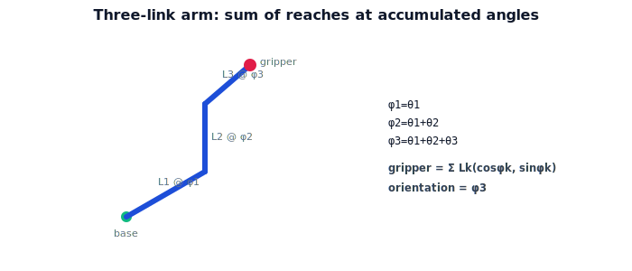

!!! abstract "You are here"
    **Module 4 — Forward Kinematics using Denavit–Hartenberg Parameters**  ·  **Unit 3 — Chaining Transforms (Two and Three Links)**  ·  **Lesson 3.3 — A Planar 2-/3-Link Arm**

# Lesson 3.3 — A Planar 2-/3-Link Arm

## 1. Why This Matters

Two links taught the nesting; three links confirm the *pattern*. Once you see that each additional joint contributes one more factor and one more term at the next accumulated angle, you can write forward kinematics for a planar arm of any length without re-deriving anything. This is the canonical running example for the rest of the module — the arm we'll later describe with a DH table.

## 2. Physical Intuition

Shoulder, elbow, wrist: three joints, three links, your hand at the end. Each joint bends relative to the link before it. To find your hand, you place each link in turn, always measuring its direction by *all* the bends that came before. The third link points in the direction of $\theta_1+\theta_2+\theta_3$ — the running total. More joints, same rule: stack the reaches, each at its accumulated angle.

## 3. Mathematical Foundations

Planar 3-link arm, lengths $L_1,L_2,L_3$, relative angles $\theta_1,\theta_2,\theta_3$. Define accumulated angles $\phi_1=\theta_1$, $\phi_2=\theta_1+\theta_2$, $\phi_3=\theta_1+\theta_2+\theta_3$. The gripper position is the sum of link reaches at their accumulated angles:

$$\mathbf{t} = \sum_{k=1}^{3} \big(L_k\cos\phi_k,\ L_k\sin\phi_k\big),$$

and the orientation is $\phi_3 = \theta_1+\theta_2+\theta_3$. Equivalently, the matrix product

$$T_0^3 = T_0^1(\theta_1)\,T_1^2(\theta_2)\,T_2^3(\theta_3)$$

produces exactly this translation column and a rotation block for $\phi_3$. The 2-link case is the same formula truncated at $k=2$. This "sum of reaches at accumulated angles" is the closed form of planar forward kinematics; the matrix product is its general (and 3D-ready) expression.

## 4. Visual Explanation

<figure markdown>
  { width="680" }
</figure>

## 5. Engineering Example

The greenhouse arm with a wrist joint is a 3-link planar chain in its working plane: shoulder, elbow, wrist. The wrist's job is mostly orientation — letting the gripper approach the fruit at the right angle — which shows up as the third accumulated angle $\phi_3$ setting the gripper's facing direction. The controller evaluates the same sum (or product) with three terms.

## 6. Worked Example

$L_1=0.4, L_2=0.3, L_3=0.2$; $\theta_1=30°, \theta_2=60°, \theta_3=-30°$. Accumulated: $\phi_1=30°, \phi_2=90°, \phi_3=60°$. Reaches: $L_1$: $(0.346,0.2)$; $L_2$: $(0,0.3)$; $L_3$: $(0.2\cos60°,0.2\sin60°)=(0.1,0.173)$. Sum: $(0.346+0+0.1,\ 0.2+0.3+0.173)=(0.446, 0.673)$, orientation $\phi_3=60°$. The matrix product $T_0^3$ gives the identical translation and a $60°$ rotation block.

## 7. Interactive Demonstration

**Guided prediction.** For the 3-link arm above, predict whether straightening all joints ($\theta_2=\theta_3=0°$) puts the gripper at distance $L_1+L_2+L_3$ from the base. Predict the orientation. Confirm: yes, fully extended reach $0.9$ at orientation $\theta_1$.

## 8. Coding Exercise

!!! tip "Run the hands-on notebook"
    `modules/module04/notebooks/M04_U03_L3_3_A_Planar_2_3_Link_Arm.ipynb` — open in JupyterLab and run **Kernel → Restart & Run All**.

Generalize to `fk_planar(joints)` where `joints=[(theta, L), ...]`: accumulate angles, sum reaches, return position and orientation; verify the worked example and that it agrees with the matrix product `fk_chain`.

## 9. Knowledge Check

Formative — unlimited attempts, immediate feedback; does not affect your grade.

<iframe src="../../quizzes/module04/lesson11_quiz.html" title="A Planar 2-/3-Link Arm knowledge check" style="width:100%;height:720px;border:1px solid #e2e8f0;border-radius:12px"></iframe>

[Open this quiz in a new tab ↗](../quizzes/module04/lesson11_quiz.html)

A check on the accumulated-angle pattern, the 3-link position sum, and orientation $\phi_n$.

## 10. Challenge Problem

A 3-link arm has the same total length as a 2-link arm. Argue why the 3-link arm can reach the same *positions* with more configurations and can also control the gripper *orientation* independently of position in many cases. (This previews redundancy — extra DOF.)

## 11. Common Mistakes

- Using relative instead of accumulated angles in the reach terms.
- Forgetting the orientation is the *final* accumulated angle $\phi_n$.
- Summing magnitudes instead of vector components.

## 12. Key Takeaways

- Planar forward kinematics = **sum of link reaches at accumulated angles** $\phi_k = \sum_{j\le k}\theta_j$.
- Gripper orientation = $\phi_n$, the total accumulated angle.
- Equivalent to the matrix product $T_0^n = T_0^1\cdots T_{n-1}^n$.
- This 2-/3-link arm is the module's running example.

---

## AI Learning Companion

Copy any prompt below into ChatGPT, Claude, or another AI assistant.

**Tutor prompt** — explain it another way
```
Explain Lesson 3.3 (Module 4) — A Planar 2-/3-Link Arm — using shoulder/elbow/wrist. Show the accumulated-angle pattern φk = sum of θ up to k, the gripper as the sum of link reaches, and orientation = φn.
```

**Practice prompt** — generate more exercises
```
Give me 6 exercises computing the gripper position and orientation of planar 3-link arms with various angles and link lengths. Include answers.
```

**Explore prompt** — connect it to the real world
```
Show me how a shoulder/elbow/wrist arm uses the wrist (third accumulated angle) mainly to set the gripper's approach orientation.
```

## Global Learning Support

Need this lesson explained in another language? Copy one of the prompts below into an AI assistant. English remains the authoritative source.

**Supported languages (initial):** English · Español · 中文 (Simplified Chinese) · Türkçe

**Español**
```
I just completed Lesson 3.3 (Module 4) — A Planar 2-/3-Link Arm.
Explain this lesson in Spanish. Keep robotics and mathematical terminology in English when appropriate.
Then provide: a summary, three practice questions, and one challenge problem.
```

**中文 (Simplified Chinese)**
```
I just completed Lesson 3.3 (Module 4) — A Planar 2-/3-Link Arm.
Explain this lesson in Simplified Chinese. Keep mathematical notation unchanged.
Then provide: a summary, three practice questions, and one challenge problem.
```

**Türkçe**
```
I just completed Lesson 3.3 (Module 4) — A Planar 2-/3-Link Arm.
Explain this lesson in Turkish. Keep robotics terminology in English where commonly used.
Then provide: a summary, three practice questions, and one challenge problem.
```

---

*Next lesson: 3.4 — Chaining Transforms (Unit 3 Recap).*
