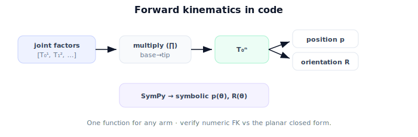

!!! abstract "You are here"
    **Module 4 — Forward Kinematics using Denavit–Hartenberg Parameters**  ·  **Unit 4 — The Forward Kinematics Map**  ·  **Lesson 4.3 — Forward Kinematics in Code**

# Lesson 4.3 — Forward Kinematics in Code

## 1. Why This Matters

The math says "multiply the factors." Good code makes that one small function that works for any arm and is easy to verify. This lesson builds it: a factor-builder per joint, a product, and pose extraction — checked against the planar closed form we trust. We also peek at **SymPy**, which multiplies the factors *symbolically*, giving a formula for the gripper pose in terms of the joint variables. That symbolic form is what later modules (and your own debugging) lean on.

## 2. Physical Intuition

Computing forward kinematics by hand is error-prone past two joints; the computer never miscounts an accumulated angle. We hand it the recipe for each joint (how it moves with its variable, plus the fixed link geometry), it forms each matrix and multiplies. Because every joint uses the same recipe shape, one function covers a 2-DOF toy and a 7-DOF industrial arm. The only thing that changes between robots is the *list of factors*.

## 3. Mathematical Foundations

The implementation mirrors the math exactly:

1. For each joint $i$, build $T_{i-1}^i(\theta_i)$ — a $4\times4$ $SE(3)$ matrix from the joint variable and the (fixed) link geometry.
2. Multiply in order: $T = T_0^1 T_1^2 \cdots T_{n-1}^n$.
3. Extract position $\mathbf{p}=T[0{:}3,3]$ and orientation $R=T[0{:}3,0{:}3]$.

Numerically (NumPy) this is a `reduce` over matrix products. Symbolically (SymPy) the same product yields closed-form trig expressions for $\mathbf{p}(\boldsymbol{\theta})$ and $R(\boldsymbol{\theta})$ — useful for verification and for the Jacobian work in Module 6. We verify the numeric FK against the planar sum-of-reaches formula (Unit 3): they must agree to machine precision. (A small implementation note we'll respect in code: build each factor as a fresh array rather than mutating a shared one, to avoid aliasing bugs.)

## 4. Visual Explanation

<figure markdown>
  { width="680" }
</figure>

## 5. Engineering Example

The greenhouse stack has one `forward_kinematics(config)` used everywhere: visualization, collision pre-checks, comparing the gripper pose to a perceived fruit target. Because it's the same product for every arm, swapping the physical arm only means swapping the factor list (the robot's parameters) — the code is untouched. A symbolic version, derived once, is cached for fast repeated evaluation and for analytically checking special poses.

## 6. Worked Example

Build the planar 2-link arm as 3D factors (rotation about $z$, translations in $xy$). Numeric `fk` at $(\theta_1,\theta_2)=(30°,60°)$ returns position $(0.346, 0.5, 0)$ and a rotation about $z$ by $90°$ — matching Unit 3. The SymPy product returns $\mathbf{p}=\big(L_1\cos\theta_1+L_2\cos(\theta_1+\theta_2),\ L_1\sin\theta_1+L_2\sin(\theta_1+\theta_2),\ 0\big)$, i.e. the closed-form formula, confirming the code encodes the right math.

## 7. Interactive Demonstration

**Guided prediction.** Predict whether the numeric `fk` and the planar closed form will agree exactly (to floating-point precision). Predict what the SymPy position expression looks like for the 2-link arm. Confirm by running both and comparing.

## 8. Coding Exercise

!!! tip "Run the hands-on notebook"
    `modules/module04/notebooks/M04_U04_L4_3_Forward_Kinematics_In_Code.ipynb` — open in JupyterLab and run **Kernel → Restart & Run All**.

Implement `se3_rotz`, `se3_trans`, and `fk(factors)` (product + position/orientation extraction), building each factor as a fresh array; verify numerically against `fk_planar` (Unit 3); then build the same arm in SymPy and show the symbolic position matches the closed form.

## 9. Knowledge Check

Formative — unlimited attempts, immediate feedback; does not affect your grade.

<iframe src="../../quizzes/module04/lesson15_quiz.html" title="Forward Kinematics in Code knowledge check" style="width:100%;height:720px;border:1px solid #e2e8f0;border-radius:12px"></iframe>

[Open this quiz in a new tab ↗](../quizzes/module04/lesson15_quiz.html)

A check on the FK code steps (build factors → multiply → extract), numeric/symbolic agreement, and verification against the closed form.

## 10. Challenge Problem

Extend `fk` to also return *every* intermediate frame $T_0^i$ (the pose of each joint), not just the end-effector. Why are the intermediate frames useful (e.g. for drawing the arm, or for collision checks along the links)?

## 11. Common Mistakes

- Multiplying factors in the wrong order.
- Mutating a shared matrix in the loop (aliasing) instead of building fresh factors.
- Forgetting to verify against a trusted closed form.

## 12. Key Takeaways

- FK in code: **build each factor → multiply in order → extract** position and orientation.
- One function handles any arm; only the **factor list** changes.
- **SymPy** gives a symbolic pose formula; verify numeric FK against the planar closed form.
- Build factors as fresh arrays to avoid aliasing bugs.

---

## AI Learning Companion

Copy any prompt below into ChatGPT, Claude, or another AI assistant.

**Tutor prompt** — explain it another way
```
Explain Lesson 4.3 (Module 4) — Forward Kinematics in Code — as build each joint's SE(3) factor, multiply in order, extract position/orientation; one function for any arm; SymPy gives a symbolic formula. Mention verifying against the planar closed form.
```

**Practice prompt** — generate more exercises
```
Give me 5 coding exercises: implement and verify forward kinematics for small serial arms (numeric and symbolic), comparing to closed-form planar results. Include solutions.
```

**Explore prompt** — connect it to the real world
```
Show me how a single forward_kinematics(config) function serves visualization, collision checks, and grasp comparison in a robot stack.
```

## Global Learning Support

Need this lesson explained in another language? Copy one of the prompts below into an AI assistant. English remains the authoritative source.

**Supported languages (initial):** English · Español · 中文 (Simplified Chinese) · Türkçe

**Español**
```
I just completed Lesson 4.3 (Module 4) — Forward Kinematics in Code.
Explain this lesson in Spanish. Keep robotics and mathematical terminology in English when appropriate.
Then provide: a summary, three practice questions, and one challenge problem.
```

**中文 (Simplified Chinese)**
```
I just completed Lesson 4.3 (Module 4) — Forward Kinematics in Code.
Explain this lesson in Simplified Chinese. Keep mathematical notation unchanged.
Then provide: a summary, three practice questions, and one challenge problem.
```

**Türkçe**
```
I just completed Lesson 4.3 (Module 4) — Forward Kinematics in Code.
Explain this lesson in Turkish. Keep robotics terminology in English where commonly used.
Then provide: a summary, three practice questions, and one challenge problem.
```

---

*Next lesson: 4.4 — The Forward Kinematics Map (Unit 4 Recap · Midpoint).*
