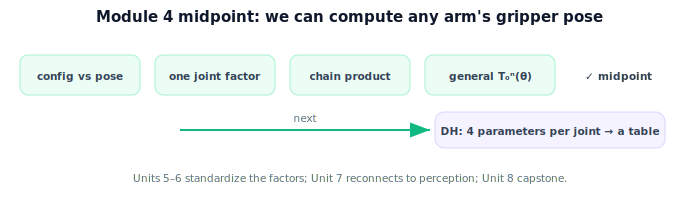

!!! abstract "You are here"
    **Module 4 — Forward Kinematics using Denavit–Hartenberg Parameters**  ·  **Unit 4 — The Forward Kinematics Map**  ·  **Lesson 4.4 — The Forward Kinematics Map (Unit 4 Recap · Midpoint)**

# Lesson 4.4 — The Forward Kinematics Map (Unit 4 Recap · Midpoint)

*A short synthesis and the module's halfway checkpoint — no new mathematics. It consolidates Units 1–4 and motivates the DH convention.*

---

## Halfway: we can compute any arm's gripper pose

Units 1–4 built forward kinematics from scratch:

> **Forward kinematics is the $SE(3)$ product $T_0^n(\boldsymbol{\theta}) = \prod_i T_{i-1}^i(\theta_i)$, giving the gripper's position (translation column) and orientation (rotation block) for any serial arm — computed once in code and verified against closed forms.**

## What the first half established

| Unit | Result |
|---|---|
| 1 — Why Kinematics | FK maps configuration → pose; serial arms (links/joints/DOF); joint vs task space; many-to-one. |
| 2 — One Joint at a Time | One joint = one $SE(3)$ factor of one variable; read pose from its columns. |
| 3 — Chaining Transforms | FK = base→tip product; planar closed form = sum of reaches at accumulated angles. |
| 4 — The FK Map | General $T_0^n(\boldsymbol{\theta})$ in $SE(3)$; position + orientation; FK in code (NumPy + SymPy). |

## The gap the second half fills

We've been hand-building each joint's factor from "a rotation and a fixed link geometry." That works, but it's ad hoc — every robot would need its own bespoke factors, and there's no agreed way to write them down. **Units 5–6 introduce the Denavit–Hartenberg (DH) convention:** a disciplined recipe that describes each joint with just **four parameters**, so any serial arm becomes a compact **table**, and each factor is generated the same way. Then **Unit 7** reads off pose and workspace and reconnects to perception ($T_0^n = T_{w\leftarrow a}$), and **Unit 8** is the capstone that places a perceived fruit in the arm's frame.

## Midpoint checkpoint

The midpoint assessment (`assessments/module04_midpoint_assessment.md`) checks readiness on: configuration vs pose; the one-joint transform; chaining as a matrix product; the general $T_0^n$; and extracting position and orientation. Clearing it means you can compute the gripper pose for any serial arm — the prerequisite for the DH formalism ahead.

## Visual Explanation

<figure markdown>
  { width="680" }
</figure>

## Coding Exercise

!!! tip "Run the hands-on notebook"
    `modules/module04/notebooks/M04_U04_L4_4_The_FK_Map_Unit_4_Recap_Midpoint.ipynb` — open in JupyterLab and run **Kernel → Restart & Run All**.

A short consolidation: given a small arm's factor list, compute $T_0^n$, extract position and orientation, and confirm against the planar closed form — the full first-half workflow in one cell.

## Knowledge Check

Formative — unlimited attempts, immediate feedback; does not affect your grade.

<iframe src="../../quizzes/module04/lesson16_quiz.html" title="The Forward Kinematics Map (Unit 4 Recap · Midpoint) knowledge check" style="width:100%;height:720px;border:1px solid #e2e8f0;border-radius:12px"></iframe>

[Open this quiz in a new tab ↗](../quizzes/module04/lesson16_quiz.html)

A brief consolidation quiz across Units 1–4 (formative — unlimited attempts).

## Key Takeaways

- We can compute **any serial arm's gripper pose** via the $SE(3)$ product $T_0^n(\boldsymbol{\theta})$.
- Pose = position (translation column) + orientation (rotation block).
- Hand-built factors are ad hoc; the **DH convention** (Units 5–6) standardizes them into a four-parameter table.
- Midpoint reached — next: **Denavit–Hartenberg parameters**.

---

## AI Learning Companion

Copy any prompt below into ChatGPT, Claude, or another AI assistant.

**Tutor prompt** — explain it another way
```
Summarize the first half of Module 4: forward kinematics as the SE(3) product T_0^n(θ) giving gripper position and orientation, built from one-joint factors and chained, computed in code. Explain why we now need the DH convention.
```

**Practice prompt** — generate more exercises
```
Give me a 12-question midpoint review of Module 4 Units 1–4: configuration vs pose, one-joint transform, chaining as a product, general T_0^n, position/orientation extraction. Include answers.
```

**Explore prompt** — connect it to the real world
```
Show me why robots are described by a parameter table (previewing DH) rather than bespoke transforms, and how one FK function then serves the whole stack.
```

## Global Learning Support

Need this lesson explained in another language? Copy one of the prompts below into an AI assistant. English remains the authoritative source.

**Supported languages (initial):** English · Español · 中文 (Simplified Chinese) · Türkçe

**Español**
```
I just completed Lesson 4.4 (Module 4) — The Forward Kinematics Map (Unit 4 Recap · Midpoint).
Explain this lesson in Spanish. Keep robotics and mathematical terminology in English when appropriate.
Then provide: a summary, three practice questions, and one challenge problem.
```

**中文 (Simplified Chinese)**
```
I just completed Lesson 4.4 (Module 4) — The Forward Kinematics Map (Unit 4 Recap · Midpoint).
Explain this lesson in Simplified Chinese. Keep mathematical notation unchanged.
Then provide: a summary, three practice questions, and one challenge problem.
```

**Türkçe**
```
I just completed Lesson 4.4 (Module 4) — The Forward Kinematics Map (Unit 4 Recap · Midpoint).
Explain this lesson in Turkish. Keep robotics terminology in English where commonly used.
Then provide: a summary, three practice questions, and one challenge problem.
```

---

*Next: Unit 5 — Denavit–Hartenberg Parameters.*
