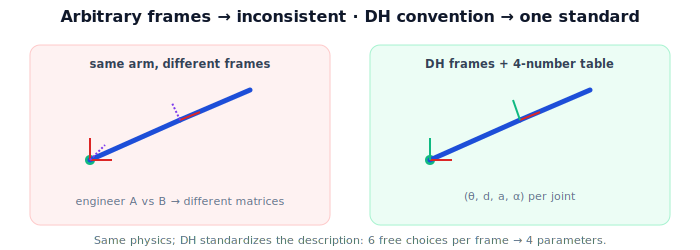

!!! abstract "You are here"
    **Module 4 — Forward Kinematics using Denavit–Hartenberg Parameters**  ·  **Unit 5 — Denavit–Hartenberg Parameters**  ·  **Lesson 5.1 — Why a Convention**

# Lesson 5.1 — Why a Convention

## 1. Why This Matters

So far each joint transform was hand-built from "a rotation and some fixed link geometry." That works for a 2-link toy, but it has no discipline: two engineers would place their frames differently, write different matrices, and struggle to compare or reuse anything. A robot's kinematics should be a *standard description* anyone can read. The **Denavit–Hartenberg (DH) convention** is that standard — a fixed recipe for where to put each joint's frame, so the transform between consecutive frames always takes the same compact form. This lesson motivates *why* we need it before the next lessons give the rules.

## 2. Physical Intuition

Imagine describing a staircase. If everyone measures from a different corner, in different units, along different edges, the descriptions don't line up — even though it's the same staircase. Agree on a convention ("measure each step's rise from the front edge, run from the top") and suddenly any staircase is just a short list of numbers anyone can reconstruct. A robot arm is the same: the links and joints are physical and fixed, but *how we attach coordinate frames to them* is a choice. Make that choice consistently and the whole arm collapses to a tidy table.

## 3. Mathematical Foundations

A frame can be attached to a link anywhere and in any orientation — that's $6$ free choices per frame (3 position, 3 orientation). With $n$ links that's a lot of arbitrariness, and the resulting transform $T_{i-1}^i$ could be any $SE(3)$ element written any number of ways. The DH convention removes the arbitrariness by **constraining where each frame's axes must point**, relative to the joint axes. Specifically (rules in Lesson 5.3), it aligns each frame's $z$-axis with its joint axis and its $x$-axis along the common normal between consecutive joint axes. Under these constraints, the transform between consecutive frames is forced to factor into exactly **four elementary motions** — and therefore needs only **four numbers** (the DH parameters, Lesson 5.2) instead of six. The math isn't new — it's still an $SE(3)$ product — but the *bookkeeping* becomes uniform and minimal.

## 4. Visual Explanation

<figure markdown>
  { width="680" }
</figure>

## 5. Engineering Example

Every robot you can buy ships with a DH table (or an equivalent URDF) in its datasheet. The greenhouse arm's manufacturer publishes its DH parameters; the controller reads them and builds forward kinematics automatically. Because the convention is shared, the same kinematics code works for that arm, a different vendor's arm, or a simulated arm — only the table changes. Without a convention, every robot would need bespoke, untransferable math.

## 6. Worked Example

Take the planar 2-link arm. Hand-built, we wrote $T_0^1 = R_z(\theta_1)\,\text{Trans}_x(L_1)$ and $T_1^2 = R_z(\theta_2)\,\text{Trans}_x(L_2)$ — already close to a convention, because we *chose* to put $z$ along the joint axis and $x$ along the link. The DH convention simply makes that choice mandatory and names the pieces: here each joint has DH parameters $\theta_i$ (variable), $d_i = 0$, $a_i = L_i$, $\alpha_i = 0$. The same arm, now described by a table — the bridge from "ad hoc" to "standard" we'll formalize next.

## 7. Interactive Demonstration

**Guided prediction.** Predict whether two correct-but-different frame placements can describe the same physical arm (yes — but with different matrices). Predict how many numbers per joint the DH convention needs (four). Confirm by inspecting the planar arm's DH parameters above.

## 8. Coding Exercise

!!! tip "Run the hands-on notebook"
    `modules/module04/notebooks/M04_U05_L5_1_Why_A_Convention.ipynb` — open in JupyterLab and run **Kernel → Restart & Run All**.

Represent a joint's DH parameters as a record `{theta, d, a, alpha}`; encode the planar 2-link arm as a list of two such records ($a=L_i$, others zero except $\theta$); print the table. (Building the transform from these comes in Lesson 6.1.)

## 9. Knowledge Check

Formative — unlimited attempts, immediate feedback; does not affect your grade.

<iframe src="../../quizzes/module04/lesson17_quiz.html" title="Why a Convention knowledge check" style="width:100%;height:720px;border:1px solid #e2e8f0;border-radius:12px"></iframe>

[Open this quiz in a new tab ↗](../quizzes/module04/lesson17_quiz.html)

A check on why arbitrary frames are inconsistent, that DH is a shared convention (not new physics), and that it reduces six choices to four parameters.

## 10. Challenge Problem

Argue why a *minimal* parameterization (four numbers) is preferable to writing each $T_{i-1}^i$ as a full $4\times4$ matrix (sixteen numbers, six independent). Consider storage, calibration, and the chance of inconsistent entries.

## 11. Common Mistakes

- Thinking DH changes the physics (it only standardizes the description).
- Believing there's only one correct frame placement (there are many; DH picks a disciplined one).
- Expecting the convention before its rules — this lesson motivates; Lessons 5.2–5.3 give the rules.

## 12. Key Takeaways

- Frame placement is a **choice**; arbitrary choices give inconsistent, non-comparable transforms.
- The **DH convention** is a shared standard for placing frames, reducing each joint to **four parameters**.
- It's bookkeeping discipline, not new physics — still an $SE(3)$ product.
- Real robots ship with DH tables so one kinematics code serves any arm.

---

## AI Learning Companion

Copy any prompt below into ChatGPT, Claude, or another AI assistant.

**Tutor prompt** — explain it another way
```
Explain Lesson 5.1 (Module 4) — Why a Convention — using the "describe a staircase consistently" analogy. Make clear DH is a shared standard for frame placement that reduces each joint to four parameters, not new physics.
```

**Practice prompt** — generate more exercises
```
Give me 5 conceptual questions on why a frame-placement convention is needed and what the DH convention standardizes. Include answers.
```

**Explore prompt** — connect it to the real world
```
Show me how a commercial robot's datasheet provides a DH table (or URDF) and how that lets one kinematics codebase serve many arms.
```

## Global Learning Support

Need this lesson explained in another language? Copy one of the prompts below into an AI assistant. English remains the authoritative source.

**Supported languages (initial):** English · Español · 中文 (Simplified Chinese) · Türkçe

**Español**
```
I just completed Lesson 5.1 (Module 4) — Why a Convention.
Explain this lesson in Spanish. Keep robotics and mathematical terminology in English when appropriate.
Then provide: a summary, three practice questions, and one challenge problem.
```

**中文 (Simplified Chinese)**
```
I just completed Lesson 5.1 (Module 4) — Why a Convention.
Explain this lesson in Simplified Chinese. Keep mathematical notation unchanged.
Then provide: a summary, three practice questions, and one challenge problem.
```

**Türkçe**
```
I just completed Lesson 5.1 (Module 4) — Why a Convention.
Explain this lesson in Turkish. Keep robotics terminology in English where commonly used.
Then provide: a summary, three practice questions, and one challenge problem.
```

---

*Next lesson: 5.2 — The Four DH Parameters.*
