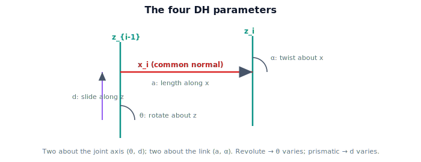

!!! abstract "You are here"
    **Module 4 — Forward Kinematics using Denavit–Hartenberg Parameters**  ·  **Unit 5 — Denavit–Hartenberg Parameters**  ·  **Lesson 5.2 — The Four DH Parameters**

# Lesson 5.2 — The Four DH Parameters

## 1. Why This Matters

This is the definition at the center of the module: the **four Denavit–Hartenberg parameters**. Once you know what $\theta, d, a, \alpha$ mean and which one is the joint's variable, you can describe any serial robot as a small table and (next unit) turn that table into forward kinematics. Four numbers per joint — that's the entire geometric description of an arm.

## 2. Physical Intuition

To get from one joint's frame to the next, you make four moves, alternating between the *joint axis* (call it $z$) and the *link* (call it $x$):

1. **Spin** about the joint's $z$-axis by an angle $\theta$ — for a revolute joint, this is the thing that moves.
2. **Slide** along that same $z$-axis by a distance $d$ — for a prismatic joint, *this* is the thing that moves.
3. **Walk** along the link's $x$-axis by its length $a$ — how long the link is.
4. **Tilt** about that $x$-axis by a twist $\alpha$ — how the next joint's axis is angled relative to this one.

Two moves are about $z$ (the joint axis): $\theta$ and $d$. Two are about $x$ (the link): $a$ and $\alpha$. That alternation — $z$, $z$, $x$, $x$ — is the whole pattern.

## 3. Mathematical Foundations

For joint $i$, the four DH parameters are:

| Parameter | Name | Axis | Meaning |
|---|---|---|---|
| $\theta_i$ | joint angle | about $z_{i-1}$ | rotation from $x_{i-1}$ to $x_i$ |
| $d_i$ | link offset | along $z_{i-1}$ | distance between links along the joint axis |
| $a_i$ | link length | along $x_i$ | distance between joint axes (common normal) |
| $\alpha_i$ | link twist | about $x_i$ | angle between consecutive joint axes |

The **joint variable** is the one that moves:
- **Revolute joint:** $\theta_i$ varies (configuration), the other three are fixed constants.
- **Prismatic joint:** $d_i$ varies, the other three are fixed.

So a robot is a table with one row per joint and these four columns; for each row, exactly one entry is the live variable and three are constants baked in by the mechanical design. (We use the **standard / distal** DH convention throughout — the alternative "modified" convention applies the same four parameters in a different order, which changes the factor multiplication in Lesson 6.1. We name ours so there's no ambiguity.)

## 4. Visual Explanation

<figure markdown>
  { width="680" }
</figure>

## 5. Engineering Example

The greenhouse arm's shoulder joint row might read $(\theta_2, d_2{=}0, a_2{=}0.35, \alpha_2{=}0)$ — a revolute joint whose upper-arm link is $0.35$ m long, lying flat in the working plane (no offset, no twist). A wrist that tilts the gripper out of the plane would have a nonzero $\alpha$. Reading these four numbers per joint, the controller reconstructs the exact geometry without ever seeing the CAD model.

## 6. Worked Example

Planar 2-link arm, both revolute, link lengths $L_1=0.4, L_2=0.3$, all in one plane. DH table (standard convention):

| $i$ | $\theta_i$ | $d_i$ | $a_i$ | $\alpha_i$ |
|---|---|---|---|---|
| 1 | $\theta_1$ (var) | 0 | 0.4 | 0 |
| 2 | $\theta_2$ (var) | 0 | 0.3 | 0 |

Both $d$ and $\alpha$ are zero because the arm is planar (no offset along the joint axis, no twist between parallel joint axes). The link lengths sit in $a$. This four-number-per-joint table fully describes the arm we've been computing by hand.

## 7. Interactive Demonstration

<iframe src="../../demos/module04/lesson18_dh_parameters.html" title="The Four DH Parameters interactive demo" style="width:100%;height:520px;border:1px solid #e2e8f0;border-radius:12px"></iframe>

[Open this demo in a new tab ↗](../demos/module04/lesson18_dh_parameters.html)

**Guided prediction.** For the planar 2-link arm, predict which DH parameters are zero and which is the variable in each row. Predict what becomes nonzero if a joint axis tilts out of the plane ($\alpha$). Confirm against the table above.

## 8. Coding Exercise

!!! tip "Run the hands-on notebook"
    `modules/module04/notebooks/M04_U05_L5_2_The_Four_DH_Parameters.ipynb` — open in JupyterLab and run **Kernel → Restart & Run All**.

Define a `DHRow(theta, d, a, alpha, kind)` structure; encode the planar 2-link arm; write a helper that, given a configuration, fills the variable entry ($\theta$ for revolute, $d$ for prismatic) and returns the completed numeric table.

## 9. Knowledge Check

Formative — unlimited attempts, immediate feedback; does not affect your grade.

<iframe src="../../quizzes/module04/lesson18_quiz.html" title="The Four DH Parameters knowledge check" style="width:100%;height:720px;border:1px solid #e2e8f0;border-radius:12px"></iframe>

[Open this quiz in a new tab ↗](../quizzes/module04/lesson18_quiz.html)

A check naming the four parameters, which axis each is about, and which one is the joint variable for revolute vs prismatic.

## 10. Challenge Problem

A joint has a nonzero $d$ *and* a nonzero $a$. Describe in words the physical shape of the link this implies (an offset *and* a sideways length). Sketch why both are sometimes needed (e.g. a link that steps up and over).

## 11. Common Mistakes

- Swapping $a$ (link length, along $x$) and $d$ (offset, along $z$).
- Forgetting that for a prismatic joint $d$ (not $\theta$) is the variable.
- Mixing standard and modified DH conventions (they order the four motions differently).

## 12. Key Takeaways

- Four DH parameters per joint: $\theta$ (rotate about $z$), $d$ (slide along $z$), $a$ (length along $x$), $\alpha$ (twist about $x$).
- Two are about the **joint axis** ($\theta, d$); two are about the **link** ($a, \alpha$).
- The **joint variable** is $\theta$ (revolute) or $d$ (prismatic); the other three are fixed.
- A robot is a table of these rows; we use the **standard (distal)** convention.

---

## AI Learning Companion

Copy any prompt below into ChatGPT, Claude, or another AI assistant.

**Tutor prompt** — explain it another way
```
Explain Lesson 5.2 (Module 4) — The Four DH Parameters — as four alternating moves: θ and d about the joint's z-axis, a and α about the link's x-axis. Say which is the joint variable for revolute vs prismatic. Use the planar 2-link DH table as the example.
```

**Practice prompt** — generate more exercises
```
Give me 6 exercises identifying the four DH parameters (and the joint variable) for simple arms, including planar and one out-of-plane twist. Include answers.
```

**Explore prompt** — connect it to the real world
```
Show me a real robot's DH table and walk me through what each of the four parameters means for one of its joints.
```

## Global Learning Support

Need this lesson explained in another language? Copy one of the prompts below into an AI assistant. English remains the authoritative source.

**Supported languages (initial):** English · Español · 中文 (Simplified Chinese) · Türkçe

**Español**
```
I just completed Lesson 5.2 (Module 4) — The Four DH Parameters.
Explain this lesson in Spanish. Keep robotics and mathematical terminology in English when appropriate.
Then provide: a summary, three practice questions, and one challenge problem.
```

**中文 (Simplified Chinese)**
```
I just completed Lesson 5.2 (Module 4) — The Four DH Parameters.
Explain this lesson in Simplified Chinese. Keep mathematical notation unchanged.
Then provide: a summary, three practice questions, and one challenge problem.
```

**Türkçe**
```
I just completed Lesson 5.2 (Module 4) — The Four DH Parameters.
Explain this lesson in Turkish. Keep robotics terminology in English where commonly used.
Then provide: a summary, three practice questions, and one challenge problem.
```

---

*Next lesson: 5.3 — Assigning Frames.*
