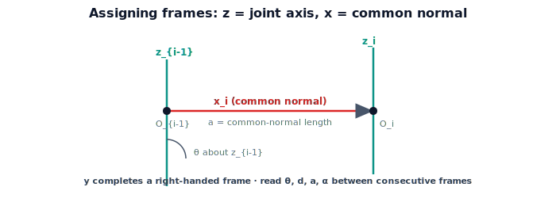

!!! abstract "You are here"
    **Module 4 — Forward Kinematics using Denavit–Hartenberg Parameters**  ·  **Unit 5 — Denavit–Hartenberg Parameters**  ·  **Lesson 5.3 — Assigning Frames**

# Lesson 5.3 — Assigning Frames

## 1. Why This Matters

The four parameters only mean something once the frames are placed by the rules. This lesson gives the recipe for attaching a coordinate frame to each joint so that the transform between consecutive frames is guaranteed to factor into the four DH motions. Place the frames correctly and the parameters fall out by inspection; place them carelessly and the numbers won't match the convention. This is the step that turns a physical arm into a valid DH table.

## 2. Physical Intuition

The rules are mostly about two axes per joint. The $z$-axis is easy: it points along the joint's axis of motion — the spin axis of a revolute joint, or the slide direction of a prismatic one. The $x$-axis is the clever part: it points along the **common normal** — the shortest line connecting this joint's axis to the *next* joint's axis. That common normal is exactly the direction "across the link" to the next joint, which is why the link length $a$ is measured along it. With $z$ and $x$ fixed, $y$ just completes a right-handed frame. Everything else (the four parameters) is then a measurement between consecutive frames.

## 3. Mathematical Foundations

DH frame-assignment rules (standard convention), for joints $i = 1\dots n$:

1. **$z_i$ axis:** along joint $i{+}1$'s axis of motion (the axis the next joint rotates about or slides along). (Equivalently, $z_{i-1}$ is joint $i$'s axis.)
2. **$x_i$ axis:** along the **common normal** between $z_{i-1}$ and $z_i$ (the shortest segment connecting the two joint axes), pointing from $z_{i-1}$ toward $z_i$. If the axes intersect, $x_i$ is perpendicular to both. If parallel, choose the common normal that simplifies the table.
3. **$y_i$ axis:** chosen to make the frame right-handed ($y = z \times x$ appropriately).
4. **Origin $O_i$:** where $x_i$ meets $z_i$.

With frames placed, read the four parameters between consecutive frames:
- $\theta_i$: angle from $x_{i-1}$ to $x_i$ about $z_{i-1}$.
- $d_i$: distance from $O_{i-1}$ to the foot of the common normal, along $z_{i-1}$.
- $a_i$: length of the common normal (distance between the joint axes).
- $\alpha_i$: angle from $z_{i-1}$ to $z_i$ about $x_i$.

The base frame ($i{=}0$) and the tool frame are placed to match the robot's mounting and gripper; conventions allow some freedom there, which we fix once per robot.

## 4. Visual Explanation

<figure markdown>
  { width="680" }
</figure>

## 5. Engineering Example

When the greenhouse arm is modeled, an engineer assigns a $z$ to each motor's axis, draws the common normals (the physical links), and reads off the table. For a tidy arm whose joints are mostly parallel or perpendicular, the $\alpha$ values come out as $0$ or $\pm 90°$ and the table is clean. The placed frames also define exactly where "the gripper" is (the tool frame), which is what forward kinematics will report.

## 6. Worked Example

Planar 2-link arm. Both joint axes point out of the plane (parallel $z$'s). Place $z_0, z_1, z_2$ all out of the plane; the common normals lie *in* the plane along each link, so $x_1$ runs along link 1 and $x_2$ along link 2. Reading off: $\theta_1, \theta_2$ are the joint angles (about the out-of-plane $z$'s), $a_1 = L_1, a_2 = L_2$ (common-normal lengths = link lengths), and $d_i = 0$, $\alpha_i = 0$ (no offset along $z$, parallel axes so no twist). This reproduces the DH table from Lesson 5.2 — now justified by the placement rules rather than asserted.

## 7. Interactive Demonstration

**Guided prediction.** For two parallel joint axes (a planar arm), predict $\alpha$ (twist between parallel axes). For two perpendicular intersecting axes, predict $a$ (common-normal length when axes intersect). Confirm: parallel → $\alpha = 0$; intersecting → $a = 0$.

## 8. Coding Exercise

!!! tip "Run the hands-on notebook"
    `modules/module04/notebooks/M04_U05_L5_3_Assigning_Frames.ipynb` — open in JupyterLab and run **Kernel → Restart & Run All**.

Given two joint axes as lines in 3D (point + direction), compute the common normal's length ($a$) and the twist angle ($\alpha$) between the directions; test on parallel axes ($a>0, \alpha=0$) and intersecting perpendicular axes ($a=0, \alpha=90°$).

## 9. Knowledge Check

Formative — unlimited attempts, immediate feedback; does not affect your grade.

<iframe src="../../quizzes/module04/lesson19_quiz.html" title="Assigning Frames knowledge check" style="width:100%;height:720px;border:1px solid #e2e8f0;border-radius:12px"></iframe>

[Open this quiz in a new tab ↗](../quizzes/module04/lesson19_quiz.html)

A check on the $z$ = joint axis rule, $x$ = common normal rule, and reading $\theta, d, a, \alpha$ from placed frames.

## 10. Challenge Problem

Two consecutive joint axes are skew (neither parallel nor intersecting). Explain why the common normal still exists and is unique, and why this is exactly the case where all four DH parameters can be nonzero.

## 11. Common Mistakes

- Putting $z$ along the link instead of along the joint axis.
- Forgetting $x$ must lie along the common normal (not just "along the link" in 3D).
- Ignoring the base/tool frame placement, which fixes where FK reports the gripper.

## 12. Key Takeaways

- **$z$** along each joint axis; **$x$** along the common normal between consecutive joint axes; **$y$** by the right-hand rule.
- The four parameters are **measured between consecutive frames** once placed.
- Parallel axes → $\alpha = 0$; intersecting axes → $a = 0$.
- Correct placement is what makes the table a *valid* DH description.

---

## AI Learning Companion

Copy any prompt below into ChatGPT, Claude, or another AI assistant.

**Tutor prompt** — explain it another way
```
Explain Lesson 5.3 (Module 4) — Assigning Frames — with the rules: z along the joint axis, x along the common normal to the next joint axis, y by the right-hand rule. Show how θ, d, a, α are then read off, using the planar 2-link arm.
```

**Practice prompt** — generate more exercises
```
Give me 6 exercises assigning DH frames and reading the four parameters for arms with parallel, intersecting, and skew joint axes. Include answers.
```

**Explore prompt** — connect it to the real world
```
Show me how an engineer assigns DH frames to a real arm and why parallel/perpendicular joints give clean α values of 0 or ±90°.
```

## Global Learning Support

Need this lesson explained in another language? Copy one of the prompts below into an AI assistant. English remains the authoritative source.

**Supported languages (initial):** English · Español · 中文 (Simplified Chinese) · Türkçe

**Español**
```
I just completed Lesson 5.3 (Module 4) — Assigning Frames.
Explain this lesson in Spanish. Keep robotics and mathematical terminology in English when appropriate.
Then provide: a summary, three practice questions, and one challenge problem.
```

**中文 (Simplified Chinese)**
```
I just completed Lesson 5.3 (Module 4) — Assigning Frames.
Explain this lesson in Simplified Chinese. Keep mathematical notation unchanged.
Then provide: a summary, three practice questions, and one challenge problem.
```

**Türkçe**
```
I just completed Lesson 5.3 (Module 4) — Assigning Frames.
Explain this lesson in Turkish. Keep robotics terminology in English where commonly used.
Then provide: a summary, three practice questions, and one challenge problem.
```

---

*Next lesson: 5.4 — Denavit–Hartenberg Parameters (Unit 5 Recap).*
