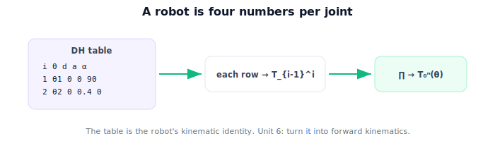

!!! abstract "You are here"
    **Module 4 — Forward Kinematics using Denavit–Hartenberg Parameters**  ·  **Unit 5 — Denavit–Hartenberg Parameters**  ·  **Lesson 5.4 — Denavit–Hartenberg Parameters (Unit 5 Recap)**

# Lesson 5.4 — Denavit–Hartenberg Parameters (Unit 5 Recap)

*A short synthesis — no new mathematics. It ties Unit 5 together and points into building the DH transform.*

---

## A robot is four numbers per joint

Unit 5 introduced the convention at the module's core:

> **Place frames by the rules ($z$ along each joint axis, $x$ along the common normal, $y$ right-handed), then describe each joint by four parameters $\theta, d, a, \alpha$ — one variable, three constants. The resulting table is the robot's kinematic identity.**

## What Unit 5 established

| Lesson | Point |
|---|---|
| 5.1 Why a Convention | Arbitrary frames are inconsistent; DH is a shared standard (4 params, not 6); not new physics. |
| 5.2 The Four DH Parameters | $\theta$ (rotate about $z$), $d$ (slide along $z$), $a$ (length along $x$), $\alpha$ (twist about $x$); joint variable = $\theta$ (revolute) or $d$ (prismatic). |
| 5.3 Assigning Frames | $z$ = joint axis, $x$ = common normal, $y$ = right-hand; read parameters between consecutive frames. |

## Why this matters

We can now write any serial arm as a DH table. But a table is only useful if it *produces* forward kinematics. **Unit 6** closes that loop: it turns the four parameters of each row into the link transform $T_{i-1}^i$ (one fixed formula), multiplies the rows into $T_0^n$, and implements DH forward kinematics in code (including symbolic DH tables with SymPy). After that, **Unit 7** interprets the resulting pose and workspace and reconnects to perception, and **Unit 8** is the capstone. The table is the input; forward kinematics is the output.

## Visual Explanation

<figure markdown>
  { width="680" }
</figure>

## Coding Exercise

!!! tip "Run the hands-on notebook"
    `modules/module04/notebooks/M04_U05_L5_4_DH_Parameters_Unit_5_Recap.ipynb` — open in JupyterLab and run **Kernel → Restart & Run All**.

A short consolidation: encode a given arm as a DH table (list of `{theta,d,a,alpha,kind}` rows), mark the variable per row, and pretty-print it — the input format Unit 6 will consume.

## Knowledge Check

Formative — unlimited attempts, immediate feedback; does not affect your grade.

<iframe src="../../quizzes/module04/lesson20_quiz.html" title="Denavit–Hartenberg Parameters (Unit 5 Recap) knowledge check" style="width:100%;height:720px;border:1px solid #e2e8f0;border-radius:12px"></iframe>

[Open this quiz in a new tab ↗](../quizzes/module04/lesson20_quiz.html)

A brief consolidation quiz across Unit 5 (formative — unlimited attempts).

## Key Takeaways

- A serial robot = a **DH table**, four parameters per joint, placed by the frame rules.
- $\theta, d, a, \alpha$: two about the joint axis, two about the link; one is the variable.
- The table is the robot's **kinematic identity** — portable across tools and vendors.
- Next: **Unit 6** — turn the table into the link transform and $T_0^n$.

---

## AI Learning Companion

Copy any prompt below into ChatGPT, Claude, or another AI assistant.

**Tutor prompt** — explain it another way
```
Summarize Unit 5 of Module 4: the DH convention places frames (z along joint axes, x along common normals) and describes each joint by four parameters θ, d, a, α (one variable, three constants). The table is the robot's kinematic identity.
```

**Practice prompt** — generate more exercises
```
Give me a 10-question review of the DH convention: the four parameters, frame-assignment rules, and reading a table off a simple arm. Include answers.
```

**Explore prompt** — connect it to the real world
```
Show me how a DH table serves as a portable description of a robot that any kinematics code can consume.
```

## Global Learning Support

Need this lesson explained in another language? Copy one of the prompts below into an AI assistant. English remains the authoritative source.

**Supported languages (initial):** English · Español · 中文 (Simplified Chinese) · Türkçe

**Español**
```
I just completed Lesson 5.4 (Module 4) — Denavit–Hartenberg Parameters (Unit 5 Recap).
Explain this lesson in Spanish. Keep robotics and mathematical terminology in English when appropriate.
Then provide: a summary, three practice questions, and one challenge problem.
```

**中文 (Simplified Chinese)**
```
I just completed Lesson 5.4 (Module 4) — Denavit–Hartenberg Parameters (Unit 5 Recap).
Explain this lesson in Simplified Chinese. Keep mathematical notation unchanged.
Then provide: a summary, three practice questions, and one challenge problem.
```

**Türkçe**
```
I just completed Lesson 5.4 (Module 4) — Denavit–Hartenberg Parameters (Unit 5 Recap).
Explain this lesson in Turkish. Keep robotics terminology in English where commonly used.
Then provide: a summary, three practice questions, and one challenge problem.
```

---

*Next: Unit 6 — Building and Using a DH Table.*
