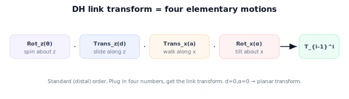

!!! abstract "You are here"
    **Module 4 — Forward Kinematics using Denavit–Hartenberg Parameters**  ·  **Unit 6 — Building and Using a DH Table**  ·  **Lesson 6.1 — The DH Link Transform**

# Lesson 6.1 — The DH Link Transform

## 1. Why This Matters

This is where the table becomes math. The four DH parameters of a joint assemble into a single, fixed $SE(3)$ formula — the **DH link transform**. It's the same formula for every joint of every robot; only the four numbers change. Once you have it, forward kinematics is "fill in each row, multiply." This one formula is the workhorse of the entire module.

## 2. Physical Intuition

Recall the four moves from Lesson 5.2: spin about $z$ by $\theta$, slide along $z$ by $d$, walk along $x$ by $a$, tilt about $x$ by $\alpha$. Doing those four moves in order carries you exactly from one joint's frame to the next. So the transform between consecutive frames is just those four elementary rigid motions composed together. No cleverness — it's the four moves, multiplied, in the order $z$-spin, $z$-slide, $x$-walk, $x$-tilt.

## 3. Mathematical Foundations

The standard (distal) DH link transform from frame $i{-}1$ to frame $i$ is the product of four elementary $SE(3)$ motions:

$$T_{i-1}^{i} = \mathrm{Rot}_z(\theta_i)\,\mathrm{Trans}_z(d_i)\,\mathrm{Trans}_x(a_i)\,\mathrm{Rot}_x(\alpha_i).$$

Multiplied out, this gives the closed form:

$$T_{i-1}^{i} = \begin{bmatrix} \cos\theta_i & -\sin\theta_i\cos\alpha_i & \sin\theta_i\sin\alpha_i & a_i\cos\theta_i \\ \sin\theta_i & \cos\theta_i\cos\alpha_i & -\cos\theta_i\sin\alpha_i & a_i\sin\theta_i \\ 0 & \sin\alpha_i & \cos\alpha_i & d_i \\ 0 & 0 & 0 & 1 \end{bmatrix}.$$

You never need to memorize the expanded matrix — just the **four-factor product**; the computer multiplies them. Note the structure: the last column holds the translation ($a_i\cos\theta_i, a_i\sin\theta_i, d_i$), and the upper-left block is the rotation built from $\theta_i$ and $\alpha_i$. For the **standard** convention the factor order is exactly as written; the **modified** convention reorders them, which is why we fixed our convention earlier.

## 4. Visual Explanation

<figure markdown>
  { width="680" }
</figure>

## 5. Engineering Example

The greenhouse controller has one function `dh_transform(theta, d, a, alpha)` returning the $4\times4$ matrix above. For each joint it passes that row's four numbers (with the live variable filled in from the encoder) and gets the link transform. The identical function serves every joint and every robot — the essence of why DH scales.

## 6. Worked Example

Planar 2-link arm, row 1: $\theta_1, d=0, a=L_1=0.4, \alpha=0$. With $\alpha=0$: $\cos\alpha=1, \sin\alpha=0$, so the formula collapses to

$$T_0^1 = \begin{bmatrix}\cos\theta_1 & -\sin\theta_1 & 0 & 0.4\cos\theta_1\\ \sin\theta_1 & \cos\theta_1 & 0 & 0.4\sin\theta_1\\ 0&0&1&0\\ 0&0&0&1\end{bmatrix},$$

which is exactly the hand-built planar transform $R_z(\theta_1)\,\mathrm{Trans}_x(0.4)$ embedded in 3D. The DH formula reproduces what we derived by hand — now from four numbers.

## 7. Interactive Demonstration

**Guided prediction.** Predict what the DH transform reduces to when $d=0$ and $\alpha=0$ (a planar rotation + link translation). Predict which entries become nonzero when $\alpha=90°$. Confirm by plugging into the four-factor product.

## 8. Coding Exercise

!!! tip "Run the hands-on notebook"
    `modules/module04/notebooks/M04_U06_L6_1_The_DH_Link_Transform.ipynb` — open in JupyterLab and run **Kernel → Restart & Run All**.

Implement `dh_transform(theta, d, a, alpha)` as the product `rotz(theta) @ transz(d) @ transx(a) @ rotx(alpha)`; verify it equals the expanded closed-form matrix; confirm the planar row 1 above matches the hand-built transform.

## 9. Knowledge Check

Formative — unlimited attempts, immediate feedback; does not affect your grade.

<iframe src="../../quizzes/module04/lesson21_quiz.html" title="The DH Link Transform knowledge check" style="width:100%;height:720px;border:1px solid #e2e8f0;border-radius:12px"></iframe>

[Open this quiz in a new tab ↗](../quizzes/module04/lesson21_quiz.html)

A check on the four-factor product, the order of motions, and that $\alpha=0,d=0$ recovers the planar transform.

## 10. Challenge Problem

Show that $\mathrm{Trans}_z(d)$ and $\mathrm{Rot}_z(\theta)$ commute (both about $z$), but $\mathrm{Trans}_x(a)$ and $\mathrm{Rot}_z(\theta)$ do not. Why does this mean the DH factor order matters even though the first two factors could be swapped?

## 11. Common Mistakes

- Reordering the four factors (use the standard order; modified DH differs).
- Memorizing the expanded matrix instead of the four-factor product.
- Forgetting to fill the joint variable into the row before building the transform.

## 12. Key Takeaways

- DH link transform: $T_{i-1}^i = \mathrm{Rot}_z(\theta)\,\mathrm{Trans}_z(d)\,\mathrm{Trans}_x(a)\,\mathrm{Rot}_x(\alpha)$.
- One fixed formula for every joint; only the four numbers change.
- With $d=0,\alpha=0$ it recovers the planar transform.
- Forward kinematics = build each row's transform, then multiply.

---

## AI Learning Companion

Copy any prompt below into ChatGPT, Claude, or another AI assistant.

**Tutor prompt** — explain it another way
```
Explain Lesson 6.1 (Module 4) — The DH Link Transform — as the four-factor product Rot_z(θ)·Trans_z(d)·Trans_x(a)·Rot_x(α). Show it collapses to the planar transform when d=0, α=0, using the 2-link arm.
```

**Practice prompt** — generate more exercises
```
Give me 6 exercises building DH link transforms from rows of (θ, d, a, α), including planar and α=90° cases. Include answers.
```

**Explore prompt** — connect it to the real world
```
Show me how one dh_transform(θ,d,a,α) function serves every joint of every robot, and why that makes DH scale.
```

## Global Learning Support

Need this lesson explained in another language? Copy one of the prompts below into an AI assistant. English remains the authoritative source.

**Supported languages (initial):** English · Español · 中文 (Simplified Chinese) · Türkçe

**Español**
```
I just completed Lesson 6.1 (Module 4) — The DH Link Transform.
Explain this lesson in Spanish. Keep robotics and mathematical terminology in English when appropriate.
Then provide: a summary, three practice questions, and one challenge problem.
```

**中文 (Simplified Chinese)**
```
I just completed Lesson 6.1 (Module 4) — The DH Link Transform.
Explain this lesson in Simplified Chinese. Keep mathematical notation unchanged.
Then provide: a summary, three practice questions, and one challenge problem.
```

**Türkçe**
```
I just completed Lesson 6.1 (Module 4) — The DH Link Transform.
Explain this lesson in Turkish. Keep robotics terminology in English where commonly used.
Then provide: a summary, three practice questions, and one challenge problem.
```

---

*Next lesson: 6.2 — Reading a Robot into a Table.*
