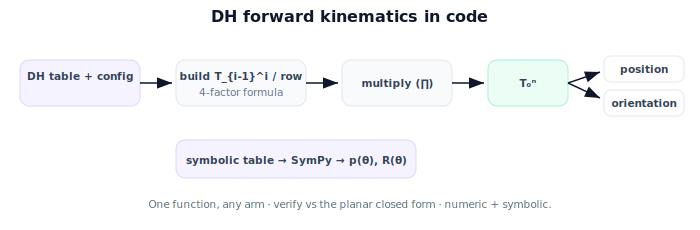

!!! abstract "You are here"
    **Module 4 — Forward Kinematics using Denavit–Hartenberg Parameters**  ·  **Unit 6 — Building and Using a DH Table**  ·  **Lesson 6.3 — DH Forward Kinematics in Code**

# Lesson 6.3 — DH Forward Kinematics in Code

## 1. Why This Matters

This lesson is the payoff of the whole DH machinery: a single, short function that takes a DH table and a configuration and returns the gripper pose — for *any* serial arm. It's the production form of forward kinematics. We build it, verify it against the closed forms we trust, and use SymPy to get a symbolic end-effector pose from a symbolic table (handy for analysis and for Module 6's velocity work later).

## 2. Physical Intuition

The code mirrors exactly what we've said in words: walk the table top to bottom; for each row, fill in the joint variable and build that link's transform with the four-parameter formula; multiply the transforms in order; read the position and orientation off the product. Because every robot is "just a different table," the same function handles a 2-DOF toy, the 3-DOF capstone arm, or a 6-DOF industrial arm. You change the data, never the code.

## 3. Mathematical Foundations

DH forward kinematics:

$$T_0^n(\boldsymbol{\theta}) = \prod_{i=1}^{n} T_{i-1}^i, \qquad T_{i-1}^i = \mathrm{Rot}_z(\theta_i)\,\mathrm{Trans}_z(d_i)\,\mathrm{Trans}_x(a_i)\,\mathrm{Rot}_x(\alpha_i),$$

with the joint variable ($\theta_i$ revolute, $d_i$ prismatic) filled from the configuration and the other three taken from the table. The implementation is:

1. `dh_transform(theta,d,a,alpha)` → the four-factor product (Lesson 6.1).
2. For each row, substitute the variable, build the transform.
3. Multiply the row transforms in order (a `reduce`).
4. Extract position (translation column) and orientation (rotation block).

We verify: the 3-DOF arm with $\alpha_1=90°$ reduces — for the in-plane part — to the planar 2-/3-link reach we already trust, confirming the DH table is right. **SymPy** runs the same product on a *symbolic* table, yielding closed-form $\mathbf{p}(\boldsymbol{\theta})$ and $R(\boldsymbol{\theta})$. (As always, build each factor as a fresh array to avoid in-place aliasing.)

## 4. Visual Explanation

<figure markdown>
  { width="680" }
</figure>

## 5. Engineering Example

The greenhouse stack stores each robot's DH table as data (often loaded from a config file or URDF). `dh_forward_kinematics(table, config)` is called for visualization, reach checks, and comparing the gripper pose to a perceived fruit position. Swapping the physical arm means swapping the table file — the kinematics code is untouched. A cached symbolic pose speeds up repeated evaluation and supports analytic checks.

## 6. Worked Example

3-DOF capstone arm (table from Lesson 6.2: row 1 $(\theta_1,0.1,0,90°)$, rows 2–3 $(\theta,0,L,0)$ with $L_2=0.4,L_3=0.3$). At configuration $(\theta_1,\theta_2,\theta_3) = (0°, 30°, 60°)$: the base swivel is $0°$ so the arm stays in the $x$–$z$ vertical plane raised by $d_1=0.1$; the in-plane 2-link reach with $(30°,60°)$ gives the same planar numbers as before — gripper at planar position $(0.346, 0.5)$ lifted to height $0.1$, i.e. $\mathbf{p}=(0.346, 0, 0.6)$ in 3D (exact axes depend on the frame setup). DH FK and the hand computation agree. SymPy returns the symbolic pose in $\theta_1,\theta_2,\theta_3$.

## 7. Interactive Demonstration

**Guided prediction.** Predict that DH FK on the 3-DOF table reproduces the planar 2-link reach for the in-plane joints. Predict what setting $\theta_1$ (base swivel) does to the gripper (rotates the whole reach about vertical). Confirm by evaluating the table at a few configurations.

## 8. Coding Exercise

!!! tip "Run the hands-on notebook"
    `modules/module04/notebooks/M04_U06_L6_3_DH_Forward_Kinematics_In_Code.ipynb` — open in JupyterLab and run **Kernel → Restart & Run All**.

Implement `dh_transform` and `dh_fk(table, config)` (fill variable → build per-row transform → multiply → extract); verify the 3-DOF arm's in-plane reach matches `fk_planar`; then build the same table symbolically in SymPy and show the symbolic position matches at a substituted configuration.

## 9. Knowledge Check

Formative — unlimited attempts, immediate feedback; does not affect your grade.

<iframe src="../../quizzes/module04/lesson23_quiz.html" title="DH Forward Kinematics in Code knowledge check" style="width:100%;height:720px;border:1px solid #e2e8f0;border-radius:12px"></iframe>

[Open this quiz in a new tab ↗](../quizzes/module04/lesson23_quiz.html)

A check on the DH FK steps, verification against the closed form, and the role of SymPy for a symbolic table.

## 10. Challenge Problem

Extend `dh_fk` to return all intermediate frames $T_0^i$ (each joint's pose). Use them to compute the position of each joint, and explain how that supports drawing the arm and checking link collisions (previewing why intermediate poses matter beyond the end-effector).

## 11. Common Mistakes

- Building the per-row transform with the wrong factor order.
- Forgetting to substitute the joint variable before multiplying.
- Not verifying against a trusted closed form (the planar reach).

## 12. Key Takeaways

- DH FK: **build each row's transform → multiply → extract** — one function for any arm.
- Verify against the planar closed form; the 3-DOF in-plane reach must match.
- **SymPy** produces the symbolic end-effector pose from a symbolic DH table.
- Robots are stored as DH tables (data); the FK code never changes.

---

## AI Learning Companion

Copy any prompt below into ChatGPT, Claude, or another AI assistant.

**Tutor prompt** — explain it another way
```
Explain Lesson 6.3 (Module 4) — DH Forward Kinematics in Code — as: for each DH row build the four-factor transform, multiply in order, extract pose; one function for any arm; verify vs the planar reach; SymPy gives the symbolic pose. Use the 3-DOF capstone arm.
```

**Practice prompt** — generate more exercises
```
Give me 5 coding exercises implementing DH forward kinematics from a table (numeric and symbolic) and verifying against closed forms. Include solutions.
```

**Explore prompt** — connect it to the real world
```
Show me how a robot stack stores a DH table as data and calls one dh_forward_kinematics(table, config) for visualization, reach checks, and grasp comparison.
```

## Global Learning Support

Need this lesson explained in another language? Copy one of the prompts below into an AI assistant. English remains the authoritative source.

**Supported languages (initial):** English · Español · 中文 (Simplified Chinese) · Türkçe

**Español**
```
I just completed Lesson 6.3 (Module 4) — DH Forward Kinematics in Code.
Explain this lesson in Spanish. Keep robotics and mathematical terminology in English when appropriate.
Then provide: a summary, three practice questions, and one challenge problem.
```

**中文 (Simplified Chinese)**
```
I just completed Lesson 6.3 (Module 4) — DH Forward Kinematics in Code.
Explain this lesson in Simplified Chinese. Keep mathematical notation unchanged.
Then provide: a summary, three practice questions, and one challenge problem.
```

**Türkçe**
```
I just completed Lesson 6.3 (Module 4) — DH Forward Kinematics in Code.
Explain this lesson in Turkish. Keep robotics terminology in English where commonly used.
Then provide: a summary, three practice questions, and one challenge problem.
```

---

*Next lesson: 6.4 — Building and Using a DH Table (Unit 6 Recap).*
