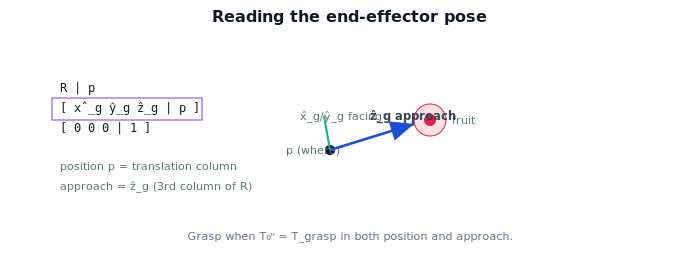

!!! abstract "You are here"
    **Module 4 — Forward Kinematics using Denavit–Hartenberg Parameters**  ·  **Unit 7 — Pose, Workspace, and Back to Perception**  ·  **Lesson 7.1 — Reading the End-Effector Pose**

# Lesson 7.1 — Reading the End-Effector Pose

## 1. Why This Matters

We can compute $T_0^n$ for any arm from its DH table. Now we *use* it. The end-effector pose answers the two questions a manipulation system actually asks: where is the gripper, and which way is it pointing? This lesson is about reading that pose fluently — pulling out the position, the approach axis, and the facing — and turning it into a grasp decision. It's the bridge from "we can compute a matrix" to "we can act."

## 2. Physical Intuition

When you reach for a mug, your brain doesn't report a $4\times4$ matrix — it knows your hand is *there* and *facing that way*, and that's enough to decide whether you can grab the handle. The robot's pose carries the same two facts. The position says whether the gripper is at the fruit. The orientation says whether the fingers will close around it or knock it off the vine. Reading the pose well means looking at both, and especially at the **approach axis** — the direction the gripper "points" as it closes in.

## 3. Mathematical Foundations

The end-effector pose is

$$T_0^n = \begin{bmatrix} R_0^n & \mathbf{p}_0^n \\ \mathbf{0}^\top & 1\end{bmatrix},\qquad R_0^n = [\,\hat{\mathbf{x}}_g\ \ \hat{\mathbf{y}}_g\ \ \hat{\mathbf{z}}_g\,].$$

To read it for manipulation:
- **Position** $\mathbf{p}_0^n$ — where the gripper origin (often the point between the fingertips) sits in the base frame.
- **Approach axis** — by convention the gripper's $\hat{\mathbf{z}}_g$ (third column of $R_0^n$): the direction the hand advances to grasp.
- **Facing / roll** — the remaining axes $\hat{\mathbf{x}}_g, \hat{\mathbf{y}}_g$ fix how the fingers are oriented around that approach (e.g. aligning the jaw opening with the fruit's stem).

A grasp target is itself a desired pose $T_{\text{grasp}}$ — a position *and* an approach. The arm "can grasp now" when $T_0^n \approx T_{\text{grasp}}$ in both position and the relevant orientation. So reading the pose is comparing two $SE(3)$ elements, not two points.

## 4. Visual Explanation

<figure markdown>
  { width="680" }
</figure>

## 5. Engineering Example

The greenhouse robot's perception (Module 3) reports a tomato's position; a grasp planner proposes an approach (e.g. straight in along the fruit's outward normal, avoiding the stem above). That defines $T_{\text{grasp}}$. The arm reads its own $T_0^n$ from joint encoders via DH forward kinematics and compares: close enough → close the gripper; otherwise → keep moving. Both halves of the pose matter — a correct position with a sideways approach would crush the fruit against a leaf.

## 6. Worked Example

3-DOF arm at a configuration giving $T_0^3$ with position $\mathbf{p}=(0.35, 0.0, 0.55)$ and rotation block whose third column is $\hat{\mathbf{z}}_g = (1,0,0)$ (approach pointing along $+x$). Interpretation: the gripper sits $0.35$ m forward and $0.55$ m up, advancing horizontally in $+x$. If the target tomato is at $(0.40,0,0.55)$ with a desired horizontal approach, the arm is $5$ cm short along $x$ but already correctly oriented — drive the gripper forward $5$ cm and grasp.

## 7. Interactive Demonstration

**Guided prediction.** Given a $T_0^n$ with $\hat{\mathbf z}_g = (0,0,1)$, predict whether the gripper approaches from the side or from below. Predict what changing the configuration to point $\hat{\mathbf z}_g = (1,0,0)$ does to the approach. Confirm by reading the third column.

## 8. Coding Exercise

!!! tip "Run the hands-on notebook"
    `modules/module04/notebooks/M04_U07_L7_1_Reading_The_End_Effector_Pose.ipynb` — open in JupyterLab and run **Kernel → Restart & Run All**.

Write `read_pose(T)` returning a dict with `position`, `approach` (third column of $R$), and `facing` (first column); apply to a `dh_fk` result; print a one-line human-readable summary ("gripper at (...), approaching along (...)").

## 9. Knowledge Check

Formative — unlimited attempts, immediate feedback; does not affect your grade.

<iframe src="../../quizzes/module04/lesson25_quiz.html" title="Reading the End-Effector Pose knowledge check" style="width:100%;height:720px;border:1px solid #e2e8f0;border-radius:12px"></iframe>

[Open this quiz in a new tab ↗](../quizzes/module04/lesson25_quiz.html)

A check that position is the translation column, the approach axis is a column of $R$, and grasping compares full poses (position + orientation).

## 10. Challenge Problem

Define a simple "grasp readiness" score that combines position error (distance) and orientation error (angle between current and desired approach axes). Why must both terms be present, and what goes wrong if you weight position only?

## 11. Common Mistakes

- Reporting only position and ignoring the approach axis.
- Confusing the approach axis (a column of $R$) with the position.
- Comparing only points when the target is really a pose.

## 12. Key Takeaways

- The end-effector pose answers **where** (position) and **which way** (orientation).
- The **approach axis** is the gripper's $\hat{\mathbf z}_g$ (third column of $R_0^n$).
- A grasp target is a **pose**; "can grasp" means $T_0^n \approx T_{\text{grasp}}$ in position and approach.
- Reading the pose well is the bridge from computing a matrix to acting on the world.

---

## AI Learning Companion

Copy any prompt below into ChatGPT, Claude, or another AI assistant.

**Tutor prompt** — explain it another way
```
Explain Lesson 7.1 (Module 4) — Reading the End-Effector Pose — as "where + which way": position = translation column, approach axis = ẑ_g (third column of R), and grasping compares full poses. Use reaching for a mug as the analogy.
```

**Practice prompt** — generate more exercises
```
Give me 6 exercises reading position and approach axis from end-effector poses and deciding grasp readiness. Include answers.
```

**Explore prompt** — connect it to the real world
```
Show me how a grasp planner turns a perceived fruit position into a desired pose (position + approach) and compares it to the arm's current pose.
```

## Global Learning Support

Need this lesson explained in another language? Copy one of the prompts below into an AI assistant. English remains the authoritative source.

**Supported languages (initial):** English · Español · 中文 (Simplified Chinese) · Türkçe

**Español**
```
I just completed Lesson 7.1 (Module 4) — Reading the End-Effector Pose.
Explain this lesson in Spanish. Keep robotics and mathematical terminology in English when appropriate.
Then provide: a summary, three practice questions, and one challenge problem.
```

**中文 (Simplified Chinese)**
```
I just completed Lesson 7.1 (Module 4) — Reading the End-Effector Pose.
Explain this lesson in Simplified Chinese. Keep mathematical notation unchanged.
Then provide: a summary, three practice questions, and one challenge problem.
```

**Türkçe**
```
I just completed Lesson 7.1 (Module 4) — Reading the End-Effector Pose.
Explain this lesson in Turkish. Keep robotics terminology in English where commonly used.
Then provide: a summary, three practice questions, and one challenge problem.
```

---

*Next lesson: 7.2 — The Reachable Workspace.*
