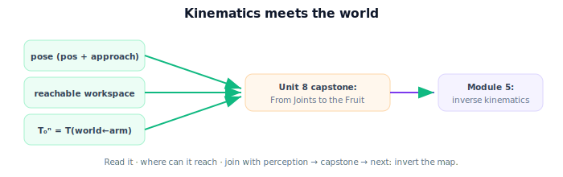

!!! abstract "You are here"
    **Module 4 — Forward Kinematics using Denavit–Hartenberg Parameters**  ·  **Unit 7 — Pose, Workspace, and Back to Perception**  ·  **Lesson 7.4 — Pose, Workspace, and Perception (Unit 7 Recap)**

# Lesson 7.4 — Pose, Workspace, and Perception (Unit 7 Recap)

*A short synthesis — no new mathematics. It ties Unit 7 together and sets up the capstone.*

---

## Kinematics meets the world

Unit 7 turned "we can compute $T_0^n$" into "we can act":

> **Read the gripper pose (position + approach) from $T_0^n$; sweep the joints to trace the reachable workspace; and recognize $T_0^n$ (with the base mount) as $T(\text{world}\leftarrow\text{arm})$ — the transform that lets perception and kinematics share one frame.**

## What Unit 7 established

| Lesson | Point |
|---|---|
| 7.1 Reading the End-Effector Pose | Position + approach axis ($\hat z_g$); grasping compares full poses. |
| 7.2 The Reachable Workspace | Image of FK over joint ranges; planar annulus (outer $L_1{+}L_2$, inner $|L_1{-}L_2|$); sample to find it. |
| 7.3 Closing the Loop with Perception | $T_0^n = T(\text{world}\leftarrow\text{arm})$; $\mathbf P_{\text{cam}}$ + mounts + FK → fruit in the arm's frame. |

## Why this matters

Everything needed for a complete perceive-to-act loop is now in hand: perception (Module 3) gives a fruit position; forward kinematics (Module 4) gives the gripper pose and the world-to-arm transform; together they place the target in the arm's frame and produce a motion. **Unit 8** assembles exactly this into a **capstone**: build the 3-DOF arm's DH model, compute and verify its forward kinematics, place a perceived fruit in the arm's frame, and reach for it — then look ahead to **Module 5**, where *inverse* kinematics solves for the joint angles that achieve a desired pose (inverting the map this module built).

## Visual Explanation

<figure markdown>
  { width="680" }
</figure>

## Coding Exercise

!!! tip "Run the hands-on notebook"
    `modules/module04/notebooks/M04_U07_L7_4_Pose_Workspace_Perception_Unit_7_Recap.ipynb` — open in JupyterLab and run **Kernel → Restart & Run All**.

A short consolidation: for the 3-DOF arm, read the gripper pose with `dh_fk`, confirm a sample target lies in the reachable workspace, and place a camera-frame point into the base frame — the three Unit-7 skills in one cell.

## Knowledge Check

Formative — unlimited attempts, immediate feedback; does not affect your grade.

<iframe src="../../quizzes/module04/lesson28_quiz.html" title="Pose, Workspace, and Perception (Unit 7 Recap) knowledge check" style="width:100%;height:720px;border:1px solid #e2e8f0;border-radius:12px"></iframe>

[Open this quiz in a new tab ↗](../quizzes/module04/lesson28_quiz.html)

A brief consolidation quiz across Unit 7 (formative — unlimited attempts).

## Key Takeaways

- $T_0^n$ gives the gripper **pose**; sweeping joints gives the **reachable workspace**.
- $T_0^n$ (with the base mount) is $T(\text{world}\leftarrow\text{arm})$ — the **perception bridge**.
- Perception + FK place a fruit in the arm's frame → a motion command.
- Next: **Unit 8** capstone, then **Module 5** (inverse kinematics).

---

## AI Learning Companion

Copy any prompt below into ChatGPT, Claude, or another AI assistant.

**Tutor prompt** — explain it another way
```
Summarize Unit 7 of Module 4: read the gripper pose (position + approach) from T_0^n; the reachable workspace is the image of FK over joint ranges; T_0^n is the T(world←arm) that joins kinematics to perception, placing a fruit in the arm's frame.
```

**Practice prompt** — generate more exercises
```
Give me a 10-question review of pose reading, reachable workspace, and the perception bridge (T_0^n = T(world←arm)). Include answers.
```

**Explore prompt** — connect it to the real world
```
Show me how a fruit-picking robot uses pose, workspace, and the world-to-arm transform together to decide whether and how to reach a tomato.
```

## Global Learning Support

Need this lesson explained in another language? Copy one of the prompts below into an AI assistant. English remains the authoritative source.

**Supported languages (initial):** English · Español · 中文 (Simplified Chinese) · Türkçe

**Español**
```
I just completed Lesson 7.4 (Module 4) — Pose, Workspace, and Perception (Unit 7 Recap).
Explain this lesson in Spanish. Keep robotics and mathematical terminology in English when appropriate.
Then provide: a summary, three practice questions, and one challenge problem.
```

**中文 (Simplified Chinese)**
```
I just completed Lesson 7.4 (Module 4) — Pose, Workspace, and Perception (Unit 7 Recap).
Explain this lesson in Simplified Chinese. Keep mathematical notation unchanged.
Then provide: a summary, three practice questions, and one challenge problem.
```

**Türkçe**
```
I just completed Lesson 7.4 (Module 4) — Pose, Workspace, and Perception (Unit 7 Recap).
Explain this lesson in Turkish. Keep robotics terminology in English where commonly used.
Then provide: a summary, three practice questions, and one challenge problem.
```

---

*Next: Unit 8 — Mini Project: From Joints to the Fruit.*
