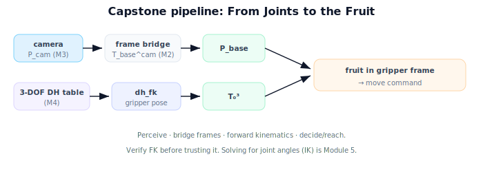

!!! abstract "You are here"
    **Module 4 — Forward Kinematics using Denavit–Hartenberg Parameters**  ·  **Unit 8 — Mini Project: From Joints to the Fruit**  ·  **Lesson 8.1 — The Project: From Joints to the Fruit**

# Lesson 8.1 — The Project: From Joints to the Fruit

## 1. Why This Matters

This is where it all comes together. Across four modules you've built coordinate frames and transforms (Module 1), composed them into $SE(3)$ motions (Module 2), turned pixels into world points (Module 3), and computed a gripper's pose from joint angles (Module 4). The capstone wires these into one small pipeline: **a 3-DOF arm that, given a perceived fruit, computes where to put its gripper.** This lesson lays out the project; the next three build, verify, and reflect.

## 2. Physical Intuition

Picture the finished system: a camera spots a tomato and reports where it is; the arm, knowing its own joint angles, computes where its gripper currently is; both get expressed in the same frame; the arm reaches. Nothing here is new — every piece was built in an earlier lesson. The capstone is the satisfying moment of assembly, like clicking the last bricks of a model together and seeing it stand. You're not learning a new idea; you're proving the ideas combine.

## 3. Mathematical Foundations

The capstone arm is the 3-DOF arm from Unit 6 (DH table: base swivel + two planar links):

| $i$ | $\theta_i$ | $d_i$ | $a_i$ | $\alpha_i$ |
|---|---|---|---|---|
| 1 | $\theta_1$ (var) | 0.1 | 0 | 90° |
| 2 | $\theta_2$ (var) | 0 | 0.4 | 0 |
| 3 | $\theta_3$ (var) | 0 | 0.3 | 0 |

The pipeline, end to end:
1. **Perception (Module 3):** a pixel + depth → fruit position in the camera frame $\mathbf P_{\text{cam}}$.
2. **Frame bridge (Module 2 + Lesson 7.3):** $\mathbf P_{\text{base}} = T_{\text{base}}^{\text{cam}}\,\mathbf P_{\text{cam}}$.
3. **Forward kinematics (Module 4):** $T_0^3(\boldsymbol\theta)$ → current gripper pose; check reachability (Lesson 7.2).
4. **Decision:** express the fruit relative to the gripper, $(T_0^3)^{-1}\mathbf P_{\text{base}}$, and report the move.

The deliverable is code that runs this pipeline on a given configuration and target, plus a verification that the forward kinematics is correct (Lesson 8.3). No inverse kinematics yet — we *report* the target relative to the gripper; *solving* for joint angles to reach it is Module 5.

## 4. Visual Explanation

<figure markdown>
  { width="680" }
</figure>

## 5. Engineering Example

This *is* the greenhouse robot in miniature. The real system has more joints, calibrated mounts, and safety checks, but the skeleton is identical: perceive a fruit, know the arm's pose, put both in one frame, act. Building the small version makes the production system legible — you can point at each block and name the module that built it.

## 6. Worked Example

We'll use: 3-DOF arm above; a base-mounted camera with $T_{\text{base}}^{\text{cam}}$ = translation $(0.1, 0, 0.5)$, no rotation; a detected fruit at $\mathbf P_{\text{cam}} = (0.05, 0, 0.40)$, so $\mathbf P_{\text{base}} = (0.15, 0, 0.90)$. Target distance from the base axis and height will be checked against the workspace, then expressed relative to whatever gripper pose the current configuration produces. Lessons 8.2–8.3 build and verify each block; 8.4 reflects and points to inverse kinematics.

## 7. Interactive Demonstration

<iframe src="../../demos/module04/lesson29_from_joints_to_fruit.html" title="The Project: From Joints to the Fruit interactive demo" style="width:100%;height:520px;border:1px solid #e2e8f0;border-radius:12px"></iframe>

[Open this demo in a new tab ↗](../demos/module04/lesson29_from_joints_to_fruit.html)

**Guided prediction.** Name which module supplies each pipeline block (perception, frame bridge, forward kinematics, decision). Predict what the capstone does *not* do (solve for joint angles — that's IK). Confirm against the pipeline above.

## 8. Coding Exercise

!!! tip "Run the hands-on notebook"
    `modules/module04/notebooks/M04_U08_L8_1_The_Project.ipynb` — open in JupyterLab and run **Kernel → Restart & Run All**.

Set up the capstone scaffold: encode the 3-DOF DH table, the camera mount transform, and the sample fruit $\mathbf P_{\text{cam}}$; compute $\mathbf P_{\text{base}}$; print the project inputs. (FK and verification follow in 8.2–8.3.)

## 9. Knowledge Check

Formative — unlimited attempts, immediate feedback; does not affect your grade.

<iframe src="../../quizzes/module04/lesson29_quiz.html" title="The Project: From Joints to the Fruit knowledge check" style="width:100%;height:720px;border:1px solid #e2e8f0;border-radius:12px"></iframe>

[Open this quiz in a new tab ↗](../quizzes/module04/lesson29_quiz.html)

A check on the capstone goal, which module supplies each block, and the FK-not-IK scope.

## 10. Challenge Problem

Sketch how you'd extend the capstone from "report the move" to "verify the fruit is reachable and oriented for grasp" using Lessons 7.1–7.2. What additional checks would a real system need (collisions, joint limits, ripeness)?

## 11. Common Mistakes

- Expecting the capstone to solve inverse kinematics (it reports, doesn't solve for angles).
- Skipping the frame bridge and comparing camera and base coordinates directly.
- Trusting forward kinematics without the verification step (8.3).

## 12. Key Takeaways

- The capstone integrates Modules 2–4 into one perceive-to-act pipeline.
- Arm: the 3-DOF DH model (base swivel + two planar links).
- Pipeline: perceive → bridge frames → forward kinematics → report target relative to gripper.
- Scope is **forward** kinematics; solving for joint angles is **Module 5**.

---

## AI Learning Companion

Copy any prompt below into ChatGPT, Claude, or another AI assistant.

**Tutor prompt** — explain it another way
```
Explain Lesson 8.1 (Module 4) — the capstone "From Joints to the Fruit" — as assembling Modules 2–4 into one pipeline: perceive (P_cam), bridge frames (P_base), forward kinematics (T_0^3), report the fruit relative to the gripper. Note IK is Module 5.
```

**Practice prompt** — generate more exercises
```
Give me 4 scenarios describing a fruit-picking pipeline and ask which module supplies each step. Include answers.
```

**Explore prompt** — connect it to the real world
```
Show me how this small 3-DOF capstone maps onto a real greenhouse harvesting robot's perceive-to-act loop.
```

## Global Learning Support

Need this lesson explained in another language? Copy one of the prompts below into an AI assistant. English remains the authoritative source.

**Supported languages (initial):** English · Español · 中文 (Simplified Chinese) · Türkçe

**Español**
```
I just completed Lesson 8.1 (Module 4) — The Project: From Joints to the Fruit.
Explain this lesson in Spanish. Keep robotics and mathematical terminology in English when appropriate.
Then provide: a summary, three practice questions, and one challenge problem.
```

**中文 (Simplified Chinese)**
```
I just completed Lesson 8.1 (Module 4) — The Project: From Joints to the Fruit.
Explain this lesson in Simplified Chinese. Keep mathematical notation unchanged.
Then provide: a summary, three practice questions, and one challenge problem.
```

**Türkçe**
```
I just completed Lesson 8.1 (Module 4) — The Project: From Joints to the Fruit.
Explain this lesson in Turkish. Keep robotics terminology in English where commonly used.
Then provide: a summary, three practice questions, and one challenge problem.
```

---

*Next lesson: 8.2 — Building the Arm's DH Model.*
