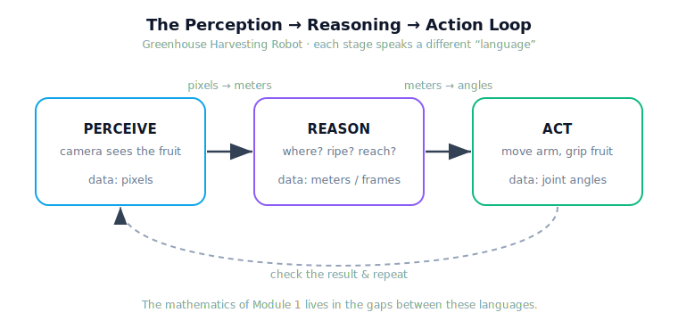
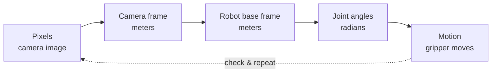
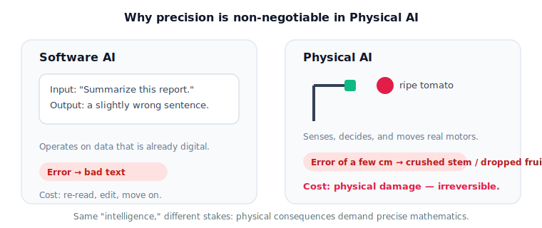

# Lesson 1.1 — Physical AI and the Physical World

!!! info "Module 1 · Unit 1 · Lesson 1.1 · ~45 min"
    The first lesson of the curriculum. It carries light mathematics; its job is to build the mental model — the **Greenhouse Harvesting Robot** — that every later lesson returns to, and to explain *why* the mathematics is coming.

    **In this lesson:** reading · diagrams · interactive demo · runnable notebook · knowledge check.

## Why this matters

You already know what AI can do on a screen — finish a sentence, recommend a film, answer a question. All of that works on data that is already digital.

A robot in a greenhouse has a harder problem. It must find a ripe tomato among the leaves, decide whether it's ready, reach out without crushing it, and place it gently in a basket. It has to **see** a real object, **understand** where it is in real space, and **move** real motors to real positions. If its sense of *where* is off by a few centimeters, it grabs a leaf or snaps a stem.

This is **Physical AI**: intelligence that senses, decides, and acts in the physical world. And it's why this curriculum opens with mathematics — acting correctly in physical space is, underneath, a mathematical problem.

## The perception → reasoning → action loop

Grab a cup: your eyes locate it, your brain estimates distance and orientation, your arm rotates to place your fingers there. You ran a **perception → reasoning → action** loop in under a second. A physical AI system runs the same loop, but every stage must be built.

<figure markdown>
  { width="640" }
  <figcaption>Each stage speaks a different "language." The mathematics of Module 1 lives in the gaps between them.</figcaption>
</figure>

- **Perception (sensing):** a camera turns the world into data — *pixels*.
- **Reasoning (decision):** interpret that data — where is the fruit, is it ripe, can I reach it — in *meters and frames*.
- **Action (actuation):** motors carry out the decision, in *joint angles*.

The hard, mathematical part is that each stage speaks a different spatial language. Getting from "a blob of red pixels" to "rotate joint 2 by 37°" means **translating between these languages precisely** — which is exactly what vectors, frames, and matrices are for.

### The pipeline, as a chain

!!! note "The map to keep"
    pixels → camera frame → robot frame → joint angles → motion. Every arrow is a lesson (or several) later in this curriculum.

## Software AI vs Physical AI

A chatbot that's wrong produces a bad sentence. A physical AI that's wrong produces a broken stem, a dropped package, a damaged part.

<figure markdown>
  { width="680" }
  <figcaption>Same "intelligence," different stakes — physical consequences demand precise mathematics.</figcaption>
</figure>

You'll see the same loop across this curriculum's fields: agriculture (harvesting fruit), robotics (moving packages), and mechatronics (positioning a tool to micrometer precision).

## Interactive demo — "Trace the loop"

Drag the tomato (or focus it and use the arrow keys). Watch its position, the distance to the gripper, and the reachability decision update live. Change the arm's reach with the slider, then press **Trace the loop** to step through perceive → reason → act.

<iframe src="../../demos/lesson01_trace_the_loop.html" title="Trace the Loop interactive demo"
        style="width:100%;height:520px;border:1px solid #e2e8f0;border-radius:12px" loading="lazy"></iframe>

## Try it: the notebook

The runnable companion lets you *see* a position become a few numbers and flow through the loop.

!!! tip "Open the notebook"
    `modules/module01/notebooks/lesson01_physical_ai_and_the_physical_world.ipynb` — run top to bottom (**Kernel → Restart & Run All**). Requires only NumPy and Matplotlib.

## Worked intuition

The camera reports a tomato 0.3 m right and 0.4 m up of the gripper. As a single arrow it points up-and-right, with length $\sqrt{0.3^2 + 0.4^2} = 0.5$ m. One arrow holds both "how far" and "which way" — the seed of a **vector** (Unit 2).

## Knowledge check

Answer each question and get immediate feedback. This is **formative** — unlimited attempts, and it does not affect your grade.

<iframe src="../../quizzes/lesson01_quiz.html" title="Lesson 1.1 knowledge check"
        style="width:100%;height:760px;border:1px solid #e2e8f0;border-radius:12px" loading="lazy"></iframe>

Source: `modules/module01/quizzes/lesson01_quiz.yaml` (questions) · answer key in `coaches/` (instructor).

## Key takeaways

- **Physical AI** senses, decides, and acts in the real world; its defining challenge is precise action under physical consequences.
- Every physical AI system runs a **perception → reasoning → action** loop, and the stages speak different spatial languages (pixels, meters/frames, angles).
- The work of robotics is **translating precisely between those languages** — fundamentally geometric.
- The **Greenhouse Harvesting Robot** is the system we build the mathematics around; "find and pick a tomato" is the task every abstract tool serves.
- You don't need the math yet — you need the **map**. Units 2–8 fill in each arrow.

---

*Next: 1.2 — Units and Dimensions.*
