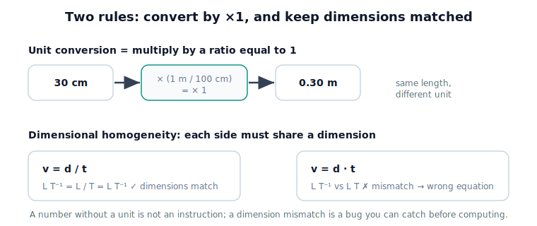

# Lesson 1.2 Units and Dimensions

## Why this matters

Tell the robot to "move 5" — five what? A number becomes an instruction only when it carries a **unit**. Mixing units (the Mars Climate Orbiter) or mismatching **dimensions** is a classic, costly bug. Every interface between robot subsystems is a place to convert units deliberately.

## The idea, visually

<figure markdown>
  { width="680" }
</figure>

## Key idea

Convert by multiplying by ratios equal to 1 (e.g. $30\ \text{cm}\times\frac{1\,\text{m}}{100\,\text{cm}} = 0.30\ \text{m}$). Check **dimensional homogeneity**: every term in a valid equation shares the same dimension — a way to catch wrong equations before computing.

## Notebook

!!! tip "Run the hands-on notebook"
    `modules/module01/notebooks/lesson02_*.ipynb` — run **Kernel → Restart & Run All**. NumPy + Matplotlib only.

## Knowledge check

Formative — unlimited attempts, immediate feedback; does not affect your grade.

<iframe src="../../quizzes/lesson02_quiz.html" title="1.2 Units and Dimensions knowledge check" style="width:100%;height:680px;border:1px solid #e2e8f0;border-radius:12px" loading="lazy"></iframe>

## Key takeaways

- A quantity is a **number + unit**; the number alone isn't an instruction.
- **Dimension** = type of quantity; **units** = scales for that type.
- Convert by ×1 ratios; only within the same dimension.
- Dimensional homogeneity catches wrong equations early.


## AI Learning Companion

Copy any prompt below into ChatGPT, Claude, or another AI assistant.

**Tutor prompt** — explain it another way

```
Re-explain Lesson 1.2 (Units and Dimensions) without the Mars Orbiter example. Make clear why a number needs a unit, what a dimension is, and how a dimensional-consistency check catches a wrong equation.
```

**Practice prompt** — generate more exercises

```
Give me 6 quick problems: unit conversions (cm to m, degrees to radians) and dimensional-consistency checks on simple physics equations. Show the answers.
```

**Explore prompt** — connect it to the real world

```
Show me 3 real engineering or robotics failures caused by unit or dimension mistakes, and how a dimensional check would have caught each one.
```

## Global Learning Support

Need this lesson explained in another language? Copy one of the prompts below into an AI assistant. English remains the authoritative source; these give an AI-generated explanation in your preferred language.

**Supported languages (initial):** English · Español · 中文 (Simplified Chinese) · Türkçe

**Español**

```
I just completed Lesson 1.2 — Units and Dimensions.
Explain this lesson in Spanish. Keep robotics and mathematical terminology in English when appropriate.
Then provide: a summary, three practice questions, and one challenge problem.
```

**中文 (Simplified Chinese)**

```
I just completed Lesson 1.2 — Units and Dimensions.
Explain this lesson in Simplified Chinese. Keep mathematical notation unchanged.
Then provide: a summary, three practice questions, and one challenge problem.
```

**Türkçe**

```
I just completed Lesson 1.2 — Units and Dimensions.
Explain this lesson in Turkish. Keep robotics terminology in English where commonly used.
Then provide: a summary, three practice questions, and one challenge problem.
```


---

*Next: 1.3 — Scalars and Physical Quantities*
