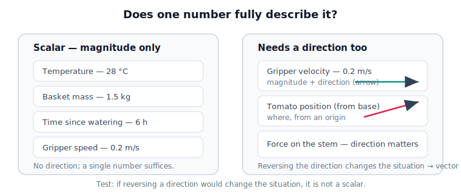

# Lesson 1.3 Scalars and Physical Quantities

## Why this matters

Some readings are fully described by one number (temperature, mass, time); others need a direction (velocity, position). Mixing them up makes a robot move the right *amount* the wrong *way*. This lesson draws the line — the doorway to vectors.

## The idea, visually

<figure markdown>
  { width="680" }
</figure>

## Key idea

A **scalar** is a magnitude with a unit, no direction. **Speed is scalar; velocity is not** (it adds direction). Test: *if reversing a direction would change the situation, it is not a scalar.*

## Notebook

!!! tip "Run the hands-on notebook"
    `modules/module01/notebooks/lesson03_*.ipynb` — run **Kernel → Restart & Run All**. NumPy + Matplotlib only.

## Knowledge check

Formative — unlimited attempts, immediate feedback; does not affect your grade.

<iframe src="../../quizzes/lesson03_quiz.html" title="1.3 Scalars and Physical Quantities knowledge check" style="width:100%;height:680px;border:1px solid #e2e8f0;border-radius:12px" loading="lazy"></iframe>

## Key takeaways

- A **scalar** is fully described by magnitude + unit.
- Environmental readings tend to be scalar; motion/location quantities need direction.
- **Speed scalar, velocity not** — the difference is direction.
- Direction-carrying quantities become **vectors** (Unit 2).


## AI Learning Companion

Copy any prompt below into ChatGPT, Claude, or another AI assistant.

**Tutor prompt** — explain it another way

```
Re-explain Lesson 1.3 (Scalars and Physical Quantities). Make the scalar versus needs-direction distinction crisp, and apply the 'reverse the direction' test to several examples.
```

**Practice prompt** — generate more exercises

```
Give me 8 physical quantities and ask me to classify each as scalar or needs-direction, then reveal the answers with a one-line reason for each.
```

**Explore prompt** — connect it to the real world

```
Show me where, in a real robot arm, scalar quantities and directional quantities each appear, and explain why the directional ones will require vectors.
```

## Global Learning Support

Need this lesson explained in another language? Copy one of the prompts below into an AI assistant. English remains the authoritative source; these give an AI-generated explanation in your preferred language.

**Supported languages (initial):** English · Español · 中文 (Simplified Chinese) · Türkçe

**Español**

```
I just completed Lesson 1.3 — Scalars and Physical Quantities.
Explain this lesson in Spanish. Keep robotics and mathematical terminology in English when appropriate.
Then provide: a summary, three practice questions, and one challenge problem.
```

**中文 (Simplified Chinese)**

```
I just completed Lesson 1.3 — Scalars and Physical Quantities.
Explain this lesson in Simplified Chinese. Keep mathematical notation unchanged.
Then provide: a summary, three practice questions, and one challenge problem.
```

**Türkçe**

```
I just completed Lesson 1.3 — Scalars and Physical Quantities.
Explain this lesson in Turkish. Keep robotics terminology in English where commonly used.
Then provide: a summary, three practice questions, and one challenge problem.
```


---

*Next: 1.4 — Measurement Error*
